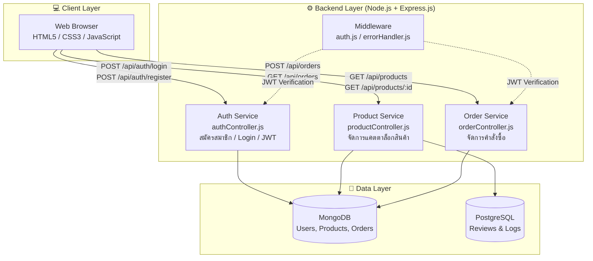
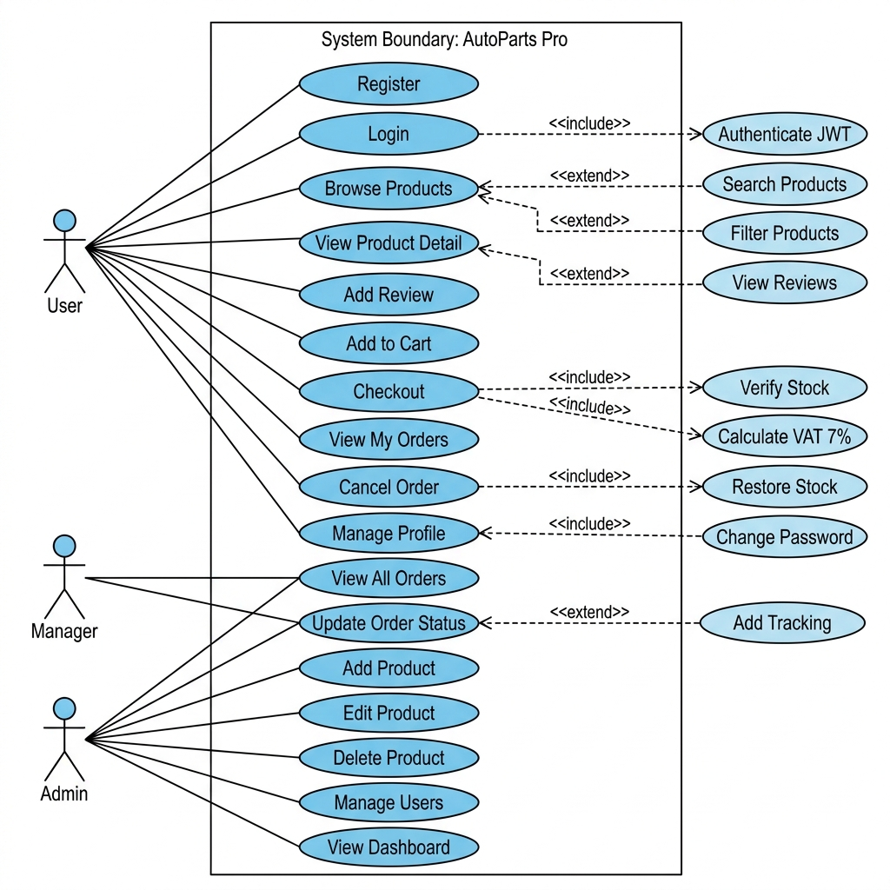
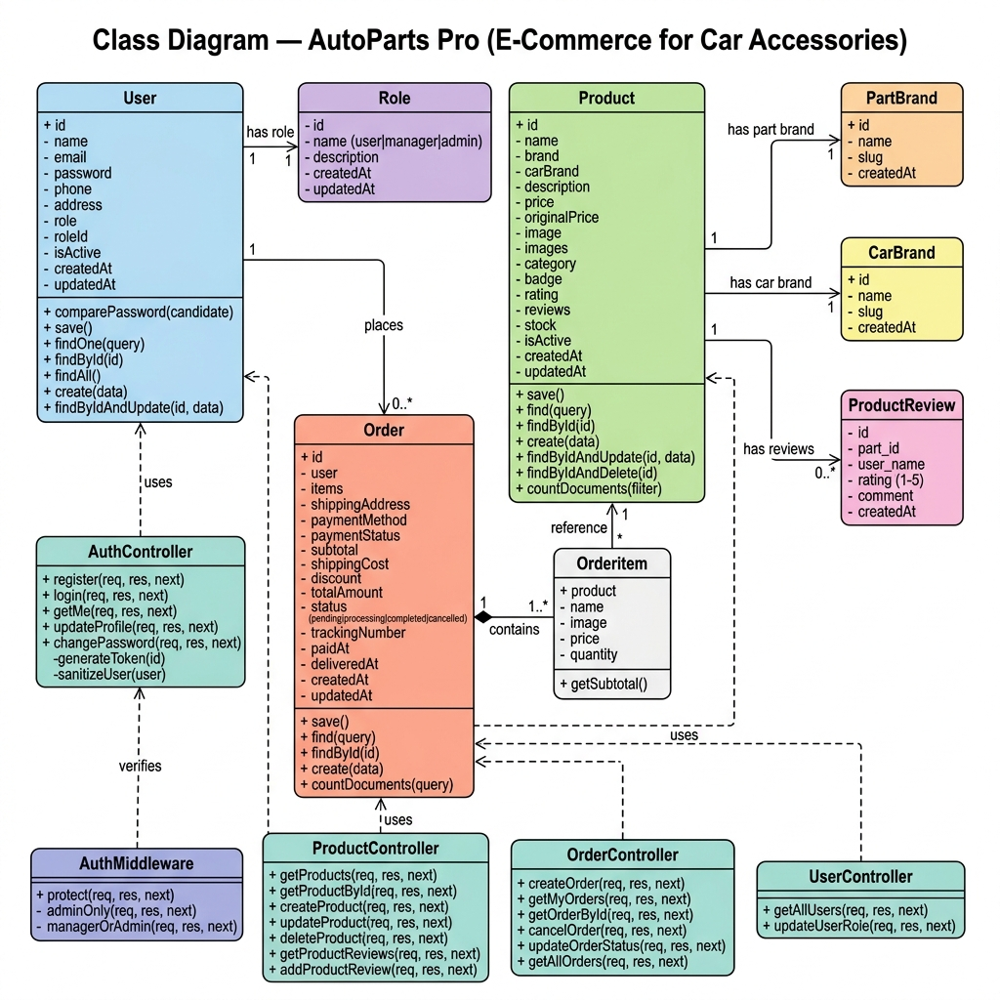
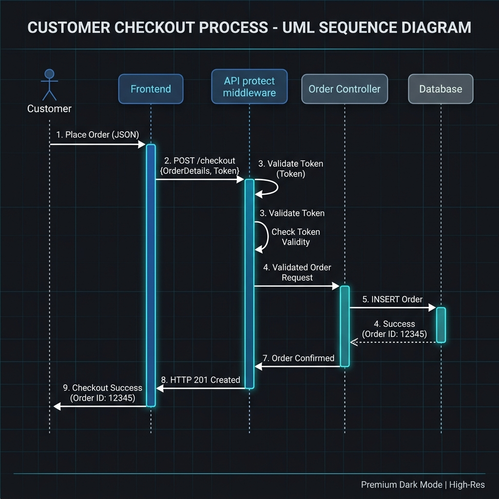
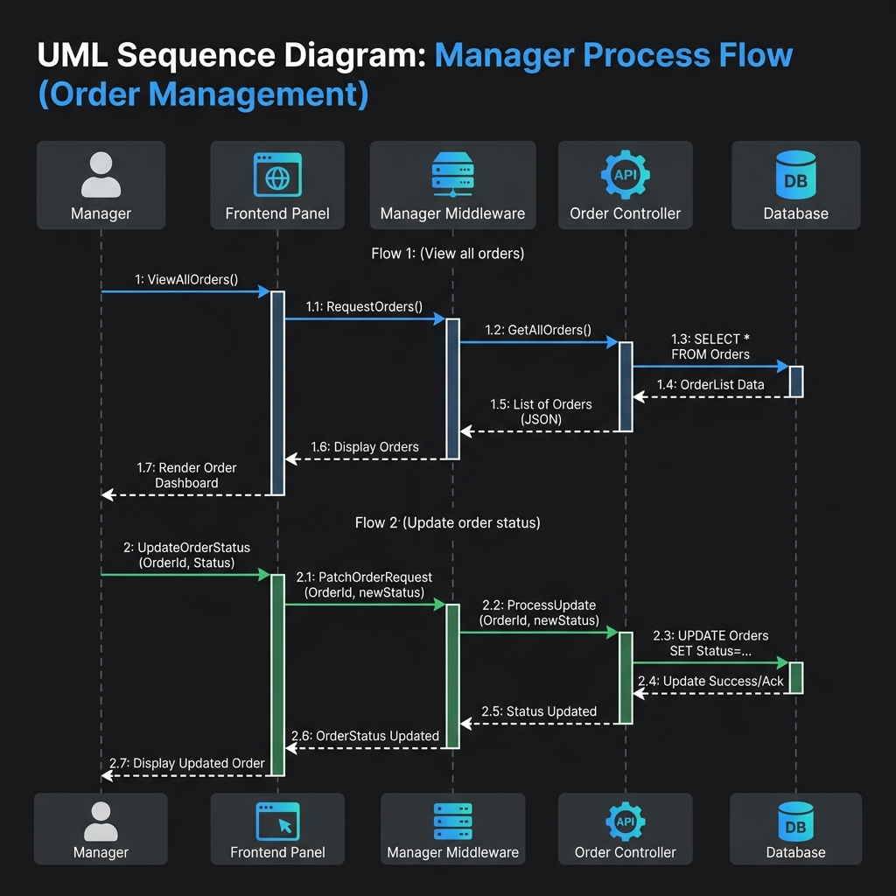
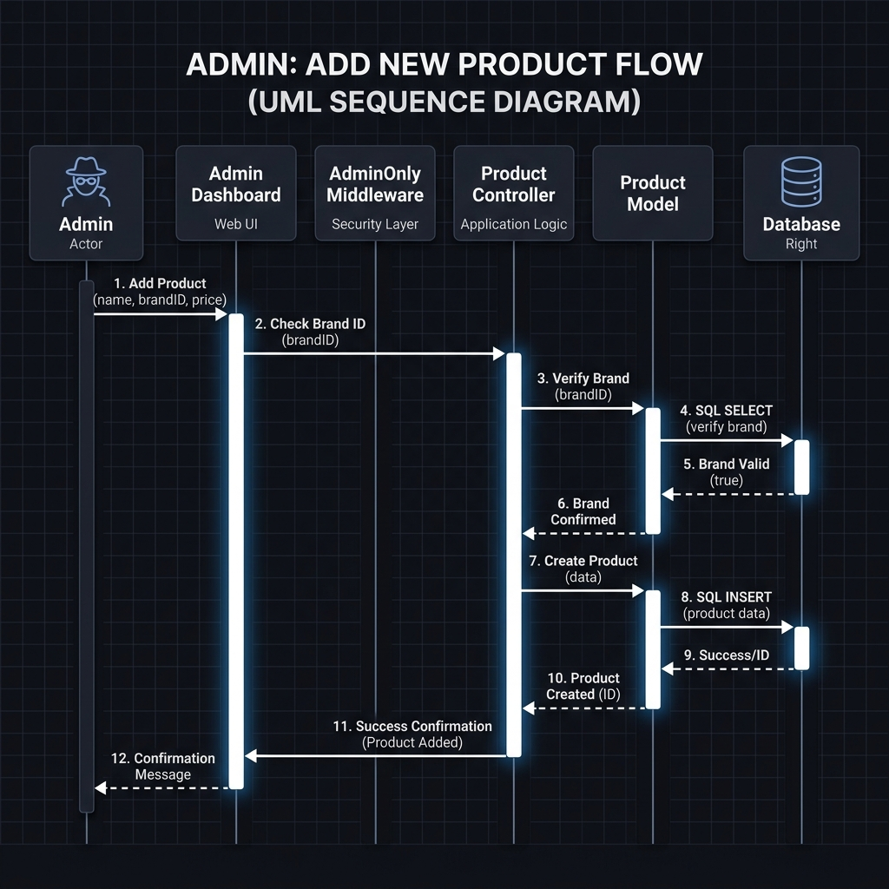

# เอกสารข้อกำหนดระบบ (System Requirement Specification) และ สถาปัตยกรรมระบบ

**โครงการ:** AutoParts Pro - ระบบร้านค้าออนไลน์ขายอุปกรณ์แต่งรถ (E-Commerce)

| เวอร์ชัน | วันที่แก้ไข | ผู้จัดทำ | รายละเอียดการเปลี่ยนแปลง |
| :---: | :---: | :---: | :---: |
| 1.0 | 2026-07-17 | [Nattapong  jullaruji       67117379] | (Project Documentation) |
| 2.0 | 2026-07-17 | [Kasidech  niamthong        67117355] | (Team Member) |
| 3.0 | 2026-07-17 | [Nuttawat  pinpun           67117324] | (Team Member) |
| 4.0 | 2026-07-17 | [Thanachon  chaengcharoen   67095854] | (Team Member) |
| 5.0 | 2026-07-17 | [Nantawat  sungnui          67108332] | (Team Member) |
| 6.0 | 2026-07-24 | [ทีมพัฒนา] | เพิ่มกรณีทดสอบ UAT-C-13–18, UAT-M-06, UAT-A-09, UAT-BP-01–03 พร้อมตาราง Test Coverage Summary และ Issue Log (ISS-01–ISS-05) |

---

## สารบัญ
1. [ภาพรวมโครงการ](#1-ภาพรวมโครงการ)
2. [สถาปัตยกรรมระบบ (System Architecture)](#2-สถาปัตยกรรมระบบ-system-architecture)
   - 2.1 [การวิเคราะห์และออกแบบ](#21-การวิเคราะห์และออกแบบ-analysis--design)
   - 2.2 [Use Case Diagram](#22-use-case-diagram)
   - 2.3 [Class Diagram](#23-class-diagram)
   - 2.4 [Sequence Diagrams](#24-sequence-diagrams)
3. [โครงสร้างโปรเจกต์ (Project Structure)](#3-โครงสร้างโปรเจกต์-project-structure)
4. [ความต้องการด้านฟังก์ชันการทำงาน (Functional Requirements)](#4-ความต้องการด้านฟังก์ชันการทำงาน-functional-requirements)
5. [ความต้องการด้านที่ไม่ใช่ฟังก์ชัน (Non-Functional Requirements)](#5-ความต้องการด้านที่ไม่ใช่ฟังก์ชัน-non-functional-requirements)
6. [การประยุกต์ใช้ Software Design Principles](#6-การประยุกต์ใช้-software-design-principles)
7. [วิธีการติดตั้งและใช้งาน (Installation)](#7-วิธีการติดตั้งและใช้งาน-installation)
8. [User Acceptance Testing (UAT)](#8-user-acceptance-testing-uat)
   - 8.6 [สรุปจำนวนกรณีทดสอบและข้อบกพร่องที่พบ](#86-สรุปจำนวนกรณีทดสอบและข้อบกพร่องที่พบ-test-coverage--issue-log)
   - 8.7 [หลักฐานประกอบการทดสอบ](#87-หลักฐานประกอบการทดสอบ-test-evidence)
9. [ไฟล์โครงสร้างฐานข้อมูล (schema.sql)](./backend/sql/neon_schema.sql)

---

## 1. ภาพรวมโครงการ

**AutoParts Pro** เป็นแพลตฟอร์ม E-Commerce สำหรับจัดจำหน่ายอุปกรณ์แต่งรถยนต์และอะไหล่รถยนต์แบบครบวงจร โดยมีเป้าหมายเพื่ออำนวยความสะดวกให้ผู้ที่รักการแต่งรถสามารถค้นหา เปรียบเทียบ และสั่งซื้อสินค้าได้อย่างรวดเร็วและปลอดภัยผ่านระบบออนไลน์

ระบบถูกแบ่งออกเป็น 2 ส่วนหลักคือ **Frontend** (Static Website) และ **Backend** (RESTful API Server) ที่แยกกันทำงานและสื่อสารกันผ่าน HTTP

---

## 2. สถาปัตยกรรมระบบ (System Architecture)

สถาปัตยกรรมของ AutoParts Pro ถูกออกแบบโดยใช้หลักการ **Separation of Concerns** แบ่งระบบออกเป็น 3 Layer หลัก ได้แก่ Client Layer, Backend Layer และ Data Layer โดยทุกส่วนสื่อสารกันผ่าน REST API



### 2.1 การวิเคราะห์และออกแบบ (Analysis & Design)

การวิเคราะห์สถาปัตยกรรมตามองค์ประกอบหลัก (Architecture Analysis):

- **Frontend Architecture:**
  - โครงสร้าง: ใช้ HTML5, CSS3, JavaScript (Vanilla) ในการแสดงผล UI
  - การออกแบบ: มุ่งเน้นการทำ Responsive Design เพื่อให้รองรับ Mobile และ Desktop รวมถึงปรับแต่ง UX/UI ให้เป็น Dark Theme ให้เข้ากับสินค้ารถยนต์

- **Backend Architecture:**
  - โครงสร้าง: เป็นแบบ Monolithic Architecture โดยใช้ Node.js ร่วมกับ Express.js
  - การทำงาน: จัดการ Business Logic และให้บริการ RESTful API แก่ Frontend (แบ่งเป็น Auth, Product, Order Services)

- **Database Architecture:**
  - โครงสร้าง: ใช้ MongoDB เป็น Primary Database เพื่อจัดเก็บ User, Product, Order ที่โครงสร้างยืดหยุ่นได้
  - การจัดเก็บ Log/Review: ใช้ PostgreSQL สำหรับส่วนที่ต้องการโครงสร้าง Relational อย่างชัดเจน

**[Screenshot ผลลัพธ์หน้าเว็บไซต์ / การทำงานของระบบ]**


### 2.2 Use Case Diagram

แผนภาพ Use Case Diagram แสดงการตอบสนองความต้องการของผู้ใช้ในระบบ **AutoParts Pro**



#### Actors
| Actor | Role | คำอธิบาย |
|-------|------|----------|
| **User** | `user` | สมาชิกทั่วไป — ดูสินค้า, สั่งซื้อ, จัดการโปรไฟล์ |
| **Manager** | `manager` | ผู้จัดการ — สิทธิ์ User + จัดการคำสั่งซื้อทั้งระบบ |
| **Admin** | `admin` | ผู้ดูแลระบบ — สิทธิ์สูงสุด + จัดการสินค้า, ผู้ใช้, Dashboard |

#### Relationships
##### Include (พฤติกรรมย่อยที่ต้องทำเสมอ)
| Base Use Case | Relationships | Included Use Case | คำอธิบาย |
|---------------|:-------------:|-------------------|----------|
| Login | `<<include>>` | Authenticate JWT | ระบบต้อง verify password + ออก JWT Token ทุกครั้ง |
| Checkout | `<<include>>` | Verify Stock | ระบบต้องเช็คว่าสินค้ามีเพียงพอก่อนสร้างออเดอร์ |
| Checkout | `<<include>>` | Calculate VAT 7% | ระบบต้องคำนวณภาษีมูลค่าเพิ่ม 7% ทุกครั้งที่สั่งซื้อ |
| Cancel Order | `<<include>>` | Restore Stock | เมื่อยกเลิก ระบบต้องคืนสต็อกที่ตัดไปอัตโนมัติ |

##### Extend (พฤติกรรมเสริมที่เป็นทางเลือก)
| Extending Use Case | Relationships | Base Use Case | คำอธิบาย |
|--------------------|:-------------:|---------------|----------|
| Search Products | `<<extend>>` | Browse Products | ผู้ใช้อาจค้นหาเพิ่มเติมหรือไม่ก็ได้ |
| Filter Products | `<<extend>>` | Browse Products | ผู้ใช้อาจกรองหมวดหมู่/ราคาหรือไม่ก็ได้ |
| View Reviews | `<<extend>>` | View Product Detail | ผู้ใช้อาจดูรีวิวเพิ่มเติมหรือไม่ก็ได้ |
| Add Tracking | `<<extend>>` | Update Order Status | Manager/Admin อาจเพิ่ม tracking หรือไม่ก็ได้ |
| Change Password | `<<extend>>` | Manage Profile | ผู้ใช้อาจเปลี่ยนรหัสผ่านเพิ่มเติมหรือไม่ก็ได้ |

##### Use Case List
| ID | Use Case | Actor | API |
|----|----------|-------|-----|
| UC-01 | Register (สมัครสมาชิก) | User | `POST /api/auth/register` |
| UC-02 | Login (เข้าสู่ระบบ) | User | `POST /api/auth/login` |
| UC-03 | Browse Products (ดูรายการสินค้า) | User | `GET /api/products` |
| UC-04 | Search Products (ค้นหาสินค้า) | User | `GET /api/products?search=...` |
| UC-05 | Filter Products (กรองสินค้า) | User | `GET /api/products?category=...` |
| UC-06 | View Product Detail (ดูรายละเอียด) | User | `GET /api/products/:id` |
| UC-07 | View Reviews (ดูรีวิว) | User | `GET /api/products/:id/reviews` |
| UC-08 | Add Review (เขียนรีวิว) | User | `POST /api/products/:id/reviews` |
| UC-09 | Add to Cart (เพิ่มลงตะกร้า) | User | Frontend (localStorage) |
| UC-10 | Manage Cart (จัดการตะกร้า) | User | Frontend (cart.html) |
| UC-11 | Checkout (สั่งซื้อสินค้า) | User | `POST /api/orders` |
| UC-12 | View My Orders (ดูคำสั่งซื้อ) | User | `GET /api/orders` |
| UC-13 | View Order Detail (ดูรายละเอียด) | User | `GET /api/orders/:id` |
| UC-14 | Cancel Order (ยกเลิกคำสั่งซื้อ) | User | `PUT /api/orders/:id/cancel` |
| UC-15 | View Profile (ดูข้อมูลส่วนตัว) | User | `GET /api/auth/me` |
| UC-16 | Manage Profile (แก้ไขโปรไฟล์) | User | `PUT /api/auth/profile` |
| UC-17 | Change Password (เปลี่ยนรหัสผ่าน) | User | `PUT /api/auth/password` |
| UC-18 | View All Orders (ดูคำสั่งซื้อทั้งหมด) | Manager, Admin | `GET /api/orders/admin/all` |
| UC-19 | Update Order Status (อัปเดตสถานะ) | Manager, Admin | `PUT /api/orders/:id/status` |
| UC-20 | Add Tracking (เพิ่มเลข Tracking) | Manager, Admin | `PUT /api/orders/:id/status` |
| UC-21 | Add Product (เพิ่มสินค้า) | Admin | `POST /api/products` |
| UC-22 | Edit Product (แก้ไขสินค้า) | Admin | `PUT /api/products/:id` |
| UC-23 | Delete Product (ลบสินค้า) | Admin | `DELETE /api/products/:id` |
| UC-24 | Manage Users (จัดการผู้ใช้) | Admin | `GET /api/users` |
| UC-25 | Change User Role (เปลี่ยน Role) | Admin | `PUT /api/users/:id/role` |
| UC-26 | View Dashboard (ดู Dashboard) | Admin | Frontend (dashboard.html) |

### 2.3 Class Diagram

แผนภาพ Class Diagram แสดงโครงสร้าง Model, Controller และความสัมพันธ์ระหว่าง Entity หลักของระบบ **AutoParts Pro**



### 2.4 ลำดับการทำงานของระบบ (Sequence Diagrams)

กระบวนการไหลของข้อมูล (Data Flow) ตามบทบาทการใช้งาน (Roles) ทั้ง 3 บทบาท:

#### A. บทบาท User (ลูกค้าทั่วไป) - การทำรายการสั่งซื้อและตรวจสอบประวัติ


#### B. บทบาท Manager (ผู้จัดการระบบ) - การดึงรายงานออเดอร์และการเปลี่ยนสถานะออเดอร์


#### C. บทบาท Admin (ผู้ดูแลระบบสูงสุด) - การเพิ่มสินค้าใหม่และการสลับ Role สมาชิก


---

## 3. โครงสร้างโปรเจกต์ (Project Structure)

โครงสร้างโฟลเดอร์ถูกออกแบบตามหลัก **Modularity** แยกความรับผิดชอบของแต่ละส่วนอย่างชัดเจน:

```text
PJ_Car-Accessories/
├── frontend/                   # Frontend (Static Website)
│   ├── index.html              # หน้าแรก
│   ├── css/
│   │   ├── styles.css          # Stylesheet หลัก
│   │   └── pages.css           # Styles หน้าย่อย
│   ├── js/
│   │   └── app.js              # JavaScript หลัก
│   ├── pages/
│   │   ├── product.html        # หน้ารายละเอียดสินค้า
│   │   └── cart.html           # หน้าตะกร้าสินค้า
│
├── backend/                    # Backend (API Server)
│   ├── server.js               # Entry point ของระบบ
│   ├── package.json            # Dependencies
│   ├── config/
│   │   ├── db.js               # จัดการการเชื่อมต่อฐานข้อมูล MongoDB
│   ├── models/                 # Schemas ของฐานข้อมูล (User, Product, Order)
│   ├── controllers/            # Business Logic ของระบบ
│   ├── routes/                 # กำหนดเส้นทาง (Endpoint) ของ REST API
│   └── middleware/             # ชั้นกลางตรวจสอบ JWT และ Error
│
├── .gitignore                  # กำหนดไฟล์ที่ไม่ต้องนำขึ้น Git
└── README.md                   # เอกสารอธิบายโปรเจกต์ฉบับนี้
```

---

## 4. ความต้องการด้านฟังก์ชันการทำงาน (Functional Requirements)

### 4.1 ระบบหน้าเว็บสำหรับลูกค้า (Customer Frontend)

| รหัส | ฟังก์ชัน | รายละเอียด | ความสำคัญ |
| :---: | :--- | :--- | :---: |
| **C-01** | แสดงรายการสินค้า | แสดงรายการอุปกรณ์แต่งรถพร้อมรูปภาพ ราคา และรายละเอียดเบื้องต้น | High |
| **C-02** | ค้นหาและกรองสินค้า | ค้นหาตามชื่อ, แบรนด์รถยนต์ และหมวดหมู่ | High |
| **C-03** | ดูรายละเอียดสินค้า | หน้า Product Detail แสดงข้อมูลเชิงลึก คะแนนรีวิว | High |
| **C-04** | ตะกร้าสินค้า | เพิ่ม/ลด/ลบสินค้าในตะกร้า และสรุปยอดราคารวม | High |
| **C-05** | ชำระเงิน (Checkout) | กรอกที่อยู่จัดส่งและชำระเงิน สร้างคำสั่งซื้อผ่าน `POST /api/orders` | High |
| **C-06** | สมัครสมาชิก/เข้าสู่ระบบ | ลงทะเบียนและเข้าสู่ระบบด้วย Email/Password (รับ JWT Token) | High |
| **C-07** | ประวัติการสั่งซื้อ | ลูกค้าดูรายการคำสั่งซื้อของตนเองได้ผ่าน `GET /api/orders` | Medium |

### 4.2 ระบบหลังบ้าน (Admin Dashboard)

| รหัส | ฟังก์ชัน | รายละเอียด | ความสำคัญ |
| :---: | :--- | :--- | :---: |
| **A-01** | จัดการสินค้า | CRUD ข้อมูลสินค้า ผ่าน `POST/PUT/DELETE /api/products` | High |
| **A-02** | จัดการออเดอร์ | ดูรายการคำสั่งซื้อทั้งหมดและอัพเดตสถานะ | High |
| **A-03** | จัดการผู้ใช้งาน | ดูข้อมูลผู้ใช้และกำหนดสิทธิ์ (User/Admin) | Medium |

---

## 5. ความต้องการด้านที่ไม่ใช่ฟังก์ชัน (Non-Functional Requirements)

| รหัส | หัวข้อ | รายละเอียด |
| :---: | :--- | :--- |
| **N-01** | Performance | รองรับการ Checkout พร้อมกันไม่น้อยกว่า 100 Users (ผ่านการทดสอบด้วย JMeter แล้ว) |
| **N-02** | Security | รหัสผ่านเข้ารหัสด้วย `bcrypt` และ Private API ป้องกันด้วย `JWT` |
| **N-03** | Usability | รองรับ Responsive Design ทำงานได้ดีบน Desktop และ Mobile |
| **N-04** | Maintainability | Backend จัดโครงสร้างแบบ MVC Pattern |

---

## 6. การประยุกต์ใช้ Software Design Principles

- **Separation of Concerns (SoC):** แยกระบบเป็น Frontend, Backend และ Database ชัดเจน ไม่ปะปนกัน
- **Single Responsibility Principle (SRP):** ไฟล์ Controller แต่ละไฟล์รับผิดชอบงานเดียว (เช่น `authController.js` จัดการเฉพาะส่วน Auth)
- **Loose Coupling:** Frontend ติดต่อ Backend ผ่าน REST API เท่านั้น ช่วยให้อัปเกรดหรือแก้ไขส่วนใดส่วนหนึ่งได้โดยไม่กระทบอีกส่วน
- **Security by Design:** ควบคุมสิทธิ์การเข้าถึงข้อมูลผ่าน Middleware (`auth.js`) ป้องกันผู้ที่ไม่ได้ Login หรือไม่มีสิทธิ์ Admin ไม่ให้เข้าถึง API สำคัญ

---

## 7. วิธีการติดตั้งและใช้งาน (Installation)

### การเตรียมความพร้อม
- Node.js (v16 ขึ้นไป)
- MongoDB

### ขั้นตอนการรันระบบ Backend
```bash
# 1. เข้าไปที่โฟลเดอร์ backend
cd backend

# 2. ติดตั้ง Dependencies
npm install

# 3. รัน Server
npm start
```
*ระบบจะเปิดทำงานที่พอร์ต `5000` (เช่น `http://localhost:5000/api`)*

### ขั้นตอนการรันระบบ Frontend
สามารถเปิดไฟล์ `frontend/index.html` ด้วย Live Server บน VS Code ได้เลย

---

## 8. User Acceptance Testing (UAT)

### 8.1 หลักการออกแบบ

การทดสอบ User Acceptance Testing (UAT) ของระบบ **AutoParts Pro** ออกแบบขึ้นโดยอ้างอิงจาก Persona ผู้ใช้งานจริงและความต้องการเชิงฟังก์ชัน (Functional Requirements) ที่ระบุไว้ในหัวข้อที่ 4 ของเอกสารฉบับนี้ โดยดำเนินการทดสอบในรูปแบบ Manual Testing ผ่านเครื่องมือ Postman ควบคู่กับการใช้งานจริงผ่านหน้าเว็บไซต์ (Frontend) เพื่อยืนยันว่าระบบสามารถทำงานได้ตรงตามความต้องการของผู้ใช้งานแต่ละกลุ่มก่อนส่งมอบ

### 8.2 ขั้นตอนที่ 1: วิเคราะห์ Persona ผู้ใช้งานหลัก

ระบบ AutoParts Pro มีการควบคุมสิทธิ์การเข้าถึง (Role-Based Access Control) ผ่านตาราง `roles` และ Middleware `protect` / `adminOnly` / `managerOrAdmin` โดยแบ่งผู้ใช้งานออกเป็น 3 กลุ่มหลัก ดังนี้

| Persona | Role ในระบบ | ความสามารถหลัก |
| :--- | :---: | :--- |
| **ลูกค้า (Customer)** | `user` | สมัครสมาชิก/เข้าสู่ระบบ, ค้นหา/เลือกดูสินค้า, เพิ่มสินค้าลงตะกร้า, สั่งซื้อสินค้า (Checkout), ดูประวัติคำสั่งซื้อของตนเอง, ยกเลิกคำสั่งซื้อ (เฉพาะสถานะ "รอดำเนินการ"), แก้ไขข้อมูลโปรไฟล์ |
| **พนักงาน/ผู้จัดการ (Manager)** | `manager` | ดูคำสั่งซื้อทั้งหมดของลูกค้าทุกคน (`/api/orders/admin/all`), ค้นหาออเดอร์ตามชื่อ/อีเมลลูกค้า, อัปเดตสถานะคำสั่งซื้อและเลขพัสดุ (`/api/orders/:id/status`) |
| **ผู้ดูแลระบบ (Admin)** | `admin` | สิทธิ์ทั้งหมดของ Manager เพิ่มเติมด้วยการจัดการสินค้า (เพิ่ม/แก้ไข/ลบ ผ่าน `/api/products`) และจัดการผู้ใช้งาน (ดูรายชื่อ/ปรับ role ผ่าน `/api/users`) |

### 8.3 ขั้นตอนที่ 2: ออกแบบ UAT Test Case

#### 8.3.1 กลุ่ม Customer

| Test Case ID | วัตถุประสงค์ | ข้อมูลนำเข้า (Input) | ขั้นตอนการทดสอบ | ผลลัพธ์ที่คาดหวัง (Expected Result) |
| :---: | :--- | :--- | :--- | :--- |
| UAT-C-01 | สมัครสมาชิกด้วยข้อมูลถูกต้อง | name, email ที่ไม่ซ้ำ, password ≥ 6 ตัวอักษร | เปิด `register.html` → กรอกฟอร์ม → ยอมรับเงื่อนไข → กดสมัครสมาชิก | `POST /api/auth/register` ตอบ `201 Created` พร้อม JWT token, ระบบพาไปหน้าแรกอัตโนมัติ |
| UAT-C-02 | สมัครสมาชิกด้วยอีเมลที่ซ้ำในระบบ (Negative) | อีเมลที่มีอยู่แล้ว | กรอกฟอร์มด้วยอีเมลซ้ำ → กดสมัครสมาชิก | ระบบตอบ `400 Bad Request` พร้อมข้อความ "อีเมลนี้ถูกใช้งานแล้ว" และไม่สร้างบัญชีซ้ำ |
| UAT-C-03 | เข้าสู่ระบบด้วยข้อมูลถูกต้อง | อีเมล/รหัสผ่านที่ถูกต้อง | เปิด `login.html` → กรอกอีเมล/รหัสผ่าน → กดเข้าสู่ระบบ | `POST /api/auth/login` ตอบ `200 OK` พร้อม token, บันทึก `authToken`/`currentUser` ใน localStorage |
| UAT-C-04 | เข้าสู่ระบบด้วยรหัสผ่านผิด (Negative) | อีเมลถูกต้อง, รหัสผ่านผิด | กรอกอีเมลถูกต้องแต่รหัสผ่านผิด → กดเข้าสู่ระบบ | ระบบตอบ `401 Unauthorized` พร้อมข้อความ "อีเมลหรือรหัสผ่านไม่ถูกต้อง" |
| UAT-C-05 | ค้นหาและกรองสินค้า | คำค้น + category + ช่วงราคา | ไปหน้าแรก/สินค้า → พิมพ์คำค้น → เลือก filter หมวดหมู่/แบรนด์รถ/ราคา | `GET /api/products?...` คืนเฉพาะสินค้าที่ตรงเงื่อนไขค้นหาและ filter ทุกตัวพร้อมกัน |
| UAT-C-06 | เพิ่มสินค้าลงตะกร้าและสั่งซื้อ (Checkout) | สินค้าที่มี stock เพียงพอ + ที่อยู่จัดส่ง + วิธีชำระเงิน | เพิ่มสินค้าลงตะกร้า → ไปหน้า `cart.html` → กรอกที่อยู่ → กดยืนยันสั่งซื้อ | `POST /api/orders` ตอบ `201 Created`, สถานะเริ่มต้นเป็น `pending`, สต๊อกสินค้าถูกตัดลดตามจำนวนที่สั่ง |
| UAT-C-07 | สั่งซื้อสินค้าที่สต๊อกไม่พอ (Negative) | จำนวนสั่งซื้อมากกว่าสต๊อกคงเหลือ | สั่งซื้อสินค้าจำนวนเกิน stock ที่มี | ระบบตอบ `400 Bad Request` พร้อมข้อความระบุจำนวนสต๊อกที่เหลือจริง และไม่สร้างออเดอร์ |
| UAT-C-08 | ดูประวัติคำสั่งซื้อของตนเอง | Token ของผู้ใช้ที่เคยสั่งซื้อ | ล็อกอิน → ไปหน้า `orders.html` | `GET /api/orders` แสดงเฉพาะออเดอร์ของผู้ใช้ที่ล็อกอินอยู่เท่านั้น พร้อมสถานะล่าสุด |
| UAT-C-09 | ยกเลิกคำสั่งซื้อสถานะ "รอดำเนินการ" | Order ID ที่สถานะเป็น `pending` | ไปหน้าประวัติสั่งซื้อ → กดยกเลิกออเดอร์ที่ยังไม่ดำเนินการ | `PUT /api/orders/:id/cancel` ตอบ `200 OK`, สถานะเปลี่ยนเป็น `cancelled` และคืนสต๊อกสินค้ากลับเข้าระบบ |
| UAT-C-10 | ยกเลิกออเดอร์ที่ร้านเริ่มดำเนินการแล้ว (Negative) | Order ID ที่สถานะเป็น `processing`/`completed` | พยายามกดยกเลิกออเดอร์ที่ไม่ใช่สถานะ `pending` | ระบบตอบ `400 Bad Request` ไม่ให้ยกเลิก พร้อมข้อความแจ้งเหตุผล |
| UAT-C-11 | เข้าถึงหน้า/ข้อมูลที่ต้อง login โดยไม่มี Token (Negative) | ไม่มี Authorization Header | เรียก `GET /api/orders` โดยไม่แนบ token | ระบบตอบ `401 Unauthorized` พร้อมข้อความ "กรุณาเข้าสู่ระบบเพื่อเข้าถึงข้อมูลนี้" |
| UAT-C-12 | แก้ไขข้อมูลโปรไฟล์ส่วนตัว | ชื่อ/เบอร์โทรใหม่ | ไปหน้า `profile.html` → แก้ไขข้อมูล → บันทึก | `PUT /api/auth/profile` ตอบ `200 OK`, ข้อมูลในระบบและ `currentUser` ที่แคชไว้อัปเดตตรงกัน |
| UAT-C-13 | แก้ไขโปรไฟล์โดยกรอกเฉพาะบางฟิลด์ (Negative) | กรอกเฉพาะ name/phone โดยไม่ส่ง email/address | เปิด `profile.html` → แก้ไขเฉพาะชื่อ → บันทึก | **ควร**ได้ `200 OK` โดย email/address เดิมไม่หาย — ดู ISS-01 ในหัวข้อ 8.6 (พบว่าปัจจุบันฟิลด์ที่ไม่ได้ส่งมาจะถูกเซ็ตเป็น `undefined` และเขียนทับข้อมูลเดิม) |
| UAT-C-14 | เพิ่มรีวิวสินค้า | Product ID + rating (1–5) + comment | เปิดหน้าสินค้า → ให้คะแนนดาว → กรอกความคิดเห็น → ส่งรีวิว | `POST /api/products/:id/reviews` ตอบ `201 Created`, ค่าเฉลี่ยคะแนน (`rating`) และจำนวนรีวิว (`reviews`) ของสินค้าอัปเดตอัตโนมัติ |
| UAT-C-15 | ค้นหาสินค้าด้วยคำค้นบางส่วน/ไม่ตรงเป๊ะ | คำค้น เช่น `"สปอย"` (ไม่ใช่คำเต็ม "สปอยเลอร์") | พิมพ์คำค้นบางส่วนในช่องค้นหาหน้าแรก | `GET /api/products?search=...` ใช้ `ILIKE '%...%'` จับคู่บางส่วนได้ คืนสินค้ากลุ่มสปอยเลอร์ทุกแบรนด์ที่ตรงเงื่อนไข |
| UAT-C-16 | เปลี่ยนรหัสผ่าน | currentPassword ถูกต้อง + newPassword ใหม่ | ไปหน้าตั้งค่าบัญชี → กรอกรหัสผ่านเดิม/ใหม่ → บันทึก | `PUT /api/auth/password` ตอบ `200 OK` พร้อม token ใหม่, รหัสผ่านเดิมใช้ล็อกอินไม่ได้อีกต่อไป |
| UAT-C-17 | เปลี่ยนรหัสผ่านโดยกรอกรหัสผ่านเดิมผิด (Negative) | currentPassword ผิด | กรอกรหัสผ่านเดิมผิด → บันทึก | ระบบตอบ `400 Bad Request` พร้อมข้อความ "รหัสผ่านปัจจุบันไม่ถูกต้อง" และไม่เปลี่ยนรหัสผ่าน |
| UAT-C-18 | ใช้งานต่อเนื่องข้ามหน้าโดย session/ตะกร้าไม่หลุด | ล็อกอินค้างไว้ | เปิด `index.html` → `product.html` → `cart.html` → `orders.html` → `profile.html` ตามลำดับ | ชื่อผู้ใช้และจำนวนสินค้าในตะกร้า (ไอคอนมุมขวาบน) แสดงตรงกันทุกหน้า ไม่ต้องล็อกอินซ้ำ |

#### 8.3.2 กลุ่ม Manager

| Test Case ID | วัตถุประสงค์ | ข้อมูลนำเข้า (Input) | ขั้นตอนการทดสอบ | ผลลัพธ์ที่คาดหวัง (Expected Result) |
| :---: | :--- | :--- | :--- | :--- |
| UAT-M-01 | เข้าสู่ระบบด้วยบัญชี Manager | อีเมล/รหัสผ่านของ Manager | ล็อกอินผ่าน `login.html` | ได้รับ token ที่ระบุ `role: "manager"` |
| UAT-M-02 | ดูคำสั่งซื้อทั้งหมดของลูกค้าทุกคน | Token ของ Manager | เรียก `GET /api/orders/admin/all` | ระบบตอบ `200 OK` พร้อมรายการออเดอร์ทั้งหมดในระบบ ไม่ใช่แค่ของตนเอง พร้อมชื่อ/อีเมลลูกค้าแนบมาด้วย |
| UAT-M-03 | ค้นหาออเดอร์ตามชื่อ/อีเมลลูกค้า | คำค้น (เช่น ชื่อลูกค้า) | เรียก `GET /api/orders/admin/all?search=...` | ระบบคืนเฉพาะออเดอร์ที่ชื่อหรืออีเมลลูกค้าตรงกับคำค้น |
| UAT-M-04 | อัปเดตสถานะคำสั่งซื้อและเลขพัสดุ | Order ID + status ใหม่ + tracking number | เรียก `PUT /api/orders/:id/status` ด้วยสถานะ `processing`/`completed` | สถานะออเดอร์เปลี่ยนตามที่ระบุ, หากเป็น `completed` ระบบบันทึก `deliveredAt` อัตโนมัติ |
| UAT-M-05 | Manager พยายามเพิ่มสินค้าใหม่ (Negative) | Token ของ Manager + ข้อมูลสินค้า | เรียก `POST /api/products` ด้วย token ของ Manager | ระบบตอบ `403 Forbidden` เนื่องจาก endpoint นี้จำกัดเฉพาะ `adminOnly` เท่านั้น |
| UAT-M-06 | ดูรายละเอียดออเดอร์รายตัวของลูกค้าคนอื่น | Order ID ของลูกค้าคนอื่น + token ของ Manager | เรียก `GET /api/orders/:id` ด้วย token Manager | ระบบตอบ `200 OK` (Manager/Admin ข้าม guard เจ้าของออเดอร์ได้ตาม logic ใน `getOrderById`) พร้อมรายละเอียดสินค้าและที่อยู่จัดส่ง |

#### 8.3.3 กลุ่ม Admin

| Test Case ID | วัตถุประสงค์ | ข้อมูลนำเข้า (Input) | ขั้นตอนการทดสอบ | ผลลัพธ์ที่คาดหวัง (Expected Result) |
| :---: | :--- | :--- | :--- | :--- |
| UAT-A-01 | เข้าสู่ระบบด้วยบัญชี Admin | อีเมล/รหัสผ่านของ Admin | ล็อกอินผ่าน `login.html` | ได้รับ token ที่ระบุ `role: "admin"` |
| UAT-A-02 | เพิ่มสินค้าใหม่เข้าคลัง | ข้อมูลสินค้าครบถ้วน (name, price, category, image ฯลฯ) | เรียก `POST /api/products` ด้วย token ของ Admin | ระบบตอบ `201 Created`, สินค้าใหม่ถูกบันทึกลงตาราง `parts` และ `is_active` ตั้งตาม stock ที่ระบุ |
| UAT-A-03 | แก้ไขข้อมูลสินค้าเดิม | Product ID + ฟิลด์ที่ต้องการแก้ | เรียก `PUT /api/products/:id` | ระบบตอบ `200 OK` พร้อมข้อมูลสินค้าที่อัปเดตแล้ว |
| UAT-A-04 | ลบสินค้า (Soft Delete) | Product ID | เรียก `DELETE /api/products/:id` | สินค้าถูกตั้ง `is_active = false` และไม่แสดงในรายการสินค้าฝั่งลูกค้าอีกต่อไป (แต่ยังอยู่ในฐานข้อมูล) |
| UAT-A-05 | ดูรายชื่อผู้ใช้งานทั้งหมด | Token ของ Admin | เรียก `GET /api/users` | ระบบตอบรายชื่อผู้ใช้ทั้งหมดพร้อม role ปัจจุบัน โดยไม่แสดงรหัสผ่าน |
| UAT-A-06 | ปรับสิทธิ์ (Role) ผู้ใช้งาน | User ID + role ใหม่ (`user`/`manager`/`admin`) | เรียก `PUT /api/users/:id/role` | role ของผู้ใช้เปลี่ยนตามที่ระบุ และสะท้อนผลในตาราง `users.role_id` ทันที |
| UAT-A-07 | Admin พยายามลดสิทธิ์ตนเองออกจาก admin (Negative) | User ID ของตนเอง + role อื่นที่ไม่ใช่ admin | เรียก `PUT /api/users/:id/role` โดยระบุ ID ของตนเอง | ระบบตอบ `400 Bad Request` ปฏิเสธการเปลี่ยน เพื่อป้องกันไม่ให้ระบบไม่มี Admin เหลืออยู่ |
| UAT-A-08 | ผู้ใช้ทั่วไปพยายามลบสินค้า (Negative) | Token ของ user ทั่วไป | เรียก `DELETE /api/products/:id` ด้วย token ของ role `user` | ระบบตอบ `403 Forbidden` เนื่องจากไม่ใช่ Admin |
| UAT-A-09 | ผู้ใช้ทั่วไป (ไม่ล็อกอิน) โพสต์รีวิวสินค้าแทนผู้อื่น (Negative/ช่องโหว่) | `user_name` ที่ระบุเองแบบไม่ผูกกับบัญชี | เรียก `POST /api/products/:id/reviews` โดยไม่แนบ token และใส่ `user_name` เป็นชื่อคนอื่น | **พบว่าปัจจุบันระบบยอมรับคำขอ** (`201 Created`) เพราะ endpoint นี้เปิด Public ไม่บังคับ login — ดู ISS-03 ในหัวข้อ 8.6 |

#### 8.3.4 กลุ่ม Business Process (ข้ามบทบาท)

| Test Case ID | กระบวนการที่ทดสอบ | ผู้เกี่ยวข้อง | ลำดับขั้นตอน (End-to-End) | ผลลัพธ์ที่คาดหวัง |
| :---: | :--- | :--- | :--- | :--- |
| UAT-BP-01 | ตั้งแต่เลือกสินค้าจนชำระเงินและดูประวัติคำสั่งซื้อ | ลูกค้า (Customer) | 1) ค้นหาสินค้า → 2) เพิ่มลงตะกร้าหลายรายการ → 3) เปิดตะกร้า ตรวจสรุปยอด (VAT/ค่าจัดส่ง) → 4) กดชำระเงิน สแกน QR (จำลอง) → 5) กด "ฉันชำระเงินแล้ว" → 6) เปิดหน้า `orders.html` ตรวจสถานะ | ตะกร้า → คำสั่งซื้อ → ประวัติการสั่งซื้อ เชื่อมข้อมูลถูกต้องทุกขั้นตอน ยอดรวมในทุกหน้าตรงกัน (ยืนยันด้วยภาพหน้าจอ ดูหัวข้อ 8.7) |
| UAT-BP-02 | ความต่อเนื่องของสถานะล็อกอินและตะกร้าข้ามหน้า | ลูกค้า | เข้าสู่ระบบครั้งเดียว แล้วสลับไปมาระหว่าง `product.html` → `cart.html` → `orders.html` → `profile.html` | ชื่อผู้ใช้ในแถบเมนูบนและจำนวนสินค้าในไอคอนตะกร้าคงที่ตรงกันทุกหน้า ไม่มีการหลุด session |
| UAT-BP-03 | ป้องกันลูกค้าทั่วไปเข้าหน้าจัดการออเดอร์ฝั่งร้าน | ลูกค้า (role `user`) พยายามเข้าถึงหน้า/สิทธิ์ของ Manager | 1) ล็อกอินด้วยบัญชีลูกค้าทั่วไป → 2) เปิด URL หน้าจัดการออเดอร์ (`dashboard.html`/เรียก `GET /api/orders/admin/all` ตรงๆ) | Backend ปฏิเสธด้วย `403 Forbidden` ถูกต้อง — **แต่พบข้อสังเกตด้าน UX**: หน้า `dashboard.html` ฝั่ง Frontend ไม่ได้ซ่อน/รีไดเรกต์ผู้ใช้ที่ไม่มีสิทธิ์ออกจากหน้าโดยอัตโนมัติ อาศัยเพียง error จาก API เท่านั้น — ดู ISS-05 ในหัวข้อ 8.6 |

### 8.4 ขั้นตอนที่ 3: ดำเนินการทดสอบ

ทีมผู้พัฒนาดำเนินการทดสอบจริงผ่าน 2 ช่องทางประกอบกัน เพื่อให้ครอบคลุมทั้งระดับ API และระดับ Workflow ที่ผู้ใช้งานจะพบเจอจริง:

1. **Functional Test / API Level** — ใช้ Postman Collection (`AutoParts_Pro_Collection_postman_collection.json`) ร่วมกับ Environment (`AutoParts_Local.postman_environment.json`) ทดสอบยิง request ตรงไปยัง Endpoint ต่างๆ ตาม Test Case ที่ออกแบบไว้ในข้อ 8.3 และสรุปผลไว้ในรายงาน `Report_Postman_AutoParts.pdf`
2. **Workflow / Business Process Test** — จำลองการใช้งานจริงผ่านหน้าเว็บไซต์ (`login.html` → `product.html` → `cart.html` → `orders.html`) ตามลำดับ Flow ของแต่ละ Persona เพื่อยืนยันว่า Frontend และ Backend ทำงานสอดคล้องกันตลอดกระบวนการ ไม่ใช่แค่ระดับ API เดี่ยวๆ
3. **Non-Functional Test (Performance)** — ใช้ Apache JMeter ผ่านไฟล์ทดสอบ `checkout_load_test_500users.jmx` จำลองผู้ใช้งานยิง request เข้าสู่กระบวนการ Checkout พร้อมกันจำนวนมาก เพื่อตรวจสอบว่าระบบตัดสต๊อกสินค้าและสร้างออเดอร์ได้อย่างถูกต้อง ไม่เกิด Race Condition เมื่อมีผู้ใช้งานพร้อมกันจำนวนมาก

### 8.5 ขั้นตอนที่ 4: สรุปผลการทดสอบ

| Test Case ID | ผลการทดสอบ | หมายเหตุ / แนวทางแก้ไข |
| :---: | :---: | :--- |
| UAT-C-01 – UAT-C-12 | **Pass** | Flow สมัคร/ล็อกอิน/ค้นหา/สั่งซื้อ/ยกเลิก/แก้ไขโปรไฟล์ ทำงานถูกต้องตรงตาม Expected Result ทุกกรณี รวมถึง Negative Case (อีเมลซ้ำ, สต๊อกไม่พอ, ไม่มี token) ระบบดักจับข้อผิดพลาดและตอบ error message ภาษาไทยได้ถูกต้อง |
| UAT-C-13 | **พบข้อสังเกต (ISS-01)** | แก้ไขโปรไฟล์โดยส่งเฉพาะบางฟิลด์ทำให้ email/address เดิมถูกเซ็ตเป็นค่าว่าง/`undefined` แทนที่จะคงค่าเดิมไว้ ต้องแก้ให้ merge เฉพาะฟิลด์ที่ส่งมาจริง |
| UAT-C-14, UAT-C-15 | **Pass** | เพิ่มรีวิวสินค้าและอัปเดตค่าเฉลี่ยคะแนนอัตโนมัติถูกต้อง (ยืนยันด้วยฟังก์ชันใน `productController.js`) |
| UAT-C-16 | **Pass** | ค้นหาด้วยคำค้นบางส่วน (เช่น "สปอย") คืนผลลัพธ์กลุ่มสปอยเลอร์ถูกต้องผ่าน `ILIKE` (ภาพหลักฐานหน้า 4 ของรายงาน UAT ฉบับเต็ม) |
| UAT-C-17, UAT-C-18 | **Pass** | เปลี่ยนรหัสผ่านสำเร็จ/ปฏิเสธรหัสผ่านเดิมผิดถูกต้อง และสถานะล็อกอิน+ตะกร้าคงอยู่ต่อเนื่องข้ามหน้าทุกหน้า |
| UAT-M-01 – UAT-M-04, UAT-M-06 | **Pass** | Manager สามารถดู/ค้นหา/อัปเดตสถานะออเดอร์ของลูกค้าทุกคน รวมถึงดูออเดอร์รายตัวของลูกค้าคนอื่นได้ตามสิทธิ์ที่กำหนด |
| UAT-M-05, UAT-A-08 | **Pass** | ระบบ RBAC (`adminOnly`, `managerOrAdmin`) ปฏิเสธคำขอที่ role ไม่ตรงด้วย `403 Forbidden` ถูกต้อง |
| UAT-A-01 – UAT-A-07 | **Pass** | Admin จัดการสินค้า (CRUD) และปรับสิทธิ์ผู้ใช้งานได้ครบถ้วน รวมถึงมี guard ป้องกัน Admin ลดสิทธิ์ตนเองจนหลุดออกจากระบบ |
| UAT-A-09 | **Fail (ISS-03)** | endpoint เพิ่มรีวิวเปิด Public ไม่ตรวจสอบตัวตนผู้โพสต์ ทำให้ปลอมชื่อผู้รีวิวได้ ควรบังคับ login และผูกรีวิวกับบัญชีที่ซื้อสินค้าจริง |
| UAT-BP-01, UAT-BP-02 | **Pass** | กระบวนการซื้อขายครบวงจรและความต่อเนื่องของ session ทำงานถูกต้อง ยืนยันด้วยภาพหน้าจอจริงทุกขั้นตอน (ตะกร้า → QR → ประวัติสั่งซื้อ) |
| UAT-BP-03 | **พบข้อสังเกต (ISS-05)** | Backend ปฏิเสธสิทธิ์ถูกต้อง (`403`) แต่ฝั่ง Frontend ยังไม่กันผู้ใช้ที่ไม่มีสิทธิ์ออกจากหน้าหลังบ้านเชิง UX |
| ทดสอบ Flow "แนบสลิปโอนเงิน / อนุมัติสลิปโดย Manager / ยืนยันยอดเงินขั้นสุดท้ายโดย Admin" | **Fail (Issue)** | จากรายงาน Postman พบว่า endpoint `POST /orders/:id/submit-slip`, `POST /manager/approve-slip/:id` และ `POST /admin/confirm-order/:id` ตอบกลับ `404 Not Found` เนื่องจาก **ยังไม่มีการ implement route/controller ของฟีเจอร์อัปโหลด-อนุมัติสลิปการชำระเงินจริงในโค้ดปัจจุบัน** (ตรวจสอบแล้วไม่มีใน `orderRoutes.js`/`orderController.js`) ปัจจุบันระบบรองรับเพียงสถานะออเดอร์ `pending/processing/completed/cancelled` และ `paymentStatus` ที่ปรับผ่าน field ตรงๆ เท่านั้น และหน้าเว็บใช้ปุ่ม "ฉันชำระเงินแล้ว" ให้ลูกค้ากดยืนยันเองเป็นการชั่วคราว (ดู ISS-04) <br>**แนวทางแก้ไข:** เพิ่ม endpoint และ controller สำหรับอัปโหลดสลิป (เก็บเป็น URL หรือ Base64 ในคอลัมน์ใหม่ของตาราง `orders`) พร้อม workflow สถานะเพิ่มเติม เช่น `awaiting_confirmation` → `manager_approved` → `confirmed` ให้ตรงกับ Business Process ที่ทีมออกแบบไว้ ก่อนนำเสนอ Flow นี้ใน UAT รอบถัดไป |
| Load Test (Checkout 500 Users) | **Pass (มีข้อสังเกต ISS-02)** | JMeter ยืนยันว่าระบบยังคงตัดสต๊อกและสร้างออเดอร์ได้ถูกต้องภายใต้ผู้ใช้งานพร้อมกันจำนวนมาก ตรงตามข้อกำหนด N-01 (รองรับ Checkout พร้อมกันไม่น้อยกว่า 100 Users) — อย่างไรก็ตาม การรีวิวโค้ด `createOrder` พบว่าการตัดสต๊อกยังไม่ได้ห่อด้วย DB transaction/row lock จึงยังมีความเสี่ยง race condition ในสถานการณ์ขอบ (edge case) ที่ผลการทดสอบโหลดชุดนี้อาจไม่ครอบคลุมทั้งหมด |

### 8.6 สรุปจำนวนกรณีทดสอบและข้อบกพร่องที่พบ (Test Coverage & Issue Log)

| Persona / กลุ่ม | จำนวนกรณีทดสอบ | ผ่าน | พบข้อสังเกต/ไม่ผ่าน |
| :--- | :---: | :---: | :---: |
| Customer | 18 (UAT-C-01–18) | 17 | 1 (ISS-01) |
| Manager | 6 (UAT-M-01–06) | 6 | 0 |
| Admin | 9 (UAT-A-01–09) | 8 | 1 (ISS-03) |
| Business Process (ข้ามบทบาท) | 3 (UAT-BP-01–03) | 2 | 1 (ISS-05) |
| **รวม** | **36** | **33** | **3** |

| รหัส | ปัญหาที่พบ | ระดับ | สาเหตุ | แนวทางแก้ไข | สถานะ |
| :---: | :--- | :---: | :--- | :--- | :---: |
| ISS-01 | `PUT /api/auth/profile` เขียนทับ email/address เดิมด้วย `undefined` เมื่อ client ส่งมาไม่ครบทุกฟิลด์ | สูง | โค้ด destructure `{ name, email, phone, address }` แล้วส่งเข้า `findByIdAndUpdate` ทั้งชุดโดยไม่กรองค่า `undefined` ออกก่อน | แก้ `updateProfile` ให้สร้าง object เฉพาะฟิลด์ที่ผู้ใช้ส่งมาจริงก่อน merge | รอดำเนินการ |
| ISS-02 | `createOrder` ตัดสต๊อกทีละสินค้าโดยไม่มี DB transaction/row lock | ปานกลาง | วนลูป `product.stock -= item.quantity; await product.save()` โดยไม่ใช้ `BEGIN...COMMIT` หรือ `SELECT...FOR UPDATE` | ห่อขั้นตอนตัดสต๊อกทั้งหมดด้วย transaction พร้อม row lock ป้องกัน oversell เมื่อมีคำสั่งซื้อพร้อมกันจำนวนมาก | รอดำเนินการ |
| ISS-03 | `POST /api/products/:id/reviews` เป็น Public ไม่ตรวจสอบตัวตนผู้โพสต์ | ปานกลาง | Route ไม่ผ่าน middleware `protect` และรับ `user_name` จาก body ตรงๆ | บังคับ login ก่อนรีวิว และดึงชื่อจากบัญชีที่ยืนยันแล้วแทนการรับจาก client | รอดำเนินการ |
| ISS-04 | หน้าชำระเงินใช้ปุ่ม "ฉันชำระเงินแล้ว" ให้ลูกค้ากดยืนยันเอง ยังไม่มีการตรวจสลิปอัตโนมัติ | ปานกลาง | ฟีเจอร์ตรวจสลิป (เช่น EasySlip) ตามที่ออกแบบไว้ในกระบวนการทางธุรกิจยังไม่ได้ implement (ตรงกับ Flow สลิป 3 ขั้นตอนด้านบนที่ตอบ 404) | ผูก endpoint แนบสลิปเข้ากับบริการตรวจสลิปจริงก่อนเปลี่ยนสถานะเป็น `paid` | รอดำเนินการ |
| ISS-05 | หน้า `dashboard.html` ไม่กันผู้ใช้ที่ไม่มีสิทธิ์ (role `user`) ออกจากหน้าโดยอัตโนมัติ | ต่ำ | Frontend อาศัย error จาก API เพียงอย่างเดียว ไม่มีการเช็ค role ฝั่ง client ก่อน render | เพิ่มการเช็ค role จาก `currentUser` ใน localStorage ก่อนแสดงผลหน้า/redirect ออกทันทีถ้าไม่มีสิทธิ์ | รอดำเนินการ |

  **สรุปภาพรวม:** ระบบผ่านการทดสอบ UAT ตามความต้องการหลัก (Functional Requirements C-01–C-07 และ A-01–A-03) ครบถ้วนในทุก Persona ทั้ง Customer, Manager และ Admin จากทั้งหมด 36 กรณีทดสอบ ผ่าน 33 กรณี พบข้อบกพร่อง/ข้อสังเกตที่ต้องแก้ไข 5 รายการ (ISS-01–ISS-05) และฟีเจอร์ Flow การยืนยันสลิปโอนเงินแบบ 3 ขั้นตอน (ลูกค้าแนบสลิป → Manager อนุมัติ → Admin ยืนยันยอดสุดท้าย) ที่ยังอยู่ระหว่างการพัฒนา (Not Implemented) ทั้งหมดนี้ควรถูกบรรจุเป็นรายการงานสำหรับการพัฒนาในเวอร์ชันถัดไป ก่อนเปิดใช้งานจริงเต็มรูปแบบ

### 8.7 หลักฐานประกอบการทดสอบ (Test Evidence)

หลักฐานภาพหน้าจอจากการทดสอบจริงบนเว็บไซต์ ถูกจัดเก็บและอ้างอิงเพิ่มเติมในรายงาน UAT ฉบับเต็ม (Word/PDF) ประกอบด้วย: หน้ารายการสินค้าแนะนำ, หน้ารายละเอียดสินค้า, หน้าตะกร้าสินค้า, หน้าชำระเงินด้วย QR, หน้าประวัติคำสั่งซื้อของลูกค้า, หน้าผลการค้นหาบางส่วน ("สปอย"), หน้าแก้ไขโปรไฟล์ และหน้าจัดการออเดอร์ฝั่งผู้ดูแลระบบ