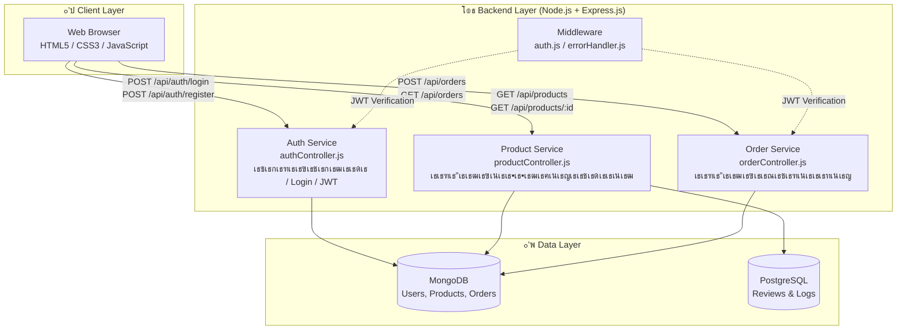

# เน€เธญเธเธชเธฒเธฃเธ‚เน‰เธญเธเธณเธซเธ™เธ”เธฃเธฐเธšเธš (System Requirement Specification) เนเธฅเธฐ เธชเธ–เธฒเธ›เธฑเธ•เธขเธเธฃเธฃเธกเธฃเธฐเธšเธš

**เน‚เธ„เธฃเธ‡เธเธฒเธฃ:** AutoParts Pro - เธฃเธฐเธšเธšเธฃเน‰เธฒเธ™เธ„เน‰เธฒเธญเธญเธ™เน„เธฅเธ™เนŒเธ‚เธฒเธขเธญเธธเธ›เธเธฃเธ“เนŒเนเธ•เนˆเธ‡เธฃเธ– (E-Commerce)

| เน€เธงเธญเธฃเนŒเธŠเธฑเธ™ | เธงเธฑเธ™เธ—เธตเนˆเนเธเน‰เน„เธ‚ | เธœเธนเน‰เธˆเธฑเธ”เธ—เธณ | เธฃเธฒเธขเธฅเธฐเน€เธญเธตเธขเธ”เธเธฒเธฃเน€เธ›เธฅเธตเนˆเธขเธ™เนเธ›เธฅเธ‡ |
| :---: | :---: | :---: | :---: |
| 1.0 | 2026-07-17 | [Nattapong  jullaruji       67117379] | (Project Documentation) |
| 2.0 | 2026-07-17 | [Kasidech  niamthong        67117355] | (Team Member) |
| 3.0 | 2026-07-17 | [Nuttawat  pinpun           67117324] | (Team Member) |
| 4.0 | 2026-07-17 | [Thanachon  chaengcharoen   67095854] | (Team Member) |
| 5.0 | 2026-07-17 | [Nantawat  sungnui          67108332] | (Team Member) |
| 6.0 | 2026-07-24 | [เธ—เธตเธกเธžเธฑเธ’เธ™เธฒ] | เน€เธžเธดเนˆเธกเธเธฃเธ“เธตเธ—เธ”เธชเธญเธš UAT-C-13โ€“18, UAT-M-06, UAT-A-09, UAT-BP-01โ€“03 เธžเธฃเน‰เธญเธกเธ•เธฒเธฃเธฒเธ‡ Test Coverage Summary เนเธฅเธฐ Issue Log (ISS-01โ€“ISS-05) |

---

## เธชเธฒเธฃเธšเธฑเธ
1. [เธ เธฒเธžเธฃเธงเธกเน‚เธ„เธฃเธ‡เธเธฒเธฃ](#1-เธ เธฒเธžเธฃเธงเธกเน‚เธ„เธฃเธ‡เธเธฒเธฃ)
2. [เธชเธ–เธฒเธ›เธฑเธ•เธขเธเธฃเธฃเธกเธฃเธฐเธšเธš (System Architecture)](#2-เธชเธ–เธฒเธ›เธฑเธ•เธขเธเธฃเธฃเธกเธฃเธฐเธšเธš-system-architecture)
3. [Class Diagram](#3-class-diagram)
4. [เน‚เธ„เธฃเธ‡เธชเธฃเน‰เธฒเธ‡เน‚เธ›เธฃเน€เธˆเธเธ•เนŒ (Project Structure)](#4-เน‚เธ„เธฃเธ‡เธชเธฃเน‰เธฒเธ‡เน‚เธ›เธฃเน€เธˆเธเธ•เนŒ-project-structure)
5. [เธ„เธงเธฒเธกเธ•เน‰เธญเธ‡เธเธฒเธฃเธ”เน‰เธฒเธ™เธŸเธฑเธ‡เธเนŒเธŠเธฑเธ™เธเธฒเธฃเธ—เธณเธ‡เธฒเธ™ (Functional Requirements)](#5-เธ„เธงเธฒเธกเธ•เน‰เธญเธ‡เธเธฒเธฃเธ”เน‰เธฒเธ™เธŸเธฑเธ‡เธเนŒเธŠเธฑเธ™เธเธฒเธฃเธ—เธณเธ‡เธฒเธ™-functional-requirements)
6. [เธ„เธงเธฒเธกเธ•เน‰เธญเธ‡เธเธฒเธฃเธ”เน‰เธฒเธ™เธ—เธตเนˆเน„เธกเนˆเนƒเธŠเนˆเธŸเธฑเธ‡เธเนŒเธŠเธฑเธ™ (Non-Functional Requirements)](#6-เธ„เธงเธฒเธกเธ•เน‰เธญเธ‡เธเธฒเธฃเธ”เน‰เธฒเธ™เธ—เธตเนˆเน„เธกเนˆเนƒเธŠเนˆเธŸเธฑเธ‡เธเนŒเธŠเธฑเธ™-non-functional-requirements)
7. [เธเธฒเธฃเธ›เธฃเธฐเธขเธธเธเธ•เนŒเนƒเธŠเน‰ Software Design Principles](#7-เธเธฒเธฃเธ›เธฃเธฐเธขเธธเธเธ•เนŒเนƒเธŠเน‰-software-design-principles)
8. [เธงเธดเธ˜เธตเธเธฒเธฃเธ•เธดเธ”เธ•เธฑเน‰เธ‡เนเธฅเธฐเนƒเธŠเน‰เธ‡เธฒเธ™ (Installation)](#8-เธงเธดเธ˜เธตเธเธฒเธฃเธ•เธดเธ”เธ•เธฑเน‰เธ‡เนเธฅเธฐเนƒเธŠเน‰เธ‡เธฒเธ™-installation)
9. [User Acceptance Testing (UAT)](#9-user-acceptance-testing-uat)
   - 9.6 [เธชเธฃเธธเธ›เธˆเธณเธ™เธงเธ™เธเธฃเธ“เธตเธ—เธ”เธชเธญเธšเนเธฅเธฐเธ‚เน‰เธญเธšเธเธžเธฃเนˆเธญเธ‡เธ—เธตเนˆเธžเธš](#96-เธชเธฃเธธเธ›เธˆเธณเธ™เธงเธ™เธเธฃเธ“เธตเธ—เธ”เธชเธญเธšเนเธฅเธฐเธ‚เน‰เธญเธšเธเธžเธฃเนˆเธญเธ‡เธ—เธตเนˆเธžเธš-test-coverage--issue-log)
   - 9.7 [เธซเธฅเธฑเธเธเธฒเธ™เธ›เธฃเธฐเธเธญเธšเธเธฒเธฃเธ—เธ”เธชเธญเธš](#97-เธซเธฅเธฑเธเธเธฒเธ™เธ›เธฃเธฐเธเธญเธšเธเธฒเธฃเธ—เธ”เธชเธญเธš-test-evidence)

---

## 1. เธ เธฒเธžเธฃเธงเธกเน‚เธ„เธฃเธ‡เธเธฒเธฃ

**AutoParts Pro** เน€เธ›เน‡เธ™เนเธžเธฅเธ•เธŸเธญเธฃเนŒเธก E-Commerce เธชเธณเธซเธฃเธฑเธšเธˆเธฑเธ”เธˆเธณเธซเธ™เนˆเธฒเธขเธญเธธเธ›เธเธฃเธ“เนŒเนเธ•เนˆเธ‡เธฃเธ–เธขเธ™เธ•เนŒเนเธฅเธฐเธญเธฐเน„เธซเธฅเนˆเธฃเธ–เธขเธ™เธ•เนŒเนเธšเธšเธ„เธฃเธšเธงเธ‡เธˆเธฃ เน‚เธ”เธขเธกเธตเน€เธ›เน‰เธฒเธซเธกเธฒเธขเน€เธžเธทเนˆเธญเธญเธณเธ™เธงเธขเธ„เธงเธฒเธกเธชเธฐเธ”เธงเธเนƒเธซเน‰เธœเธนเน‰เธ—เธตเนˆเธฃเธฑเธเธเธฒเธฃเนเธ•เนˆเธ‡เธฃเธ–เธชเธฒเธกเธฒเธฃเธ–เธ„เน‰เธ™เธซเธฒ เน€เธ›เธฃเธตเธขเธšเน€เธ—เธตเธขเธš เนเธฅเธฐเธชเธฑเนˆเธ‡เธ‹เธทเน‰เธญเธชเธดเธ™เธ„เน‰เธฒเน„เธ”เน‰เธญเธขเนˆเธฒเธ‡เธฃเธงเธ”เน€เธฃเน‡เธงเนเธฅเธฐเธ›เธฅเธญเธ”เธ เธฑเธขเธœเนˆเธฒเธ™เธฃเธฐเธšเธšเธญเธญเธ™เน„เธฅเธ™เนŒ

เธฃเธฐเธšเธšเธ–เธนเธเนเธšเนˆเธ‡เธญเธญเธเน€เธ›เน‡เธ™ 2 เธชเนˆเธงเธ™เธซเธฅเธฑเธเธ„เธทเธญ **Frontend** (Static Website) เนเธฅเธฐ **Backend** (RESTful API Server) เธ—เธตเนˆเนเธขเธเธเธฑเธ™เธ—เธณเธ‡เธฒเธ™เนเธฅเธฐเธชเธทเนˆเธญเธชเธฒเธฃเธเธฑเธ™เธœเนˆเธฒเธ™ HTTP

---

## 2. เธชเธ–เธฒเธ›เธฑเธ•เธขเธเธฃเธฃเธกเธฃเธฐเธšเธš (System Architecture)

เธชเธ–เธฒเธ›เธฑเธ•เธขเธเธฃเธฃเธกเธ‚เธญเธ‡ AutoParts Pro เธ–เธนเธเธญเธญเธเนเธšเธšเน‚เธ”เธขเนƒเธŠเน‰เธซเธฅเธฑเธเธเธฒเธฃ **Separation of Concerns** เนเธšเนˆเธ‡เธฃเธฐเธšเธšเธญเธญเธเน€เธ›เน‡เธ™ 3 Layer เธซเธฅเธฑเธ เน„เธ”เน‰เนเธเนˆ Client Layer, Backend Layer เนเธฅเธฐ Data Layer เน‚เธ”เธขเธ—เธธเธเธชเนˆเธงเธ™เธชเธทเนˆเธญเธชเธฒเธฃเธเธฑเธ™เธœเนˆเธฒเธ™ REST API



### 2.1 เธเธฒเธฃเธงเธดเน€เธ„เธฃเธฒเธฐเธซเนŒเนเธฅเธฐเธญเธญเธเนเธšเธš (Analysis & Design)

เธเธฒเธฃเธงเธดเน€เธ„เธฃเธฒเธฐเธซเนŒเธชเธ–เธฒเธ›เธฑเธ•เธขเธเธฃเธฃเธกเธ•เธฒเธกเธญเธ‡เธ„เนŒเธ›เธฃเธฐเธเธญเธšเธซเธฅเธฑเธ (Architecture Analysis):

- **Frontend Architecture:**
  - เน‚เธ„เธฃเธ‡เธชเธฃเน‰เธฒเธ‡: เนƒเธŠเน‰ HTML5, CSS3, JavaScript (Vanilla) เนƒเธ™เธเธฒเธฃเนเธชเธ”เธ‡เธœเธฅ UI
  - เธเธฒเธฃเธญเธญเธเนเธšเธš: เธกเธธเนˆเธ‡เน€เธ™เน‰เธ™เธเธฒเธฃเธ—เธณ Responsive Design เน€เธžเธทเนˆเธญเนƒเธซเน‰เธฃเธญเธ‡เธฃเธฑเธš Mobile เนเธฅเธฐ Desktop เธฃเธงเธกเธ–เธถเธ‡เธ›เธฃเธฑเธšเนเธ•เนˆเธ‡ UX/UI เนƒเธซเน‰เน€เธ›เน‡เธ™ Dark Theme เนƒเธซเน‰เน€เธ‚เน‰เธฒเธเธฑเธšเธชเธดเธ™เธ„เน‰เธฒเธฃเธ–เธขเธ™เธ•เนŒ

- **Backend Architecture:**
  - เน‚เธ„เธฃเธ‡เธชเธฃเน‰เธฒเธ‡: เน€เธ›เน‡เธ™เนเธšเธš Monolithic Architecture เน‚เธ”เธขเนƒเธŠเน‰ Node.js เธฃเนˆเธงเธกเธเธฑเธš Express.js
  - เธเธฒเธฃเธ—เธณเธ‡เธฒเธ™: เธˆเธฑเธ”เธเธฒเธฃ Business Logic เนเธฅเธฐเนƒเธซเน‰เธšเธฃเธดเธเธฒเธฃ RESTful API เนเธเนˆ Frontend (เนเธšเนˆเธ‡เน€เธ›เน‡เธ™ Auth, Product, Order Services)

- **Database Architecture:**
  - เน‚เธ„เธฃเธ‡เธชเธฃเน‰เธฒเธ‡: เนƒเธŠเน‰ MongoDB เน€เธ›เน‡เธ™ Primary Database เน€เธžเธทเนˆเธญเธˆเธฑเธ”เน€เธเน‡เธš User, Product, Order เธ—เธตเนˆเน‚เธ„เธฃเธ‡เธชเธฃเน‰เธฒเธ‡เธขเธทเธ”เธซเธขเธธเนˆเธ™เน„เธ”เน‰
  - เธเธฒเธฃเธˆเธฑเธ”เน€เธเน‡เธš Log/Review: เนƒเธŠเน‰ PostgreSQL เธชเธณเธซเธฃเธฑเธšเธชเนˆเธงเธ™เธ—เธตเนˆเธ•เน‰เธญเธ‡เธเธฒเธฃเน‚เธ„เธฃเธ‡เธชเธฃเน‰เธฒเธ‡ Relational เธญเธขเนˆเธฒเธ‡เธŠเธฑเธ”เน€เธˆเธ™

**[Screenshot เธœเธฅเธฅเธฑเธžเธ˜เนŒเธซเธ™เน‰เธฒเน€เธงเน‡เธšเน„เธ‹เธ•เนŒ / เธเธฒเธฃเธ—เธณเธ‡เธฒเธ™เธ‚เธญเธ‡เธฃเธฐเธšเธš]**


---

## 3. Class Diagram

> **Class Diagram** เนเธชเธ”เธ‡เน‚เธ„เธฃเธ‡เธชเธฃเน‰เธฒเธ‡เธ‚เธญเธ‡เธฃเธฐเธšเธš AutoParts Pro เธ„เธฃเธญเธšเธ„เธฅเธธเธก Models, Controllers, Middleware เนเธฅเธฐเธ„เธงเธฒเธกเธชเธฑเธกเธžเธฑเธ™เธ˜เนŒเธฃเธฐเธซเธงเนˆเธฒเธ‡ Class เธ—เธฑเน‰เธ‡เธซเธกเธ”

### เธชเธฑเธเธฅเธฑเธเธฉเธ“เนŒ

| Symbol | เธ„เธงเธฒเธกเธซเธกเธฒเธข |
|:------:|----------|
| `+` | Public โ€” เน€เธฃเธตเธขเธเน„เธ”เน‰เธˆเธฒเธเธ เธฒเธขเธ™เธญเธ class |
| `-` | Private โ€” เน€เธฃเธตเธขเธเน„เธ”เน‰เน€เธ‰เธžเธฒเธฐเธ เธฒเธขเนƒเธ™ class |
| `โ—†โ”€โ”€` | Composition โ€” OrderItem เธญเธขเธนเนˆเนƒเธ™ Order (JSONB embedded) |
| `โ”€โ”€โ–ท` | Association โ€” เธ„เธงเธฒเธกเธชเธฑเธกเธžเธฑเธ™เธ˜เนŒเธฃเธฐเธซเธงเนˆเธฒเธ‡ class |
| `- - โ–ท` | Dependency โ€” Controller/Middleware เนƒเธŠเน‰เธ‡เธฒเธ™ Model |

### Diagram


### เธ„เธฅเธฒเธชเธ—เธฑเน‰เธ‡เธซเธกเธ”เนƒเธ™เธฃเธฐเธšเธš

| เธเธฅเธธเนˆเธก | Classes |
|-------|---------|
| **Models** | `User`, `Product`, `Order`, `OrderItem`, `ProductReview` |
| **DB Tables** | `Role`, `PartBrand`, `CarBrand` |
| **Controllers** | `AuthController`, `ProductController`, `OrderController`, `UserController` |
| **Middleware** | `AuthMiddleware` |

---

## 4. เน‚เธ„เธฃเธ‡เธชเธฃเน‰เธฒเธ‡เน‚เธ›เธฃเน€เธˆเธเธ•เนŒ (Project Structure)

เน‚เธ„เธฃเธ‡เธชเธฃเน‰เธฒเธ‡เน‚เธŸเธฅเน€เธ”เธญเธฃเนŒเธ–เธนเธเธญเธญเธเนเธšเธšเธ•เธฒเธกเธซเธฅเธฑเธ **Modularity** เนเธขเธเธ„เธงเธฒเธกเธฃเธฑเธšเธœเธดเธ”เธŠเธญเธšเธ‚เธญเธ‡เนเธ•เนˆเธฅเธฐเธชเนˆเธงเธ™เธญเธขเนˆเธฒเธ‡เธŠเธฑเธ”เน€เธˆเธ™:

```text
PJ_Car-Accessories/
โ”œโ”€โ”€ frontend/                   # Frontend (Static Website)
โ”‚   โ”œโ”€โ”€ index.html              # เธซเธ™เน‰เธฒเนเธฃเธ
โ”‚   โ”œโ”€โ”€ css/
โ”‚   โ”‚   โ”œโ”€โ”€ styles.css          # Stylesheet เธซเธฅเธฑเธ
โ”‚   โ”‚   โ””โ”€โ”€ pages.css           # Styles เธซเธ™เน‰เธฒเธขเนˆเธญเธข
โ”‚   โ”œโ”€โ”€ js/
โ”‚   โ”‚   โ””โ”€โ”€ app.js              # JavaScript เธซเธฅเธฑเธ
โ”‚   โ”œโ”€โ”€ pages/
โ”‚   โ”‚   โ”œโ”€โ”€ product.html        # เธซเธ™เน‰เธฒเธฃเธฒเธขเธฅเธฐเน€เธญเธตเธขเธ”เธชเธดเธ™เธ„เน‰เธฒ
โ”‚   โ”‚   โ””โ”€โ”€ cart.html           # เธซเธ™เน‰เธฒเธ•เธฐเธเธฃเน‰เธฒเธชเธดเธ™เธ„เน‰เธฒ
โ”‚
โ”œโ”€โ”€ backend/                    # Backend (API Server)
โ”‚   โ”œโ”€โ”€ server.js               # Entry point เธ‚เธญเธ‡เธฃเธฐเธšเธš
โ”‚   โ”œโ”€โ”€ package.json            # Dependencies
โ”‚   โ”œโ”€โ”€ config/
โ”‚   โ”‚   โ”œโ”€โ”€ db.js               # เธˆเธฑเธ”เธเธฒเธฃเธเธฒเธฃเน€เธŠเธทเนˆเธญเธกเธ•เนˆเธญเธเธฒเธ™เธ‚เน‰เธญเธกเธนเธฅ MongoDB
โ”‚   โ”œโ”€โ”€ models/                 # Schemas เธ‚เธญเธ‡เธเธฒเธ™เธ‚เน‰เธญเธกเธนเธฅ (User, Product, Order)
โ”‚   โ”œโ”€โ”€ controllers/            # Business Logic เธ‚เธญเธ‡เธฃเธฐเธšเธš
โ”‚   โ”œโ”€โ”€ routes/                 # เธเธณเธซเธ™เธ”เน€เธชเน‰เธ™เธ—เธฒเธ‡ (Endpoint) เธ‚เธญเธ‡ REST API
โ”‚   โ””โ”€โ”€ middleware/             # เธŠเธฑเน‰เธ™เธเธฅเธฒเธ‡เธ•เธฃเธงเธˆเธชเธญเธš JWT เนเธฅเธฐ Error
โ”‚
โ”œโ”€โ”€ .gitignore                  # เธเธณเธซเธ™เธ”เน„เธŸเธฅเนŒเธ—เธตเนˆเน„เธกเนˆเธ•เน‰เธญเธ‡เธ™เธณเธ‚เธถเน‰เธ™ Git
โ””โ”€โ”€ README.md                   # เน€เธญเธเธชเธฒเธฃเธญเธ˜เธดเธšเธฒเธขเน‚เธ›เธฃเน€เธˆเธเธ•เนŒเธ‰เธšเธฑเธšเธ™เธตเน‰
```

---

## 5. เธ„เธงเธฒเธกเธ•เน‰เธญเธ‡เธเธฒเธฃเธ”เน‰เธฒเธ™เธŸเธฑเธ‡เธเนŒเธŠเธฑเธ™เธเธฒเธฃเธ—เธณเธ‡เธฒเธ™ (Functional Requirements)

### 4.1 เธฃเธฐเธšเธšเธซเธ™เน‰เธฒเน€เธงเน‡เธšเธชเธณเธซเธฃเธฑเธšเธฅเธนเธเธ„เน‰เธฒ (Customer Frontend)

| เธฃเธซเธฑเธช | เธŸเธฑเธ‡เธเนŒเธŠเธฑเธ™ | เธฃเธฒเธขเธฅเธฐเน€เธญเธตเธขเธ” | เธ„เธงเธฒเธกเธชเธณเธ„เธฑเธ |
| :---: | :--- | :--- | :---: |
| **C-01** | เนเธชเธ”เธ‡เธฃเธฒเธขเธเธฒเธฃเธชเธดเธ™เธ„เน‰เธฒ | เนเธชเธ”เธ‡เธฃเธฒเธขเธเธฒเธฃเธญเธธเธ›เธเธฃเธ“เนŒเนเธ•เนˆเธ‡เธฃเธ–เธžเธฃเน‰เธญเธกเธฃเธนเธ›เธ เธฒเธž เธฃเธฒเธ„เธฒ เนเธฅเธฐเธฃเธฒเธขเธฅเธฐเน€เธญเธตเธขเธ”เน€เธšเธทเน‰เธญเธ‡เธ•เน‰เธ™ | High |
| **C-02** | เธ„เน‰เธ™เธซเธฒเนเธฅเธฐเธเธฃเธญเธ‡เธชเธดเธ™เธ„เน‰เธฒ | เธ„เน‰เธ™เธซเธฒเธ•เธฒเธกเธŠเธทเนˆเธญ, เนเธšเธฃเธ™เธ”เนŒเธฃเธ–เธขเธ™เธ•เนŒ เนเธฅเธฐเธซเธกเธงเธ”เธซเธกเธนเนˆ | High |
| **C-03** | เธ”เธนเธฃเธฒเธขเธฅเธฐเน€เธญเธตเธขเธ”เธชเธดเธ™เธ„เน‰เธฒ | เธซเธ™เน‰เธฒ Product Detail เนเธชเธ”เธ‡เธ‚เน‰เธญเธกเธนเธฅเน€เธŠเธดเธ‡เธฅเธถเธ เธ„เธฐเนเธ™เธ™เธฃเธตเธงเธดเธง | High |
| **C-04** | เธ•เธฐเธเธฃเน‰เธฒเธชเธดเธ™เธ„เน‰เธฒ | เน€เธžเธดเนˆเธก/เธฅเธ”/เธฅเธšเธชเธดเธ™เธ„เน‰เธฒเนƒเธ™เธ•เธฐเธเธฃเน‰เธฒ เนเธฅเธฐเธชเธฃเธธเธ›เธขเธญเธ”เธฃเธฒเธ„เธฒเธฃเธงเธก | High |
| **C-05** | เธŠเธณเธฃเธฐเน€เธ‡เธดเธ™ (Checkout) | เธเธฃเธญเธเธ—เธตเนˆเธญเธขเธนเนˆเธˆเธฑเธ”เธชเนˆเธ‡เนเธฅเธฐเธŠเธณเธฃเธฐเน€เธ‡เธดเธ™ เธชเธฃเน‰เธฒเธ‡เธ„เธณเธชเธฑเนˆเธ‡เธ‹เธทเน‰เธญเธœเนˆเธฒเธ™ `POST /api/orders` | High |
| **C-06** | เธชเธกเธฑเธ„เธฃเธชเธกเธฒเธŠเธดเธ/เน€เธ‚เน‰เธฒเธชเธนเนˆเธฃเธฐเธšเธš | เธฅเธ‡เธ—เธฐเน€เธšเธตเธขเธ™เนเธฅเธฐเน€เธ‚เน‰เธฒเธชเธนเนˆเธฃเธฐเธšเธšเธ”เน‰เธงเธข Email/Password (เธฃเธฑเธš JWT Token) | High |
| **C-07** | เธ›เธฃเธฐเธงเธฑเธ•เธดเธเธฒเธฃเธชเธฑเนˆเธ‡เธ‹เธทเน‰เธญ | เธฅเธนเธเธ„เน‰เธฒเธ”เธนเธฃเธฒเธขเธเธฒเธฃเธ„เธณเธชเธฑเนˆเธ‡เธ‹เธทเน‰เธญเธ‚เธญเธ‡เธ•เธ™เน€เธญเธ‡เน„เธ”เน‰เธœเนˆเธฒเธ™ `GET /api/orders` | Medium |

### 4.2 เธฃเธฐเธšเธšเธซเธฅเธฑเธ‡เธšเน‰เธฒเธ™ (Admin Dashboard)

| เธฃเธซเธฑเธช | เธŸเธฑเธ‡เธเนŒเธŠเธฑเธ™ | เธฃเธฒเธขเธฅเธฐเน€เธญเธตเธขเธ” | เธ„เธงเธฒเธกเธชเธณเธ„เธฑเธ |
| :---: | :--- | :--- | :---: |
| **A-01** | เธˆเธฑเธ”เธเธฒเธฃเธชเธดเธ™เธ„เน‰เธฒ | CRUD เธ‚เน‰เธญเธกเธนเธฅเธชเธดเธ™เธ„เน‰เธฒ เธœเนˆเธฒเธ™ `POST/PUT/DELETE /api/products` | High |
| **A-02** | เธˆเธฑเธ”เธเธฒเธฃเธญเธญเน€เธ”เธญเธฃเนŒ | เธ”เธนเธฃเธฒเธขเธเธฒเธฃเธ„เธณเธชเธฑเนˆเธ‡เธ‹เธทเน‰เธญเธ—เธฑเน‰เธ‡เธซเธกเธ”เนเธฅเธฐเธญเธฑเธžเน€เธ”เธ•เธชเธ–เธฒเธ™เธฐ | High |
| **A-03** | เธˆเธฑเธ”เธเธฒเธฃเธœเธนเน‰เนƒเธŠเน‰เธ‡เธฒเธ™ | เธ”เธนเธ‚เน‰เธญเธกเธนเธฅเธœเธนเน‰เนƒเธŠเน‰เนเธฅเธฐเธเธณเธซเธ™เธ”เธชเธดเธ—เธ˜เธดเนŒ (User/Admin) | Medium |

---

## 6. เธ„เธงเธฒเธกเธ•เน‰เธญเธ‡เธเธฒเธฃเธ”เน‰เธฒเธ™เธ—เธตเนˆเน„เธกเนˆเนƒเธŠเนˆเธŸเธฑเธ‡เธเนŒเธŠเธฑเธ™ (Non-Functional Requirements)

| เธฃเธซเธฑเธช | เธซเธฑเธงเธ‚เน‰เธญ | เธฃเธฒเธขเธฅเธฐเน€เธญเธตเธขเธ” |
| :---: | :--- | :--- |
| **N-01** | Performance | เธฃเธญเธ‡เธฃเธฑเธšเธเธฒเธฃ Checkout เธžเธฃเน‰เธญเธกเธเธฑเธ™เน„เธกเนˆเธ™เน‰เธญเธขเธเธงเนˆเธฒ 100 Users (เธœเนˆเธฒเธ™เธเธฒเธฃเธ—เธ”เธชเธญเธšเธ”เน‰เธงเธข JMeter เนเธฅเน‰เธง) |
| **N-02** | Security | เธฃเธซเธฑเธชเธœเนˆเธฒเธ™เน€เธ‚เน‰เธฒเธฃเธซเธฑเธชเธ”เน‰เธงเธข `bcrypt` เนเธฅเธฐ Private API เธ›เน‰เธญเธ‡เธเธฑเธ™เธ”เน‰เธงเธข `JWT` |
| **N-03** | Usability | เธฃเธญเธ‡เธฃเธฑเธš Responsive Design เธ—เธณเธ‡เธฒเธ™เน„เธ”เน‰เธ”เธตเธšเธ™ Desktop เนเธฅเธฐ Mobile |
| **N-04** | Maintainability | Backend เธˆเธฑเธ”เน‚เธ„เธฃเธ‡เธชเธฃเน‰เธฒเธ‡เนเธšเธš MVC Pattern |

---

## 7. เธเธฒเธฃเธ›เธฃเธฐเธขเธธเธเธ•เนŒเนƒเธŠเน‰ Software Design Principles

- **Separation of Concerns (SoC):** เนเธขเธเธฃเธฐเธšเธšเน€เธ›เน‡เธ™ Frontend, Backend เนเธฅเธฐ Database เธŠเธฑเธ”เน€เธˆเธ™ เน„เธกเนˆเธ›เธฐเธ›เธ™เธเธฑเธ™
- **Single Responsibility Principle (SRP):** เน„เธŸเธฅเนŒ Controller เนเธ•เนˆเธฅเธฐเน„เธŸเธฅเนŒเธฃเธฑเธšเธœเธดเธ”เธŠเธญเธšเธ‡เธฒเธ™เน€เธ”เธตเธขเธง (เน€เธŠเนˆเธ™ `authController.js` เธˆเธฑเธ”เธเธฒเธฃเน€เธ‰เธžเธฒเธฐเธชเนˆเธงเธ™ Auth)
- **Loose Coupling:** Frontend เธ•เธดเธ”เธ•เนˆเธญ Backend เธœเนˆเธฒเธ™ REST API เน€เธ—เนˆเธฒเธ™เธฑเน‰เธ™ เธŠเนˆเธงเธขเนƒเธซเน‰เธญเธฑเธ›เน€เธเธฃเธ”เธซเธฃเธทเธญเนเธเน‰เน„เธ‚เธชเนˆเธงเธ™เนƒเธ”เธชเนˆเธงเธ™เธซเธ™เธถเนˆเธ‡เน„เธ”เน‰เน‚เธ”เธขเน„เธกเนˆเธเธฃเธฐเธ—เธšเธญเธตเธเธชเนˆเธงเธ™
- **Security by Design:** เธ„เธงเธšเธ„เธธเธกเธชเธดเธ—เธ˜เธดเนŒเธเธฒเธฃเน€เธ‚เน‰เธฒเธ–เธถเธ‡เธ‚เน‰เธญเธกเธนเธฅเธœเนˆเธฒเธ™ Middleware (`auth.js`) เธ›เน‰เธญเธ‡เธเธฑเธ™เธœเธนเน‰เธ—เธตเนˆเน„เธกเนˆเน„เธ”เน‰ Login เธซเธฃเธทเธญเน„เธกเนˆเธกเธตเธชเธดเธ—เธ˜เธดเนŒ Admin เน„เธกเนˆเนƒเธซเน‰เน€เธ‚เน‰เธฒเธ–เธถเธ‡ API เธชเธณเธ„เธฑเธ

---

## 8. เธงเธดเธ˜เธตเธเธฒเธฃเธ•เธดเธ”เธ•เธฑเน‰เธ‡เนเธฅเธฐเนƒเธŠเน‰เธ‡เธฒเธ™ (Installation)

### เธเธฒเธฃเน€เธ•เธฃเธตเธขเธกเธ„เธงเธฒเธกเธžเธฃเน‰เธญเธก
- Node.js (v16 เธ‚เธถเน‰เธ™เน„เธ›)
- MongoDB

### เธ‚เธฑเน‰เธ™เธ•เธญเธ™เธเธฒเธฃเธฃเธฑเธ™เธฃเธฐเธšเธš Backend
```bash
# 1. เน€เธ‚เน‰เธฒเน„เธ›เธ—เธตเนˆเน‚เธŸเธฅเน€เธ”เธญเธฃเนŒ backend
cd backend

# 2. เธ•เธดเธ”เธ•เธฑเน‰เธ‡ Dependencies
npm install

# 3. เธฃเธฑเธ™ Server
npm start
```
*เธฃเธฐเธšเธšเธˆเธฐเน€เธ›เธดเธ”เธ—เธณเธ‡เธฒเธ™เธ—เธตเนˆเธžเธญเธฃเนŒเธ• `5000` (เน€เธŠเนˆเธ™ `http://localhost:5000/api`)*

### เธ‚เธฑเน‰เธ™เธ•เธญเธ™เธเธฒเธฃเธฃเธฑเธ™เธฃเธฐเธšเธš Frontend
เธชเธฒเธกเธฒเธฃเธ–เน€เธ›เธดเธ”เน„เธŸเธฅเนŒ `frontend/index.html` เธ”เน‰เธงเธข Live Server เธšเธ™ VS Code เน„เธ”เน‰เน€เธฅเธข

---

## 9. User Acceptance Testing (UAT)

### 9.1 เธซเธฅเธฑเธเธเธฒเธฃเธญเธญเธเนเธšเธš

เธเธฒเธฃเธ—เธ”เธชเธญเธš User Acceptance Testing (UAT) เธ‚เธญเธ‡เธฃเธฐเธšเธš **AutoParts Pro** เธญเธญเธเนเธšเธšเธ‚เธถเน‰เธ™เน‚เธ”เธขเธญเน‰เธฒเธ‡เธญเธดเธ‡เธˆเธฒเธ Persona เธœเธนเน‰เนƒเธŠเน‰เธ‡เธฒเธ™เธˆเธฃเธดเธ‡เนเธฅเธฐเธ„เธงเธฒเธกเธ•เน‰เธญเธ‡เธเธฒเธฃเน€เธŠเธดเธ‡เธŸเธฑเธ‡เธเนŒเธŠเธฑเธ™ (Functional Requirements) เธ—เธตเนˆเธฃเธฐเธšเธธเน„เธงเน‰เนƒเธ™เธซเธฑเธงเธ‚เน‰เธญเธ—เธตเนˆ 4 เธ‚เธญเธ‡เน€เธญเธเธชเธฒเธฃเธ‰เธšเธฑเธšเธ™เธตเน‰ เน‚เธ”เธขเธ”เธณเน€เธ™เธดเธ™เธเธฒเธฃเธ—เธ”เธชเธญเธšเนƒเธ™เธฃเธนเธ›เนเธšเธš Manual Testing เธœเนˆเธฒเธ™เน€เธ„เธฃเธทเนˆเธญเธ‡เธกเธทเธญ Postman เธ„เธงเธšเธ„เธนเนˆเธเธฑเธšเธเธฒเธฃเนƒเธŠเน‰เธ‡เธฒเธ™เธˆเธฃเธดเธ‡เธœเนˆเธฒเธ™เธซเธ™เน‰เธฒเน€เธงเน‡เธšเน„เธ‹เธ•เนŒ (Frontend) เน€เธžเธทเนˆเธญเธขเธทเธ™เธขเธฑเธ™เธงเนˆเธฒเธฃเธฐเธšเธšเธชเธฒเธกเธฒเธฃเธ–เธ—เธณเธ‡เธฒเธ™เน„เธ”เน‰เธ•เธฃเธ‡เธ•เธฒเธกเธ„เธงเธฒเธกเธ•เน‰เธญเธ‡เธเธฒเธฃเธ‚เธญเธ‡เธœเธนเน‰เนƒเธŠเน‰เธ‡เธฒเธ™เนเธ•เนˆเธฅเธฐเธเธฅเธธเนˆเธกเธเนˆเธญเธ™เธชเนˆเธ‡เธกเธญเธš

### 9.2 เธ‚เธฑเน‰เธ™เธ•เธญเธ™เธ—เธตเนˆ 1: เธงเธดเน€เธ„เธฃเธฒเธฐเธซเนŒ Persona เธœเธนเน‰เนƒเธŠเน‰เธ‡เธฒเธ™เธซเธฅเธฑเธ

เธฃเธฐเธšเธš AutoParts Pro เธกเธตเธเธฒเธฃเธ„เธงเธšเธ„เธธเธกเธชเธดเธ—เธ˜เธดเนŒเธเธฒเธฃเน€เธ‚เน‰เธฒเธ–เธถเธ‡ (Role-Based Access Control) เธœเนˆเธฒเธ™เธ•เธฒเธฃเธฒเธ‡ `roles` เนเธฅเธฐ Middleware `protect` / `adminOnly` / `managerOrAdmin` เน‚เธ”เธขเนเธšเนˆเธ‡เธœเธนเน‰เนƒเธŠเน‰เธ‡เธฒเธ™เธญเธญเธเน€เธ›เน‡เธ™ 3 เธเธฅเธธเนˆเธกเธซเธฅเธฑเธ เธ”เธฑเธ‡เธ™เธตเน‰

| Persona | Role เนƒเธ™เธฃเธฐเธšเธš | เธ„เธงเธฒเธกเธชเธฒเธกเธฒเธฃเธ–เธซเธฅเธฑเธ |
| :--- | :---: | :--- |
| **เธฅเธนเธเธ„เน‰เธฒ (Customer)** | `user` | เธชเธกเธฑเธ„เธฃเธชเธกเธฒเธŠเธดเธ/เน€เธ‚เน‰เธฒเธชเธนเนˆเธฃเธฐเธšเธš, เธ„เน‰เธ™เธซเธฒ/เน€เธฅเธทเธญเธเธ”เธนเธชเธดเธ™เธ„เน‰เธฒ, เน€เธžเธดเนˆเธกเธชเธดเธ™เธ„เน‰เธฒเธฅเธ‡เธ•เธฐเธเธฃเน‰เธฒ, เธชเธฑเนˆเธ‡เธ‹เธทเน‰เธญเธชเธดเธ™เธ„เน‰เธฒ (Checkout), เธ”เธนเธ›เธฃเธฐเธงเธฑเธ•เธดเธ„เธณเธชเธฑเนˆเธ‡เธ‹เธทเน‰เธญเธ‚เธญเธ‡เธ•เธ™เน€เธญเธ‡, เธขเธเน€เธฅเธดเธเธ„เธณเธชเธฑเนˆเธ‡เธ‹เธทเน‰เธญ (เน€เธ‰เธžเธฒเธฐเธชเธ–เธฒเธ™เธฐ "เธฃเธญเธ”เธณเน€เธ™เธดเธ™เธเธฒเธฃ"), เนเธเน‰เน„เธ‚เธ‚เน‰เธญเธกเธนเธฅเน‚เธ›เธฃเน„เธŸเธฅเนŒ |
| **เธžเธ™เธฑเธเธ‡เธฒเธ™/เธœเธนเน‰เธˆเธฑเธ”เธเธฒเธฃ (Manager)** | `manager` | เธ”เธนเธ„เธณเธชเธฑเนˆเธ‡เธ‹เธทเน‰เธญเธ—เธฑเน‰เธ‡เธซเธกเธ”เธ‚เธญเธ‡เธฅเธนเธเธ„เน‰เธฒเธ—เธธเธเธ„เธ™ (`/api/orders/admin/all`), เธ„เน‰เธ™เธซเธฒเธญเธญเน€เธ”เธญเธฃเนŒเธ•เธฒเธกเธŠเธทเนˆเธญ/เธญเธตเน€เธกเธฅเธฅเธนเธเธ„เน‰เธฒ, เธญเธฑเธ›เน€เธ”เธ•เธชเธ–เธฒเธ™เธฐเธ„เธณเธชเธฑเนˆเธ‡เธ‹เธทเน‰เธญเนเธฅเธฐเน€เธฅเธ‚เธžเธฑเธชเธ”เธธ (`/api/orders/:id/status`) |
| **เธœเธนเน‰เธ”เธนเนเธฅเธฃเธฐเธšเธš (Admin)** | `admin` | เธชเธดเธ—เธ˜เธดเนŒเธ—เธฑเน‰เธ‡เธซเธกเธ”เธ‚เธญเธ‡ Manager เน€เธžเธดเนˆเธกเน€เธ•เธดเธกเธ”เน‰เธงเธขเธเธฒเธฃเธˆเธฑเธ”เธเธฒเธฃเธชเธดเธ™เธ„เน‰เธฒ (เน€เธžเธดเนˆเธก/เนเธเน‰เน„เธ‚/เธฅเธš เธœเนˆเธฒเธ™ `/api/products`) เนเธฅเธฐเธˆเธฑเธ”เธเธฒเธฃเธœเธนเน‰เนƒเธŠเน‰เธ‡เธฒเธ™ (เธ”เธนเธฃเธฒเธขเธŠเธทเนˆเธญ/เธ›เธฃเธฑเธš role เธœเนˆเธฒเธ™ `/api/users`) |

### 9.3 เธ‚เธฑเน‰เธ™เธ•เธญเธ™เธ—เธตเนˆ 2: เธญเธญเธเนเธšเธš UAT Test Case

#### 9.3.1 เธเธฅเธธเนˆเธก Customer

| Test Case ID | เธงเธฑเธ•เธ–เธธเธ›เธฃเธฐเธชเธ‡เธ„เนŒ | เธ‚เน‰เธญเธกเธนเธฅเธ™เธณเน€เธ‚เน‰เธฒ (Input) | เธ‚เธฑเน‰เธ™เธ•เธญเธ™เธเธฒเธฃเธ—เธ”เธชเธญเธš | เธœเธฅเธฅเธฑเธžเธ˜เนŒเธ—เธตเนˆเธ„เธฒเธ”เธซเธงเธฑเธ‡ (Expected Result) |
| :---: | :--- | :--- | :--- | :--- |
| UAT-C-01 | เธชเธกเธฑเธ„เธฃเธชเธกเธฒเธŠเธดเธเธ”เน‰เธงเธขเธ‚เน‰เธญเธกเธนเธฅเธ–เธนเธเธ•เน‰เธญเธ‡ | name, email เธ—เธตเนˆเน„เธกเนˆเธ‹เน‰เธณ, password โ‰ฅ 6 เธ•เธฑเธงเธญเธฑเธเธฉเธฃ | เน€เธ›เธดเธ” `register.html` โ†’ เธเธฃเธญเธเธŸเธญเธฃเนŒเธก โ†’ เธขเธญเธกเธฃเธฑเธšเน€เธ‡เธทเนˆเธญเธ™เน„เธ‚ โ†’ เธเธ”เธชเธกเธฑเธ„เธฃเธชเธกเธฒเธŠเธดเธ | `POST /api/auth/register` เธ•เธญเธš `201 Created` เธžเธฃเน‰เธญเธก JWT token, เธฃเธฐเธšเธšเธžเธฒเน„เธ›เธซเธ™เน‰เธฒเนเธฃเธเธญเธฑเธ•เน‚เธ™เธกเธฑเธ•เธด |
| UAT-C-02 | เธชเธกเธฑเธ„เธฃเธชเธกเธฒเธŠเธดเธเธ”เน‰เธงเธขเธญเธตเน€เธกเธฅเธ—เธตเนˆเธ‹เน‰เธณเนƒเธ™เธฃเธฐเธšเธš (Negative) | เธญเธตเน€เธกเธฅเธ—เธตเนˆเธกเธตเธญเธขเธนเนˆเนเธฅเน‰เธง | เธเธฃเธญเธเธŸเธญเธฃเนŒเธกเธ”เน‰เธงเธขเธญเธตเน€เธกเธฅเธ‹เน‰เธณ โ†’ เธเธ”เธชเธกเธฑเธ„เธฃเธชเธกเธฒเธŠเธดเธ | เธฃเธฐเธšเธšเธ•เธญเธš `400 Bad Request` เธžเธฃเน‰เธญเธกเธ‚เน‰เธญเธ„เธงเธฒเธก "เธญเธตเน€เธกเธฅเธ™เธตเน‰เธ–เธนเธเนƒเธŠเน‰เธ‡เธฒเธ™เนเธฅเน‰เธง" เนเธฅเธฐเน„เธกเนˆเธชเธฃเน‰เธฒเธ‡เธšเธฑเธเธŠเธตเธ‹เน‰เธณ |
| UAT-C-03 | เน€เธ‚เน‰เธฒเธชเธนเนˆเธฃเธฐเธšเธšเธ”เน‰เธงเธขเธ‚เน‰เธญเธกเธนเธฅเธ–เธนเธเธ•เน‰เธญเธ‡ | เธญเธตเน€เธกเธฅ/เธฃเธซเธฑเธชเธœเนˆเธฒเธ™เธ—เธตเนˆเธ–เธนเธเธ•เน‰เธญเธ‡ | เน€เธ›เธดเธ” `login.html` โ†’ เธเธฃเธญเธเธญเธตเน€เธกเธฅ/เธฃเธซเธฑเธชเธœเนˆเธฒเธ™ โ†’ เธเธ”เน€เธ‚เน‰เธฒเธชเธนเนˆเธฃเธฐเธšเธš | `POST /api/auth/login` เธ•เธญเธš `200 OK` เธžเธฃเน‰เธญเธก token, เธšเธฑเธ™เธ—เธถเธ `authToken`/`currentUser` เนƒเธ™ localStorage |
| UAT-C-04 | เน€เธ‚เน‰เธฒเธชเธนเนˆเธฃเธฐเธšเธšเธ”เน‰เธงเธขเธฃเธซเธฑเธชเธœเนˆเธฒเธ™เธœเธดเธ” (Negative) | เธญเธตเน€เธกเธฅเธ–เธนเธเธ•เน‰เธญเธ‡, เธฃเธซเธฑเธชเธœเนˆเธฒเธ™เธœเธดเธ” | เธเธฃเธญเธเธญเธตเน€เธกเธฅเธ–เธนเธเธ•เน‰เธญเธ‡เนเธ•เนˆเธฃเธซเธฑเธชเธœเนˆเธฒเธ™เธœเธดเธ” โ†’ เธเธ”เน€เธ‚เน‰เธฒเธชเธนเนˆเธฃเธฐเธšเธš | เธฃเธฐเธšเธšเธ•เธญเธš `401 Unauthorized` เธžเธฃเน‰เธญเธกเธ‚เน‰เธญเธ„เธงเธฒเธก "เธญเธตเน€เธกเธฅเธซเธฃเธทเธญเธฃเธซเธฑเธชเธœเนˆเธฒเธ™เน„เธกเนˆเธ–เธนเธเธ•เน‰เธญเธ‡" |
| UAT-C-05 | เธ„เน‰เธ™เธซเธฒเนเธฅเธฐเธเธฃเธญเธ‡เธชเธดเธ™เธ„เน‰เธฒ | เธ„เธณเธ„เน‰เธ™ + category + เธŠเนˆเธงเธ‡เธฃเธฒเธ„เธฒ | เน„เธ›เธซเธ™เน‰เธฒเนเธฃเธ/เธชเธดเธ™เธ„เน‰เธฒ โ†’ เธžเธดเธกเธžเนŒเธ„เธณเธ„เน‰เธ™ โ†’ เน€เธฅเธทเธญเธ filter เธซเธกเธงเธ”เธซเธกเธนเนˆ/เนเธšเธฃเธ™เธ”เนŒเธฃเธ–/เธฃเธฒเธ„เธฒ | `GET /api/products?...` เธ„เธทเธ™เน€เธ‰เธžเธฒเธฐเธชเธดเธ™เธ„เน‰เธฒเธ—เธตเนˆเธ•เธฃเธ‡เน€เธ‡เธทเนˆเธญเธ™เน„เธ‚เธ„เน‰เธ™เธซเธฒเนเธฅเธฐ filter เธ—เธธเธเธ•เธฑเธงเธžเธฃเน‰เธญเธกเธเธฑเธ™ |
| UAT-C-06 | เน€เธžเธดเนˆเธกเธชเธดเธ™เธ„เน‰เธฒเธฅเธ‡เธ•เธฐเธเธฃเน‰เธฒเนเธฅเธฐเธชเธฑเนˆเธ‡เธ‹เธทเน‰เธญ (Checkout) | เธชเธดเธ™เธ„เน‰เธฒเธ—เธตเนˆเธกเธต stock เน€เธžเธตเธขเธ‡เธžเธญ + เธ—เธตเนˆเธญเธขเธนเนˆเธˆเธฑเธ”เธชเนˆเธ‡ + เธงเธดเธ˜เธตเธŠเธณเธฃเธฐเน€เธ‡เธดเธ™ | เน€เธžเธดเนˆเธกเธชเธดเธ™เธ„เน‰เธฒเธฅเธ‡เธ•เธฐเธเธฃเน‰เธฒ โ†’ เน„เธ›เธซเธ™เน‰เธฒ `cart.html` โ†’ เธเธฃเธญเธเธ—เธตเนˆเธญเธขเธนเนˆ โ†’ เธเธ”เธขเธทเธ™เธขเธฑเธ™เธชเธฑเนˆเธ‡เธ‹เธทเน‰เธญ | `POST /api/orders` เธ•เธญเธš `201 Created`, เธชเธ–เธฒเธ™เธฐเน€เธฃเธดเนˆเธกเธ•เน‰เธ™เน€เธ›เน‡เธ™ `pending`, เธชเธ•เนŠเธญเธเธชเธดเธ™เธ„เน‰เธฒเธ–เธนเธเธ•เธฑเธ”เธฅเธ”เธ•เธฒเธกเธˆเธณเธ™เธงเธ™เธ—เธตเนˆเธชเธฑเนˆเธ‡ |
| UAT-C-07 | เธชเธฑเนˆเธ‡เธ‹เธทเน‰เธญเธชเธดเธ™เธ„เน‰เธฒเธ—เธตเนˆเธชเธ•เนŠเธญเธเน„เธกเนˆเธžเธญ (Negative) | เธˆเธณเธ™เธงเธ™เธชเธฑเนˆเธ‡เธ‹เธทเน‰เธญเธกเธฒเธเธเธงเนˆเธฒเธชเธ•เนŠเธญเธเธ„เธ‡เน€เธซเธฅเธทเธญ | เธชเธฑเนˆเธ‡เธ‹เธทเน‰เธญเธชเธดเธ™เธ„เน‰เธฒเธˆเธณเธ™เธงเธ™เน€เธเธดเธ™ stock เธ—เธตเนˆเธกเธต | เธฃเธฐเธšเธšเธ•เธญเธš `400 Bad Request` เธžเธฃเน‰เธญเธกเธ‚เน‰เธญเธ„เธงเธฒเธกเธฃเธฐเธšเธธเธˆเธณเธ™เธงเธ™เธชเธ•เนŠเธญเธเธ—เธตเนˆเน€เธซเธฅเธทเธญเธˆเธฃเธดเธ‡ เนเธฅเธฐเน„เธกเนˆเธชเธฃเน‰เธฒเธ‡เธญเธญเน€เธ”เธญเธฃเนŒ |
| UAT-C-08 | เธ”เธนเธ›เธฃเธฐเธงเธฑเธ•เธดเธ„เธณเธชเธฑเนˆเธ‡เธ‹เธทเน‰เธญเธ‚เธญเธ‡เธ•เธ™เน€เธญเธ‡ | Token เธ‚เธญเธ‡เธœเธนเน‰เนƒเธŠเน‰เธ—เธตเนˆเน€เธ„เธขเธชเธฑเนˆเธ‡เธ‹เธทเน‰เธญ | เธฅเน‡เธญเธเธญเธดเธ™ โ†’ เน„เธ›เธซเธ™เน‰เธฒ `orders.html` | `GET /api/orders` เนเธชเธ”เธ‡เน€เธ‰เธžเธฒเธฐเธญเธญเน€เธ”เธญเธฃเนŒเธ‚เธญเธ‡เธœเธนเน‰เนƒเธŠเน‰เธ—เธตเนˆเธฅเน‡เธญเธเธญเธดเธ™เธญเธขเธนเนˆเน€เธ—เนˆเธฒเธ™เธฑเน‰เธ™ เธžเธฃเน‰เธญเธกเธชเธ–เธฒเธ™เธฐเธฅเนˆเธฒเธชเธธเธ” |
| UAT-C-09 | เธขเธเน€เธฅเธดเธเธ„เธณเธชเธฑเนˆเธ‡เธ‹เธทเน‰เธญเธชเธ–เธฒเธ™เธฐ "เธฃเธญเธ”เธณเน€เธ™เธดเธ™เธเธฒเธฃ" | Order ID เธ—เธตเนˆเธชเธ–เธฒเธ™เธฐเน€เธ›เน‡เธ™ `pending` | เน„เธ›เธซเธ™เน‰เธฒเธ›เธฃเธฐเธงเธฑเธ•เธดเธชเธฑเนˆเธ‡เธ‹เธทเน‰เธญ โ†’ เธเธ”เธขเธเน€เธฅเธดเธเธญเธญเน€เธ”เธญเธฃเนŒเธ—เธตเนˆเธขเธฑเธ‡เน„เธกเนˆเธ”เธณเน€เธ™เธดเธ™เธเธฒเธฃ | `PUT /api/orders/:id/cancel` เธ•เธญเธš `200 OK`, เธชเธ–เธฒเธ™เธฐเน€เธ›เธฅเธตเนˆเธขเธ™เน€เธ›เน‡เธ™ `cancelled` เนเธฅเธฐเธ„เธทเธ™เธชเธ•เนŠเธญเธเธชเธดเธ™เธ„เน‰เธฒเธเธฅเธฑเธšเน€เธ‚เน‰เธฒเธฃเธฐเธšเธš |
| UAT-C-10 | เธขเธเน€เธฅเธดเธเธญเธญเน€เธ”เธญเธฃเนŒเธ—เธตเนˆเธฃเน‰เธฒเธ™เน€เธฃเธดเนˆเธกเธ”เธณเน€เธ™เธดเธ™เธเธฒเธฃเนเธฅเน‰เธง (Negative) | Order ID เธ—เธตเนˆเธชเธ–เธฒเธ™เธฐเน€เธ›เน‡เธ™ `processing`/`completed` | เธžเธขเธฒเธขเธฒเธกเธเธ”เธขเธเน€เธฅเธดเธเธญเธญเน€เธ”เธญเธฃเนŒเธ—เธตเนˆเน„เธกเนˆเนƒเธŠเนˆเธชเธ–เธฒเธ™เธฐ `pending` | เธฃเธฐเธšเธšเธ•เธญเธš `400 Bad Request` เน„เธกเนˆเนƒเธซเน‰เธขเธเน€เธฅเธดเธ เธžเธฃเน‰เธญเธกเธ‚เน‰เธญเธ„เธงเธฒเธกเนเธˆเน‰เธ‡เน€เธซเธ•เธธเธœเธฅ |
| UAT-C-11 | เน€เธ‚เน‰เธฒเธ–เธถเธ‡เธซเธ™เน‰เธฒ/เธ‚เน‰เธญเธกเธนเธฅเธ—เธตเนˆเธ•เน‰เธญเธ‡ login เน‚เธ”เธขเน„เธกเนˆเธกเธต Token (Negative) | เน„เธกเนˆเธกเธต Authorization Header | เน€เธฃเธตเธขเธ `GET /api/orders` เน‚เธ”เธขเน„เธกเนˆเนเธ™เธš token | เธฃเธฐเธšเธšเธ•เธญเธš `401 Unauthorized` เธžเธฃเน‰เธญเธกเธ‚เน‰เธญเธ„เธงเธฒเธก "เธเธฃเธธเธ“เธฒเน€เธ‚เน‰เธฒเธชเธนเนˆเธฃเธฐเธšเธšเน€เธžเธทเนˆเธญเน€เธ‚เน‰เธฒเธ–เธถเธ‡เธ‚เน‰เธญเธกเธนเธฅเธ™เธตเน‰" |
| UAT-C-12 | เนเธเน‰เน„เธ‚เธ‚เน‰เธญเธกเธนเธฅเน‚เธ›เธฃเน„เธŸเธฅเนŒเธชเนˆเธงเธ™เธ•เธฑเธง | เธŠเธทเนˆเธญ/เน€เธšเธญเธฃเนŒเน‚เธ—เธฃเนƒเธซเธกเนˆ | เน„เธ›เธซเธ™เน‰เธฒ `profile.html` โ†’ เนเธเน‰เน„เธ‚เธ‚เน‰เธญเธกเธนเธฅ โ†’ เธšเธฑเธ™เธ—เธถเธ | `PUT /api/auth/profile` เธ•เธญเธš `200 OK`, เธ‚เน‰เธญเธกเธนเธฅเนƒเธ™เธฃเธฐเธšเธšเนเธฅเธฐ `currentUser` เธ—เธตเนˆเนเธ„เธŠเน„เธงเน‰เธญเธฑเธ›เน€เธ”เธ•เธ•เธฃเธ‡เธเธฑเธ™ |
| UAT-C-13 | เนเธเน‰เน„เธ‚เน‚เธ›เธฃเน„เธŸเธฅเนŒเน‚เธ”เธขเธเธฃเธญเธเน€เธ‰เธžเธฒเธฐเธšเธฒเธ‡เธŸเธดเธฅเธ”เนŒ (Negative) | เธเธฃเธญเธเน€เธ‰เธžเธฒเธฐ name/phone เน‚เธ”เธขเน„เธกเนˆเธชเนˆเธ‡ email/address | เน€เธ›เธดเธ” `profile.html` โ†’ เนเธเน‰เน„เธ‚เน€เธ‰เธžเธฒเธฐเธŠเธทเนˆเธญ โ†’ เธšเธฑเธ™เธ—เธถเธ | **เธ„เธงเธฃ**เน„เธ”เน‰ `200 OK` เน‚เธ”เธข email/address เน€เธ”เธดเธกเน„เธกเนˆเธซเธฒเธข โ€” เธ”เธน ISS-01 เนƒเธ™เธซเธฑเธงเธ‚เน‰เธญ 8.6 (เธžเธšเธงเนˆเธฒเธ›เธฑเธˆเธˆเธธเธšเธฑเธ™เธŸเธดเธฅเธ”เนŒเธ—เธตเนˆเน„เธกเนˆเน„เธ”เน‰เธชเนˆเธ‡เธกเธฒเธˆเธฐเธ–เธนเธเน€เธ‹เน‡เธ•เน€เธ›เน‡เธ™ `undefined` เนเธฅเธฐเน€เธ‚เธตเธขเธ™เธ—เธฑเธšเธ‚เน‰เธญเธกเธนเธฅเน€เธ”เธดเธก) |
| UAT-C-14 | เน€เธžเธดเนˆเธกเธฃเธตเธงเธดเธงเธชเธดเธ™เธ„เน‰เธฒ | Product ID + rating (1โ€“5) + comment | เน€เธ›เธดเธ”เธซเธ™เน‰เธฒเธชเธดเธ™เธ„เน‰เธฒ โ†’ เนƒเธซเน‰เธ„เธฐเนเธ™เธ™เธ”เธฒเธง โ†’ เธเธฃเธญเธเธ„เธงเธฒเธกเธ„เธดเธ”เน€เธซเน‡เธ™ โ†’ เธชเนˆเธ‡เธฃเธตเธงเธดเธง | `POST /api/products/:id/reviews` เธ•เธญเธš `201 Created`, เธ„เนˆเธฒเน€เธ‰เธฅเธตเนˆเธขเธ„เธฐเนเธ™เธ™ (`rating`) เนเธฅเธฐเธˆเธณเธ™เธงเธ™เธฃเธตเธงเธดเธง (`reviews`) เธ‚เธญเธ‡เธชเธดเธ™เธ„เน‰เธฒเธญเธฑเธ›เน€เธ”เธ•เธญเธฑเธ•เน‚เธ™เธกเธฑเธ•เธด |
| UAT-C-15 | เธ„เน‰เธ™เธซเธฒเธชเธดเธ™เธ„เน‰เธฒเธ”เน‰เธงเธขเธ„เธณเธ„เน‰เธ™เธšเธฒเธ‡เธชเนˆเธงเธ™/เน„เธกเนˆเธ•เธฃเธ‡เน€เธ›เนŠเธฐ | เธ„เธณเธ„เน‰เธ™ เน€เธŠเนˆเธ™ `"เธชเธ›เธญเธข"` (เน„เธกเนˆเนƒเธŠเนˆเธ„เธณเน€เธ•เน‡เธก "เธชเธ›เธญเธขเน€เธฅเธญเธฃเนŒ") | เธžเธดเธกเธžเนŒเธ„เธณเธ„เน‰เธ™เธšเธฒเธ‡เธชเนˆเธงเธ™เนƒเธ™เธŠเนˆเธญเธ‡เธ„เน‰เธ™เธซเธฒเธซเธ™เน‰เธฒเนเธฃเธ | `GET /api/products?search=...` เนƒเธŠเน‰ `ILIKE '%...%'` เธˆเธฑเธšเธ„เธนเนˆเธšเธฒเธ‡เธชเนˆเธงเธ™เน„เธ”เน‰ เธ„เธทเธ™เธชเธดเธ™เธ„เน‰เธฒเธเธฅเธธเนˆเธกเธชเธ›เธญเธขเน€เธฅเธญเธฃเนŒเธ—เธธเธเนเธšเธฃเธ™เธ”เนŒเธ—เธตเนˆเธ•เธฃเธ‡เน€เธ‡เธทเนˆเธญเธ™เน„เธ‚ |
| UAT-C-16 | เน€เธ›เธฅเธตเนˆเธขเธ™เธฃเธซเธฑเธชเธœเนˆเธฒเธ™ | currentPassword เธ–เธนเธเธ•เน‰เธญเธ‡ + newPassword เนƒเธซเธกเนˆ | เน„เธ›เธซเธ™เน‰เธฒเธ•เธฑเน‰เธ‡เธ„เนˆเธฒเธšเธฑเธเธŠเธต โ†’ เธเธฃเธญเธเธฃเธซเธฑเธชเธœเนˆเธฒเธ™เน€เธ”เธดเธก/เนƒเธซเธกเนˆ โ†’ เธšเธฑเธ™เธ—เธถเธ | `PUT /api/auth/password` เธ•เธญเธš `200 OK` เธžเธฃเน‰เธญเธก token เนƒเธซเธกเนˆ, เธฃเธซเธฑเธชเธœเนˆเธฒเธ™เน€เธ”เธดเธกเนƒเธŠเน‰เธฅเน‡เธญเธเธญเธดเธ™เน„เธกเนˆเน„เธ”เน‰เธญเธตเธเธ•เนˆเธญเน„เธ› |
| UAT-C-17 | เน€เธ›เธฅเธตเนˆเธขเธ™เธฃเธซเธฑเธชเธœเนˆเธฒเธ™เน‚เธ”เธขเธเธฃเธญเธเธฃเธซเธฑเธชเธœเนˆเธฒเธ™เน€เธ”เธดเธกเธœเธดเธ” (Negative) | currentPassword เธœเธดเธ” | เธเธฃเธญเธเธฃเธซเธฑเธชเธœเนˆเธฒเธ™เน€เธ”เธดเธกเธœเธดเธ” โ†’ เธšเธฑเธ™เธ—เธถเธ | เธฃเธฐเธšเธšเธ•เธญเธš `400 Bad Request` เธžเธฃเน‰เธญเธกเธ‚เน‰เธญเธ„เธงเธฒเธก "เธฃเธซเธฑเธชเธœเนˆเธฒเธ™เธ›เธฑเธˆเธˆเธธเธšเธฑเธ™เน„เธกเนˆเธ–เธนเธเธ•เน‰เธญเธ‡" เนเธฅเธฐเน„เธกเนˆเน€เธ›เธฅเธตเนˆเธขเธ™เธฃเธซเธฑเธชเธœเนˆเธฒเธ™ |
| UAT-C-18 | เนƒเธŠเน‰เธ‡เธฒเธ™เธ•เนˆเธญเน€เธ™เธทเนˆเธญเธ‡เธ‚เน‰เธฒเธกเธซเธ™เน‰เธฒเน‚เธ”เธข session/เธ•เธฐเธเธฃเน‰เธฒเน„เธกเนˆเธซเธฅเธธเธ” | เธฅเน‡เธญเธเธญเธดเธ™เธ„เน‰เธฒเธ‡เน„เธงเน‰ | เน€เธ›เธดเธ” `index.html` โ†’ `product.html` โ†’ `cart.html` โ†’ `orders.html` โ†’ `profile.html` เธ•เธฒเธกเธฅเธณเธ”เธฑเธš | เธŠเธทเนˆเธญเธœเธนเน‰เนƒเธŠเน‰เนเธฅเธฐเธˆเธณเธ™เธงเธ™เธชเธดเธ™เธ„เน‰เธฒเนƒเธ™เธ•เธฐเธเธฃเน‰เธฒ (เน„เธญเธ„เธญเธ™เธกเธธเธกเธ‚เธงเธฒเธšเธ™) เนเธชเธ”เธ‡เธ•เธฃเธ‡เธเธฑเธ™เธ—เธธเธเธซเธ™เน‰เธฒ เน„เธกเนˆเธ•เน‰เธญเธ‡เธฅเน‡เธญเธเธญเธดเธ™เธ‹เน‰เธณ |

#### 9.3.2 เธเธฅเธธเนˆเธก Manager

| Test Case ID | เธงเธฑเธ•เธ–เธธเธ›เธฃเธฐเธชเธ‡เธ„เนŒ | เธ‚เน‰เธญเธกเธนเธฅเธ™เธณเน€เธ‚เน‰เธฒ (Input) | เธ‚เธฑเน‰เธ™เธ•เธญเธ™เธเธฒเธฃเธ—เธ”เธชเธญเธš | เธœเธฅเธฅเธฑเธžเธ˜เนŒเธ—เธตเนˆเธ„เธฒเธ”เธซเธงเธฑเธ‡ (Expected Result) |
| :---: | :--- | :--- | :--- | :--- |
| UAT-M-01 | เน€เธ‚เน‰เธฒเธชเธนเนˆเธฃเธฐเธšเธšเธ”เน‰เธงเธขเธšเธฑเธเธŠเธต Manager | เธญเธตเน€เธกเธฅ/เธฃเธซเธฑเธชเธœเนˆเธฒเธ™เธ‚เธญเธ‡ Manager | เธฅเน‡เธญเธเธญเธดเธ™เธœเนˆเธฒเธ™ `login.html` | เน„เธ”เน‰เธฃเธฑเธš token เธ—เธตเนˆเธฃเธฐเธšเธธ `role: "manager"` |
| UAT-M-02 | เธ”เธนเธ„เธณเธชเธฑเนˆเธ‡เธ‹เธทเน‰เธญเธ—เธฑเน‰เธ‡เธซเธกเธ”เธ‚เธญเธ‡เธฅเธนเธเธ„เน‰เธฒเธ—เธธเธเธ„เธ™ | Token เธ‚เธญเธ‡ Manager | เน€เธฃเธตเธขเธ `GET /api/orders/admin/all` | เธฃเธฐเธšเธšเธ•เธญเธš `200 OK` เธžเธฃเน‰เธญเธกเธฃเธฒเธขเธเธฒเธฃเธญเธญเน€เธ”เธญเธฃเนŒเธ—เธฑเน‰เธ‡เธซเธกเธ”เนƒเธ™เธฃเธฐเธšเธš เน„เธกเนˆเนƒเธŠเนˆเนเธ„เนˆเธ‚เธญเธ‡เธ•เธ™เน€เธญเธ‡ เธžเธฃเน‰เธญเธกเธŠเธทเนˆเธญ/เธญเธตเน€เธกเธฅเธฅเธนเธเธ„เน‰เธฒเนเธ™เธšเธกเธฒเธ”เน‰เธงเธข |
| UAT-M-03 | เธ„เน‰เธ™เธซเธฒเธญเธญเน€เธ”เธญเธฃเนŒเธ•เธฒเธกเธŠเธทเนˆเธญ/เธญเธตเน€เธกเธฅเธฅเธนเธเธ„เน‰เธฒ | เธ„เธณเธ„เน‰เธ™ (เน€เธŠเนˆเธ™ เธŠเธทเนˆเธญเธฅเธนเธเธ„เน‰เธฒ) | เน€เธฃเธตเธขเธ `GET /api/orders/admin/all?search=...` | เธฃเธฐเธšเธšเธ„เธทเธ™เน€เธ‰เธžเธฒเธฐเธญเธญเน€เธ”เธญเธฃเนŒเธ—เธตเนˆเธŠเธทเนˆเธญเธซเธฃเธทเธญเธญเธตเน€เธกเธฅเธฅเธนเธเธ„เน‰เธฒเธ•เธฃเธ‡เธเธฑเธšเธ„เธณเธ„เน‰เธ™ |
| UAT-M-04 | เธญเธฑเธ›เน€เธ”เธ•เธชเธ–เธฒเธ™เธฐเธ„เธณเธชเธฑเนˆเธ‡เธ‹เธทเน‰เธญเนเธฅเธฐเน€เธฅเธ‚เธžเธฑเธชเธ”เธธ | Order ID + status เนƒเธซเธกเนˆ + tracking number | เน€เธฃเธตเธขเธ `PUT /api/orders/:id/status` เธ”เน‰เธงเธขเธชเธ–เธฒเธ™เธฐ `processing`/`completed` | เธชเธ–เธฒเธ™เธฐเธญเธญเน€เธ”เธญเธฃเนŒเน€เธ›เธฅเธตเนˆเธขเธ™เธ•เธฒเธกเธ—เธตเนˆเธฃเธฐเธšเธธ, เธซเธฒเธเน€เธ›เน‡เธ™ `completed` เธฃเธฐเธšเธšเธšเธฑเธ™เธ—เธถเธ `deliveredAt` เธญเธฑเธ•เน‚เธ™เธกเธฑเธ•เธด |
| UAT-M-05 | Manager เธžเธขเธฒเธขเธฒเธกเน€เธžเธดเนˆเธกเธชเธดเธ™เธ„เน‰เธฒเนƒเธซเธกเนˆ (Negative) | Token เธ‚เธญเธ‡ Manager + เธ‚เน‰เธญเธกเธนเธฅเธชเธดเธ™เธ„เน‰เธฒ | เน€เธฃเธตเธขเธ `POST /api/products` เธ”เน‰เธงเธข token เธ‚เธญเธ‡ Manager | เธฃเธฐเธšเธšเธ•เธญเธš `403 Forbidden` เน€เธ™เธทเนˆเธญเธ‡เธˆเธฒเธ endpoint เธ™เธตเน‰เธˆเธณเธเธฑเธ”เน€เธ‰เธžเธฒเธฐ `adminOnly` เน€เธ—เนˆเธฒเธ™เธฑเน‰เธ™ |
| UAT-M-06 | เธ”เธนเธฃเธฒเธขเธฅเธฐเน€เธญเธตเธขเธ”เธญเธญเน€เธ”เธญเธฃเนŒเธฃเธฒเธขเธ•เธฑเธงเธ‚เธญเธ‡เธฅเธนเธเธ„เน‰เธฒเธ„เธ™เธญเธทเนˆเธ™ | Order ID เธ‚เธญเธ‡เธฅเธนเธเธ„เน‰เธฒเธ„เธ™เธญเธทเนˆเธ™ + token เธ‚เธญเธ‡ Manager | เน€เธฃเธตเธขเธ `GET /api/orders/:id` เธ”เน‰เธงเธข token Manager | เธฃเธฐเธšเธšเธ•เธญเธš `200 OK` (Manager/Admin เธ‚เน‰เธฒเธก guard เน€เธˆเน‰เธฒเธ‚เธญเธ‡เธญเธญเน€เธ”เธญเธฃเนŒเน„เธ”เน‰เธ•เธฒเธก logic เนƒเธ™ `getOrderById`) เธžเธฃเน‰เธญเธกเธฃเธฒเธขเธฅเธฐเน€เธญเธตเธขเธ”เธชเธดเธ™เธ„เน‰เธฒเนเธฅเธฐเธ—เธตเนˆเธญเธขเธนเนˆเธˆเธฑเธ”เธชเนˆเธ‡ |

#### 9.3.3 เธเธฅเธธเนˆเธก Admin

| Test Case ID | เธงเธฑเธ•เธ–เธธเธ›เธฃเธฐเธชเธ‡เธ„เนŒ | เธ‚เน‰เธญเธกเธนเธฅเธ™เธณเน€เธ‚เน‰เธฒ (Input) | เธ‚เธฑเน‰เธ™เธ•เธญเธ™เธเธฒเธฃเธ—เธ”เธชเธญเธš | เธœเธฅเธฅเธฑเธžเธ˜เนŒเธ—เธตเนˆเธ„เธฒเธ”เธซเธงเธฑเธ‡ (Expected Result) |
| :---: | :--- | :--- | :--- | :--- |
| UAT-A-01 | เน€เธ‚เน‰เธฒเธชเธนเนˆเธฃเธฐเธšเธšเธ”เน‰เธงเธขเธšเธฑเธเธŠเธต Admin | เธญเธตเน€เธกเธฅ/เธฃเธซเธฑเธชเธœเนˆเธฒเธ™เธ‚เธญเธ‡ Admin | เธฅเน‡เธญเธเธญเธดเธ™เธœเนˆเธฒเธ™ `login.html` | เน„เธ”เน‰เธฃเธฑเธš token เธ—เธตเนˆเธฃเธฐเธšเธธ `role: "admin"` |
| UAT-A-02 | เน€เธžเธดเนˆเธกเธชเธดเธ™เธ„เน‰เธฒเนƒเธซเธกเนˆเน€เธ‚เน‰เธฒเธ„เธฅเธฑเธ‡ | เธ‚เน‰เธญเธกเธนเธฅเธชเธดเธ™เธ„เน‰เธฒเธ„เธฃเธšเธ–เน‰เธงเธ™ (name, price, category, image เธฏเธฅเธฏ) | เน€เธฃเธตเธขเธ `POST /api/products` เธ”เน‰เธงเธข token เธ‚เธญเธ‡ Admin | เธฃเธฐเธšเธšเธ•เธญเธš `201 Created`, เธชเธดเธ™เธ„เน‰เธฒเนƒเธซเธกเนˆเธ–เธนเธเธšเธฑเธ™เธ—เธถเธเธฅเธ‡เธ•เธฒเธฃเธฒเธ‡ `parts` เนเธฅเธฐ `is_active` เธ•เธฑเน‰เธ‡เธ•เธฒเธก stock เธ—เธตเนˆเธฃเธฐเธšเธธ |
| UAT-A-03 | เนเธเน‰เน„เธ‚เธ‚เน‰เธญเธกเธนเธฅเธชเธดเธ™เธ„เน‰เธฒเน€เธ”เธดเธก | Product ID + เธŸเธดเธฅเธ”เนŒเธ—เธตเนˆเธ•เน‰เธญเธ‡เธเธฒเธฃเนเธเน‰ | เน€เธฃเธตเธขเธ `PUT /api/products/:id` | เธฃเธฐเธšเธšเธ•เธญเธš `200 OK` เธžเธฃเน‰เธญเธกเธ‚เน‰เธญเธกเธนเธฅเธชเธดเธ™เธ„เน‰เธฒเธ—เธตเนˆเธญเธฑเธ›เน€เธ”เธ•เนเธฅเน‰เธง |
| UAT-A-04 | เธฅเธšเธชเธดเธ™เธ„เน‰เธฒ (Soft Delete) | Product ID | เน€เธฃเธตเธขเธ `DELETE /api/products/:id` | เธชเธดเธ™เธ„เน‰เธฒเธ–เธนเธเธ•เธฑเน‰เธ‡ `is_active = false` เนเธฅเธฐเน„เธกเนˆเนเธชเธ”เธ‡เนƒเธ™เธฃเธฒเธขเธเธฒเธฃเธชเธดเธ™เธ„เน‰เธฒเธเธฑเนˆเธ‡เธฅเธนเธเธ„เน‰เธฒเธญเธตเธเธ•เนˆเธญเน„เธ› (เนเธ•เนˆเธขเธฑเธ‡เธญเธขเธนเนˆเนƒเธ™เธเธฒเธ™เธ‚เน‰เธญเธกเธนเธฅ) |
| UAT-A-05 | เธ”เธนเธฃเธฒเธขเธŠเธทเนˆเธญเธœเธนเน‰เนƒเธŠเน‰เธ‡เธฒเธ™เธ—เธฑเน‰เธ‡เธซเธกเธ” | Token เธ‚เธญเธ‡ Admin | เน€เธฃเธตเธขเธ `GET /api/users` | เธฃเธฐเธšเธšเธ•เธญเธšเธฃเธฒเธขเธŠเธทเนˆเธญเธœเธนเน‰เนƒเธŠเน‰เธ—เธฑเน‰เธ‡เธซเธกเธ”เธžเธฃเน‰เธญเธก role เธ›เธฑเธˆเธˆเธธเธšเธฑเธ™ เน‚เธ”เธขเน„เธกเนˆเนเธชเธ”เธ‡เธฃเธซเธฑเธชเธœเนˆเธฒเธ™ |
| UAT-A-06 | เธ›เธฃเธฑเธšเธชเธดเธ—เธ˜เธดเนŒ (Role) เธœเธนเน‰เนƒเธŠเน‰เธ‡เธฒเธ™ | User ID + role เนƒเธซเธกเนˆ (`user`/`manager`/`admin`) | เน€เธฃเธตเธขเธ `PUT /api/users/:id/role` | role เธ‚เธญเธ‡เธœเธนเน‰เนƒเธŠเน‰เน€เธ›เธฅเธตเนˆเธขเธ™เธ•เธฒเธกเธ—เธตเนˆเธฃเธฐเธšเธธ เนเธฅเธฐเธชเธฐเธ—เน‰เธญเธ™เธœเธฅเนƒเธ™เธ•เธฒเธฃเธฒเธ‡ `users.role_id` เธ—เธฑเธ™เธ—เธต |
| UAT-A-07 | Admin เธžเธขเธฒเธขเธฒเธกเธฅเธ”เธชเธดเธ—เธ˜เธดเนŒเธ•เธ™เน€เธญเธ‡เธญเธญเธเธˆเธฒเธ admin (Negative) | User ID เธ‚เธญเธ‡เธ•เธ™เน€เธญเธ‡ + role เธญเธทเนˆเธ™เธ—เธตเนˆเน„เธกเนˆเนƒเธŠเนˆ admin | เน€เธฃเธตเธขเธ `PUT /api/users/:id/role` เน‚เธ”เธขเธฃเธฐเธšเธธ ID เธ‚เธญเธ‡เธ•เธ™เน€เธญเธ‡ | เธฃเธฐเธšเธšเธ•เธญเธš `400 Bad Request` เธ›เธเธดเน€เธชเธ˜เธเธฒเธฃเน€เธ›เธฅเธตเนˆเธขเธ™ เน€เธžเธทเนˆเธญเธ›เน‰เธญเธ‡เธเธฑเธ™เน„เธกเนˆเนƒเธซเน‰เธฃเธฐเธšเธšเน„เธกเนˆเธกเธต Admin เน€เธซเธฅเธทเธญเธญเธขเธนเนˆ |
| UAT-A-08 | เธœเธนเน‰เนƒเธŠเน‰เธ—เธฑเนˆเธงเน„เธ›เธžเธขเธฒเธขเธฒเธกเธฅเธšเธชเธดเธ™เธ„เน‰เธฒ (Negative) | Token เธ‚เธญเธ‡ user เธ—เธฑเนˆเธงเน„เธ› | เน€เธฃเธตเธขเธ `DELETE /api/products/:id` เธ”เน‰เธงเธข token เธ‚เธญเธ‡ role `user` | เธฃเธฐเธšเธšเธ•เธญเธš `403 Forbidden` เน€เธ™เธทเนˆเธญเธ‡เธˆเธฒเธเน„เธกเนˆเนƒเธŠเนˆ Admin |
| UAT-A-09 | เธœเธนเน‰เนƒเธŠเน‰เธ—เธฑเนˆเธงเน„เธ› (เน„เธกเนˆเธฅเน‡เธญเธเธญเธดเธ™) เน‚เธžเธชเธ•เนŒเธฃเธตเธงเธดเธงเธชเธดเธ™เธ„เน‰เธฒเนเธ—เธ™เธœเธนเน‰เธญเธทเนˆเธ™ (Negative/เธŠเนˆเธญเธ‡เน‚เธซเธงเนˆ) | `user_name` เธ—เธตเนˆเธฃเธฐเธšเธธเน€เธญเธ‡เนเธšเธšเน„เธกเนˆเธœเธนเธเธเธฑเธšเธšเธฑเธเธŠเธต | เน€เธฃเธตเธขเธ `POST /api/products/:id/reviews` เน‚เธ”เธขเน„เธกเนˆเนเธ™เธš token เนเธฅเธฐเนƒเธชเนˆ `user_name` เน€เธ›เน‡เธ™เธŠเธทเนˆเธญเธ„เธ™เธญเธทเนˆเธ™ | **เธžเธšเธงเนˆเธฒเธ›เธฑเธˆเธˆเธธเธšเธฑเธ™เธฃเธฐเธšเธšเธขเธญเธกเธฃเธฑเธšเธ„เธณเธ‚เธญ** (`201 Created`) เน€เธžเธฃเธฒเธฐ endpoint เธ™เธตเน‰เน€เธ›เธดเธ” Public เน„เธกเนˆเธšเธฑเธ‡เธ„เธฑเธš login โ€” เธ”เธน ISS-03 เนƒเธ™เธซเธฑเธงเธ‚เน‰เธญ 8.6 |

#### 9.3.4 เธเธฅเธธเนˆเธก Business Process (เธ‚เน‰เธฒเธกเธšเธ—เธšเธฒเธ—)

| Test Case ID | เธเธฃเธฐเธšเธงเธ™เธเธฒเธฃเธ—เธตเนˆเธ—เธ”เธชเธญเธš | เธœเธนเน‰เน€เธเธตเนˆเธขเธงเธ‚เน‰เธญเธ‡ | เธฅเธณเธ”เธฑเธšเธ‚เธฑเน‰เธ™เธ•เธญเธ™ (End-to-End) | เธœเธฅเธฅเธฑเธžเธ˜เนŒเธ—เธตเนˆเธ„เธฒเธ”เธซเธงเธฑเธ‡ |
| :---: | :--- | :--- | :--- | :--- |
| UAT-BP-01 | เธ•เธฑเน‰เธ‡เนเธ•เนˆเน€เธฅเธทเธญเธเธชเธดเธ™เธ„เน‰เธฒเธˆเธ™เธŠเธณเธฃเธฐเน€เธ‡เธดเธ™เนเธฅเธฐเธ”เธนเธ›เธฃเธฐเธงเธฑเธ•เธดเธ„เธณเธชเธฑเนˆเธ‡เธ‹เธทเน‰เธญ | เธฅเธนเธเธ„เน‰เธฒ (Customer) | 1) เธ„เน‰เธ™เธซเธฒเธชเธดเธ™เธ„เน‰เธฒ โ†’ 2) เน€เธžเธดเนˆเธกเธฅเธ‡เธ•เธฐเธเธฃเน‰เธฒเธซเธฅเธฒเธขเธฃเธฒเธขเธเธฒเธฃ โ†’ 3) เน€เธ›เธดเธ”เธ•เธฐเธเธฃเน‰เธฒ เธ•เธฃเธงเธˆเธชเธฃเธธเธ›เธขเธญเธ” (VAT/เธ„เนˆเธฒเธˆเธฑเธ”เธชเนˆเธ‡) โ†’ 4) เธเธ”เธŠเธณเธฃเธฐเน€เธ‡เธดเธ™ เธชเนเธเธ™ QR (เธˆเธณเธฅเธญเธ‡) โ†’ 5) เธเธ” "เธ‰เธฑเธ™เธŠเธณเธฃเธฐเน€เธ‡เธดเธ™เนเธฅเน‰เธง" โ†’ 6) เน€เธ›เธดเธ”เธซเธ™เน‰เธฒ `orders.html` เธ•เธฃเธงเธˆเธชเธ–เธฒเธ™เธฐ | เธ•เธฐเธเธฃเน‰เธฒ โ†’ เธ„เธณเธชเธฑเนˆเธ‡เธ‹เธทเน‰เธญ โ†’ เธ›เธฃเธฐเธงเธฑเธ•เธดเธเธฒเธฃเธชเธฑเนˆเธ‡เธ‹เธทเน‰เธญ เน€เธŠเธทเนˆเธญเธกเธ‚เน‰เธญเธกเธนเธฅเธ–เธนเธเธ•เน‰เธญเธ‡เธ—เธธเธเธ‚เธฑเน‰เธ™เธ•เธญเธ™ เธขเธญเธ”เธฃเธงเธกเนƒเธ™เธ—เธธเธเธซเธ™เน‰เธฒเธ•เธฃเธ‡เธเธฑเธ™ (เธขเธทเธ™เธขเธฑเธ™เธ”เน‰เธงเธขเธ เธฒเธžเธซเธ™เน‰เธฒเธˆเธญ เธ”เธนเธซเธฑเธงเธ‚เน‰เธญ 8.7) |
| UAT-BP-02 | เธ„เธงเธฒเธกเธ•เนˆเธญเน€เธ™เธทเนˆเธญเธ‡เธ‚เธญเธ‡เธชเธ–เธฒเธ™เธฐเธฅเน‡เธญเธเธญเธดเธ™เนเธฅเธฐเธ•เธฐเธเธฃเน‰เธฒเธ‚เน‰เธฒเธกเธซเธ™เน‰เธฒ | เธฅเธนเธเธ„เน‰เธฒ | เน€เธ‚เน‰เธฒเธชเธนเนˆเธฃเธฐเธšเธšเธ„เธฃเธฑเน‰เธ‡เน€เธ”เธตเธขเธง เนเธฅเน‰เธงเธชเธฅเธฑเธšเน„เธ›เธกเธฒเธฃเธฐเธซเธงเนˆเธฒเธ‡ `product.html` โ†’ `cart.html` โ†’ `orders.html` โ†’ `profile.html` | เธŠเธทเนˆเธญเธœเธนเน‰เนƒเธŠเน‰เนƒเธ™เนเธ–เธšเน€เธกเธ™เธนเธšเธ™เนเธฅเธฐเธˆเธณเธ™เธงเธ™เธชเธดเธ™เธ„เน‰เธฒเนƒเธ™เน„เธญเธ„เธญเธ™เธ•เธฐเธเธฃเน‰เธฒเธ„เธ‡เธ—เธตเนˆเธ•เธฃเธ‡เธเธฑเธ™เธ—เธธเธเธซเธ™เน‰เธฒ เน„เธกเนˆเธกเธตเธเธฒเธฃเธซเธฅเธธเธ” session |
| UAT-BP-03 | เธ›เน‰เธญเธ‡เธเธฑเธ™เธฅเธนเธเธ„เน‰เธฒเธ—เธฑเนˆเธงเน„เธ›เน€เธ‚เน‰เธฒเธซเธ™เน‰เธฒเธˆเธฑเธ”เธเธฒเธฃเธญเธญเน€เธ”เธญเธฃเนŒเธเธฑเนˆเธ‡เธฃเน‰เธฒเธ™ | เธฅเธนเธเธ„เน‰เธฒ (role `user`) เธžเธขเธฒเธขเธฒเธกเน€เธ‚เน‰เธฒเธ–เธถเธ‡เธซเธ™เน‰เธฒ/เธชเธดเธ—เธ˜เธดเนŒเธ‚เธญเธ‡ Manager | 1) เธฅเน‡เธญเธเธญเธดเธ™เธ”เน‰เธงเธขเธšเธฑเธเธŠเธตเธฅเธนเธเธ„เน‰เธฒเธ—เธฑเนˆเธงเน„เธ› โ†’ 2) เน€เธ›เธดเธ” URL เธซเธ™เน‰เธฒเธˆเธฑเธ”เธเธฒเธฃเธญเธญเน€เธ”เธญเธฃเนŒ (`dashboard.html`/เน€เธฃเธตเธขเธ `GET /api/orders/admin/all` เธ•เธฃเธ‡เน†) | Backend เธ›เธเธดเน€เธชเธ˜เธ”เน‰เธงเธข `403 Forbidden` เธ–เธนเธเธ•เน‰เธญเธ‡ โ€” **เนเธ•เนˆเธžเธšเธ‚เน‰เธญเธชเธฑเธ‡เน€เธเธ•เธ”เน‰เธฒเธ™ UX**: เธซเธ™เน‰เธฒ `dashboard.html` เธเธฑเนˆเธ‡ Frontend เน„เธกเนˆเน„เธ”เน‰เธ‹เนˆเธญเธ™/เธฃเธตเน„เธ”เน€เธฃเธเธ•เนŒเธœเธนเน‰เนƒเธŠเน‰เธ—เธตเนˆเน„เธกเนˆเธกเธตเธชเธดเธ—เธ˜เธดเนŒเธญเธญเธเธˆเธฒเธเธซเธ™เน‰เธฒเน‚เธ”เธขเธญเธฑเธ•เน‚เธ™เธกเธฑเธ•เธด เธญเธฒเธจเธฑเธขเน€เธžเธตเธขเธ‡ error เธˆเธฒเธ API เน€เธ—เนˆเธฒเธ™เธฑเน‰เธ™ โ€” เธ”เธน ISS-05 เนƒเธ™เธซเธฑเธงเธ‚เน‰เธญ 8.6 |

### 9.4 เธ‚เธฑเน‰เธ™เธ•เธญเธ™เธ—เธตเนˆ 3: เธ”เธณเน€เธ™เธดเธ™เธเธฒเธฃเธ—เธ”เธชเธญเธš

เธ—เธตเธกเธœเธนเน‰เธžเธฑเธ’เธ™เธฒเธ”เธณเน€เธ™เธดเธ™เธเธฒเธฃเธ—เธ”เธชเธญเธšเธˆเธฃเธดเธ‡เธœเนˆเธฒเธ™ 2 เธŠเนˆเธญเธ‡เธ—เธฒเธ‡เธ›เธฃเธฐเธเธญเธšเธเธฑเธ™ เน€เธžเธทเนˆเธญเนƒเธซเน‰เธ„เธฃเธญเธšเธ„เธฅเธธเธกเธ—เธฑเน‰เธ‡เธฃเธฐเธ”เธฑเธš API เนเธฅเธฐเธฃเธฐเธ”เธฑเธš Workflow เธ—เธตเนˆเธœเธนเน‰เนƒเธŠเน‰เธ‡เธฒเธ™เธˆเธฐเธžเธšเน€เธˆเธญเธˆเธฃเธดเธ‡:

1. **Functional Test / API Level** โ€” เนƒเธŠเน‰ Postman Collection (`AutoParts_Pro_Collection_postman_collection.json`) เธฃเนˆเธงเธกเธเธฑเธš Environment (`AutoParts_Local.postman_environment.json`) เธ—เธ”เธชเธญเธšเธขเธดเธ‡ request เธ•เธฃเธ‡เน„เธ›เธขเธฑเธ‡ Endpoint เธ•เนˆเธฒเธ‡เน† เธ•เธฒเธก Test Case เธ—เธตเนˆเธญเธญเธเนเธšเธšเน„เธงเน‰เนƒเธ™เธ‚เน‰เธญ 8.3 เนเธฅเธฐเธชเธฃเธธเธ›เธœเธฅเน„เธงเน‰เนƒเธ™เธฃเธฒเธขเธ‡เธฒเธ™ `Report_Postman_AutoParts.pdf`
2. **Workflow / Business Process Test** โ€” เธˆเธณเธฅเธญเธ‡เธเธฒเธฃเนƒเธŠเน‰เธ‡เธฒเธ™เธˆเธฃเธดเธ‡เธœเนˆเธฒเธ™เธซเธ™เน‰เธฒเน€เธงเน‡เธšเน„เธ‹เธ•เนŒ (`login.html` โ†’ `product.html` โ†’ `cart.html` โ†’ `orders.html`) เธ•เธฒเธกเธฅเธณเธ”เธฑเธš Flow เธ‚เธญเธ‡เนเธ•เนˆเธฅเธฐ Persona เน€เธžเธทเนˆเธญเธขเธทเธ™เธขเธฑเธ™เธงเนˆเธฒ Frontend เนเธฅเธฐ Backend เธ—เธณเธ‡เธฒเธ™เธชเธญเธ”เธ„เธฅเน‰เธญเธ‡เธเธฑเธ™เธ•เธฅเธญเธ”เธเธฃเธฐเธšเธงเธ™เธเธฒเธฃ เน„เธกเนˆเนƒเธŠเนˆเนเธ„เนˆเธฃเธฐเธ”เธฑเธš API เน€เธ”เธตเนˆเธขเธงเน†
3. **Non-Functional Test (Performance)** โ€” เนƒเธŠเน‰ Apache JMeter เธœเนˆเธฒเธ™เน„เธŸเธฅเนŒเธ—เธ”เธชเธญเธš `checkout_load_test_500users.jmx` เธˆเธณเธฅเธญเธ‡เธœเธนเน‰เนƒเธŠเน‰เธ‡เธฒเธ™เธขเธดเธ‡ request เน€เธ‚เน‰เธฒเธชเธนเนˆเธเธฃเธฐเธšเธงเธ™เธเธฒเธฃ Checkout เธžเธฃเน‰เธญเธกเธเธฑเธ™เธˆเธณเธ™เธงเธ™เธกเธฒเธ เน€เธžเธทเนˆเธญเธ•เธฃเธงเธˆเธชเธญเธšเธงเนˆเธฒเธฃเธฐเธšเธšเธ•เธฑเธ”เธชเธ•เนŠเธญเธเธชเธดเธ™เธ„เน‰เธฒเนเธฅเธฐเธชเธฃเน‰เธฒเธ‡เธญเธญเน€เธ”เธญเธฃเนŒเน„เธ”เน‰เธญเธขเนˆเธฒเธ‡เธ–เธนเธเธ•เน‰เธญเธ‡ เน„เธกเนˆเน€เธเธดเธ” Race Condition เน€เธกเธทเนˆเธญเธกเธตเธœเธนเน‰เนƒเธŠเน‰เธ‡เธฒเธ™เธžเธฃเน‰เธญเธกเธเธฑเธ™เธˆเธณเธ™เธงเธ™เธกเธฒเธ

### 9.5 เธ‚เธฑเน‰เธ™เธ•เธญเธ™เธ—เธตเนˆ 4: เธชเธฃเธธเธ›เธœเธฅเธเธฒเธฃเธ—เธ”เธชเธญเธš

| Test Case ID | เธœเธฅเธเธฒเธฃเธ—เธ”เธชเธญเธš | เธซเธกเธฒเธขเน€เธซเธ•เธธ / เนเธ™เธงเธ—เธฒเธ‡เนเธเน‰เน„เธ‚ |
| :---: | :---: | :--- |
| UAT-C-01 โ€“ UAT-C-12 | **Pass** | Flow เธชเธกเธฑเธ„เธฃ/เธฅเน‡เธญเธเธญเธดเธ™/เธ„เน‰เธ™เธซเธฒ/เธชเธฑเนˆเธ‡เธ‹เธทเน‰เธญ/เธขเธเน€เธฅเธดเธ/เนเธเน‰เน„เธ‚เน‚เธ›เธฃเน„เธŸเธฅเนŒ เธ—เธณเธ‡เธฒเธ™เธ–เธนเธเธ•เน‰เธญเธ‡เธ•เธฃเธ‡เธ•เธฒเธก Expected Result เธ—เธธเธเธเธฃเธ“เธต เธฃเธงเธกเธ–เธถเธ‡ Negative Case (เธญเธตเน€เธกเธฅเธ‹เน‰เธณ, เธชเธ•เนŠเธญเธเน„เธกเนˆเธžเธญ, เน„เธกเนˆเธกเธต token) เธฃเธฐเธšเธšเธ”เธฑเธเธˆเธฑเธšเธ‚เน‰เธญเธœเธดเธ”เธžเธฅเธฒเธ”เนเธฅเธฐเธ•เธญเธš error message เธ เธฒเธฉเธฒเน„เธ—เธขเน„เธ”เน‰เธ–เธนเธเธ•เน‰เธญเธ‡ |
| UAT-C-13 | **เธžเธšเธ‚เน‰เธญเธชเธฑเธ‡เน€เธเธ• (ISS-01)** | เนเธเน‰เน„เธ‚เน‚เธ›เธฃเน„เธŸเธฅเนŒเน‚เธ”เธขเธชเนˆเธ‡เน€เธ‰เธžเธฒเธฐเธšเธฒเธ‡เธŸเธดเธฅเธ”เนŒเธ—เธณเนƒเธซเน‰ email/address เน€เธ”เธดเธกเธ–เธนเธเน€เธ‹เน‡เธ•เน€เธ›เน‡เธ™เธ„เนˆเธฒเธงเนˆเธฒเธ‡/`undefined` เนเธ—เธ™เธ—เธตเนˆเธˆเธฐเธ„เธ‡เธ„เนˆเธฒเน€เธ”เธดเธกเน„เธงเน‰ เธ•เน‰เธญเธ‡เนเธเน‰เนƒเธซเน‰ merge เน€เธ‰เธžเธฒเธฐเธŸเธดเธฅเธ”เนŒเธ—เธตเนˆเธชเนˆเธ‡เธกเธฒเธˆเธฃเธดเธ‡ |
| UAT-C-14, UAT-C-15 | **Pass** | เน€เธžเธดเนˆเธกเธฃเธตเธงเธดเธงเธชเธดเธ™เธ„เน‰เธฒเนเธฅเธฐเธญเธฑเธ›เน€เธ”เธ•เธ„เนˆเธฒเน€เธ‰เธฅเธตเนˆเธขเธ„เธฐเนเธ™เธ™เธญเธฑเธ•เน‚เธ™เธกเธฑเธ•เธดเธ–เธนเธเธ•เน‰เธญเธ‡ (เธขเธทเธ™เธขเธฑเธ™เธ”เน‰เธงเธขเธŸเธฑเธ‡เธเนŒเธŠเธฑเธ™เนƒเธ™ `productController.js`) |
| UAT-C-16 | **Pass** | เธ„เน‰เธ™เธซเธฒเธ”เน‰เธงเธขเธ„เธณเธ„เน‰เธ™เธšเธฒเธ‡เธชเนˆเธงเธ™ (เน€เธŠเนˆเธ™ "เธชเธ›เธญเธข") เธ„เธทเธ™เธœเธฅเธฅเธฑเธžเธ˜เนŒเธเธฅเธธเนˆเธกเธชเธ›เธญเธขเน€เธฅเธญเธฃเนŒเธ–เธนเธเธ•เน‰เธญเธ‡เธœเนˆเธฒเธ™ `ILIKE` (เธ เธฒเธžเธซเธฅเธฑเธเธเธฒเธ™เธซเธ™เน‰เธฒ 4 เธ‚เธญเธ‡เธฃเธฒเธขเธ‡เธฒเธ™ UAT เธ‰เธšเธฑเธšเน€เธ•เน‡เธก) |
| UAT-C-17, UAT-C-18 | **Pass** | เน€เธ›เธฅเธตเนˆเธขเธ™เธฃเธซเธฑเธชเธœเนˆเธฒเธ™เธชเธณเน€เธฃเน‡เธˆ/เธ›เธเธดเน€เธชเธ˜เธฃเธซเธฑเธชเธœเนˆเธฒเธ™เน€เธ”เธดเธกเธœเธดเธ”เธ–เธนเธเธ•เน‰เธญเธ‡ เนเธฅเธฐเธชเธ–เธฒเธ™เธฐเธฅเน‡เธญเธเธญเธดเธ™+เธ•เธฐเธเธฃเน‰เธฒเธ„เธ‡เธญเธขเธนเนˆเธ•เนˆเธญเน€เธ™เธทเนˆเธญเธ‡เธ‚เน‰เธฒเธกเธซเธ™เน‰เธฒเธ—เธธเธเธซเธ™เน‰เธฒ |
| UAT-M-01 โ€“ UAT-M-04, UAT-M-06 | **Pass** | Manager เธชเธฒเธกเธฒเธฃเธ–เธ”เธน/เธ„เน‰เธ™เธซเธฒ/เธญเธฑเธ›เน€เธ”เธ•เธชเธ–เธฒเธ™เธฐเธญเธญเน€เธ”เธญเธฃเนŒเธ‚เธญเธ‡เธฅเธนเธเธ„เน‰เธฒเธ—เธธเธเธ„เธ™ เธฃเธงเธกเธ–เธถเธ‡เธ”เธนเธญเธญเน€เธ”เธญเธฃเนŒเธฃเธฒเธขเธ•เธฑเธงเธ‚เธญเธ‡เธฅเธนเธเธ„เน‰เธฒเธ„เธ™เธญเธทเนˆเธ™เน„เธ”เน‰เธ•เธฒเธกเธชเธดเธ—เธ˜เธดเนŒเธ—เธตเนˆเธเธณเธซเธ™เธ” |
| UAT-M-05, UAT-A-08 | **Pass** | เธฃเธฐเธšเธš RBAC (`adminOnly`, `managerOrAdmin`) เธ›เธเธดเน€เธชเธ˜เธ„เธณเธ‚เธญเธ—เธตเนˆ role เน„เธกเนˆเธ•เธฃเธ‡เธ”เน‰เธงเธข `403 Forbidden` เธ–เธนเธเธ•เน‰เธญเธ‡ |
| UAT-A-01 โ€“ UAT-A-07 | **Pass** | Admin เธˆเธฑเธ”เธเธฒเธฃเธชเธดเธ™เธ„เน‰เธฒ (CRUD) เนเธฅเธฐเธ›เธฃเธฑเธšเธชเธดเธ—เธ˜เธดเนŒเธœเธนเน‰เนƒเธŠเน‰เธ‡เธฒเธ™เน„เธ”เน‰เธ„เธฃเธšเธ–เน‰เธงเธ™ เธฃเธงเธกเธ–เธถเธ‡เธกเธต guard เธ›เน‰เธญเธ‡เธเธฑเธ™ Admin เธฅเธ”เธชเธดเธ—เธ˜เธดเนŒเธ•เธ™เน€เธญเธ‡เธˆเธ™เธซเธฅเธธเธ”เธญเธญเธเธˆเธฒเธเธฃเธฐเธšเธš |
| UAT-A-09 | **Fail (ISS-03)** | endpoint เน€เธžเธดเนˆเธกเธฃเธตเธงเธดเธงเน€เธ›เธดเธ” Public เน„เธกเนˆเธ•เธฃเธงเธˆเธชเธญเธšเธ•เธฑเธงเธ•เธ™เธœเธนเน‰เน‚เธžเธชเธ•เนŒ เธ—เธณเนƒเธซเน‰เธ›เธฅเธญเธกเธŠเธทเนˆเธญเธœเธนเน‰เธฃเธตเธงเธดเธงเน„เธ”เน‰ เธ„เธงเธฃเธšเธฑเธ‡เธ„เธฑเธš login เนเธฅเธฐเธœเธนเธเธฃเธตเธงเธดเธงเธเธฑเธšเธšเธฑเธเธŠเธตเธ—เธตเนˆเธ‹เธทเน‰เธญเธชเธดเธ™เธ„เน‰เธฒเธˆเธฃเธดเธ‡ |
| UAT-BP-01, UAT-BP-02 | **Pass** | เธเธฃเธฐเธšเธงเธ™เธเธฒเธฃเธ‹เธทเน‰เธญเธ‚เธฒเธขเธ„เธฃเธšเธงเธ‡เธˆเธฃเนเธฅเธฐเธ„เธงเธฒเธกเธ•เนˆเธญเน€เธ™เธทเนˆเธญเธ‡เธ‚เธญเธ‡ session เธ—เธณเธ‡เธฒเธ™เธ–เธนเธเธ•เน‰เธญเธ‡ เธขเธทเธ™เธขเธฑเธ™เธ”เน‰เธงเธขเธ เธฒเธžเธซเธ™เน‰เธฒเธˆเธญเธˆเธฃเธดเธ‡เธ—เธธเธเธ‚เธฑเน‰เธ™เธ•เธญเธ™ (เธ•เธฐเธเธฃเน‰เธฒ โ†’ QR โ†’ เธ›เธฃเธฐเธงเธฑเธ•เธดเธชเธฑเนˆเธ‡เธ‹เธทเน‰เธญ) |
| UAT-BP-03 | **เธžเธšเธ‚เน‰เธญเธชเธฑเธ‡เน€เธเธ• (ISS-05)** | Backend เธ›เธเธดเน€เธชเธ˜เธชเธดเธ—เธ˜เธดเนŒเธ–เธนเธเธ•เน‰เธญเธ‡ (`403`) เนเธ•เนˆเธเธฑเนˆเธ‡ Frontend เธขเธฑเธ‡เน„เธกเนˆเธเธฑเธ™เธœเธนเน‰เนƒเธŠเน‰เธ—เธตเนˆเน„เธกเนˆเธกเธตเธชเธดเธ—เธ˜เธดเนŒเธญเธญเธเธˆเธฒเธเธซเธ™เน‰เธฒเธซเธฅเธฑเธ‡เธšเน‰เธฒเธ™เน€เธŠเธดเธ‡ UX |
| เธ—เธ”เธชเธญเธš Flow "เนเธ™เธšเธชเธฅเธดเธ›เน‚เธญเธ™เน€เธ‡เธดเธ™ / เธญเธ™เธธเธกเธฑเธ•เธดเธชเธฅเธดเธ›เน‚เธ”เธข Manager / เธขเธทเธ™เธขเธฑเธ™เธขเธญเธ”เน€เธ‡เธดเธ™เธ‚เธฑเน‰เธ™เธชเธธเธ”เธ—เน‰เธฒเธขเน‚เธ”เธข Admin" | **Fail (Issue)** | เธˆเธฒเธเธฃเธฒเธขเธ‡เธฒเธ™ Postman เธžเธšเธงเนˆเธฒ endpoint `POST /orders/:id/submit-slip`, `POST /manager/approve-slip/:id` เนเธฅเธฐ `POST /admin/confirm-order/:id` เธ•เธญเธšเธเธฅเธฑเธš `404 Not Found` เน€เธ™เธทเนˆเธญเธ‡เธˆเธฒเธ **เธขเธฑเธ‡เน„เธกเนˆเธกเธตเธเธฒเธฃ implement route/controller เธ‚เธญเธ‡เธŸเธตเน€เธˆเธญเธฃเนŒเธญเธฑเธ›เน‚เธซเธฅเธ”-เธญเธ™เธธเธกเธฑเธ•เธดเธชเธฅเธดเธ›เธเธฒเธฃเธŠเธณเธฃเธฐเน€เธ‡เธดเธ™เธˆเธฃเธดเธ‡เนƒเธ™เน‚เธ„เน‰เธ”เธ›เธฑเธˆเธˆเธธเธšเธฑเธ™** (เธ•เธฃเธงเธˆเธชเธญเธšเนเธฅเน‰เธงเน„เธกเนˆเธกเธตเนƒเธ™ `orderRoutes.js`/`orderController.js`) เธ›เธฑเธˆเธˆเธธเธšเธฑเธ™เธฃเธฐเธšเธšเธฃเธญเธ‡เธฃเธฑเธšเน€เธžเธตเธขเธ‡เธชเธ–เธฒเธ™เธฐเธญเธญเน€เธ”เธญเธฃเนŒ `pending/processing/completed/cancelled` เนเธฅเธฐ `paymentStatus` เธ—เธตเนˆเธ›เธฃเธฑเธšเธœเนˆเธฒเธ™ field เธ•เธฃเธ‡เน† เน€เธ—เนˆเธฒเธ™เธฑเน‰เธ™ เนเธฅเธฐเธซเธ™เน‰เธฒเน€เธงเน‡เธšเนƒเธŠเน‰เธ›เธธเนˆเธก "เธ‰เธฑเธ™เธŠเธณเธฃเธฐเน€เธ‡เธดเธ™เนเธฅเน‰เธง" เนƒเธซเน‰เธฅเธนเธเธ„เน‰เธฒเธเธ”เธขเธทเธ™เธขเธฑเธ™เน€เธญเธ‡เน€เธ›เน‡เธ™เธเธฒเธฃเธŠเธฑเนˆเธงเธ„เธฃเธฒเธง (เธ”เธน ISS-04) <br>**เนเธ™เธงเธ—เธฒเธ‡เนเธเน‰เน„เธ‚:** เน€เธžเธดเนˆเธก endpoint เนเธฅเธฐ controller เธชเธณเธซเธฃเธฑเธšเธญเธฑเธ›เน‚เธซเธฅเธ”เธชเธฅเธดเธ› (เน€เธเน‡เธšเน€เธ›เน‡เธ™ URL เธซเธฃเธทเธญ Base64 เนƒเธ™เธ„เธญเธฅเธฑเธกเธ™เนŒเนƒเธซเธกเนˆเธ‚เธญเธ‡เธ•เธฒเธฃเธฒเธ‡ `orders`) เธžเธฃเน‰เธญเธก workflow เธชเธ–เธฒเธ™เธฐเน€เธžเธดเนˆเธกเน€เธ•เธดเธก เน€เธŠเนˆเธ™ `awaiting_confirmation` โ†’ `manager_approved` โ†’ `confirmed` เนƒเธซเน‰เธ•เธฃเธ‡เธเธฑเธš Business Process เธ—เธตเนˆเธ—เธตเธกเธญเธญเธเนเธšเธšเน„เธงเน‰ เธเนˆเธญเธ™เธ™เธณเน€เธชเธ™เธญ Flow เธ™เธตเน‰เนƒเธ™ UAT เธฃเธญเธšเธ–เธฑเธ”เน„เธ› |
| Load Test (Checkout 500 Users) | **Pass (เธกเธตเธ‚เน‰เธญเธชเธฑเธ‡เน€เธเธ• ISS-02)** | JMeter เธขเธทเธ™เธขเธฑเธ™เธงเนˆเธฒเธฃเธฐเธšเธšเธขเธฑเธ‡เธ„เธ‡เธ•เธฑเธ”เธชเธ•เนŠเธญเธเนเธฅเธฐเธชเธฃเน‰เธฒเธ‡เธญเธญเน€เธ”เธญเธฃเนŒเน„เธ”เน‰เธ–เธนเธเธ•เน‰เธญเธ‡เธ เธฒเธขเนƒเธ•เน‰เธœเธนเน‰เนƒเธŠเน‰เธ‡เธฒเธ™เธžเธฃเน‰เธญเธกเธเธฑเธ™เธˆเธณเธ™เธงเธ™เธกเธฒเธ เธ•เธฃเธ‡เธ•เธฒเธกเธ‚เน‰เธญเธเธณเธซเธ™เธ” N-01 (เธฃเธญเธ‡เธฃเธฑเธš Checkout เธžเธฃเน‰เธญเธกเธเธฑเธ™เน„เธกเนˆเธ™เน‰เธญเธขเธเธงเนˆเธฒ 100 Users) โ€” เธญเธขเนˆเธฒเธ‡เน„เธฃเธเน‡เธ•เธฒเธก เธเธฒเธฃเธฃเธตเธงเธดเธงเน‚เธ„เน‰เธ” `createOrder` เธžเธšเธงเนˆเธฒเธเธฒเธฃเธ•เธฑเธ”เธชเธ•เนŠเธญเธเธขเธฑเธ‡เน„เธกเนˆเน„เธ”เน‰เธซเนˆเธญเธ”เน‰เธงเธข DB transaction/row lock เธˆเธถเธ‡เธขเธฑเธ‡เธกเธตเธ„เธงเธฒเธกเน€เธชเธตเนˆเธขเธ‡ race condition เนƒเธ™เธชเธ–เธฒเธ™เธเธฒเธฃเธ“เนŒเธ‚เธญเธš (edge case) เธ—เธตเนˆเธœเธฅเธเธฒเธฃเธ—เธ”เธชเธญเธšเน‚เธซเธฅเธ”เธŠเธธเธ”เธ™เธตเน‰เธญเธฒเธˆเน„เธกเนˆเธ„เธฃเธญเธšเธ„เธฅเธธเธกเธ—เธฑเน‰เธ‡เธซเธกเธ” |

### 9.6 เธชเธฃเธธเธ›เธˆเธณเธ™เธงเธ™เธเธฃเธ“เธตเธ—เธ”เธชเธญเธšเนเธฅเธฐเธ‚เน‰เธญเธšเธเธžเธฃเนˆเธญเธ‡เธ—เธตเนˆเธžเธš (Test Coverage & Issue Log)

| Persona / เธเธฅเธธเนˆเธก | เธˆเธณเธ™เธงเธ™เธเธฃเธ“เธตเธ—เธ”เธชเธญเธš | เธœเนˆเธฒเธ™ | เธžเธšเธ‚เน‰เธญเธชเธฑเธ‡เน€เธเธ•/เน„เธกเนˆเธœเนˆเธฒเธ™ |
| :--- | :---: | :---: | :---: |
| Customer | 18 (UAT-C-01โ€“18) | 17 | 1 (ISS-01) |
| Manager | 6 (UAT-M-01โ€“06) | 6 | 0 |
| Admin | 9 (UAT-A-01โ€“09) | 8 | 1 (ISS-03) |
| Business Process (เธ‚เน‰เธฒเธกเธšเธ—เธšเธฒเธ—) | 3 (UAT-BP-01โ€“03) | 2 | 1 (ISS-05) |
| **เธฃเธงเธก** | **36** | **33** | **3** |

| เธฃเธซเธฑเธช | เธ›เธฑเธเธซเธฒเธ—เธตเนˆเธžเธš | เธฃเธฐเธ”เธฑเธš | เธชเธฒเน€เธซเธ•เธธ | เนเธ™เธงเธ—เธฒเธ‡เนเธเน‰เน„เธ‚ | เธชเธ–เธฒเธ™เธฐ |
| :---: | :--- | :---: | :--- | :--- | :---: |
| ISS-01 | `PUT /api/auth/profile` เน€เธ‚เธตเธขเธ™เธ—เธฑเธš email/address เน€เธ”เธดเธกเธ”เน‰เธงเธข `undefined` เน€เธกเธทเนˆเธญ client เธชเนˆเธ‡เธกเธฒเน„เธกเนˆเธ„เธฃเธšเธ—เธธเธเธŸเธดเธฅเธ”เนŒ | เธชเธนเธ‡ | เน‚เธ„เน‰เธ” destructure `{ name, email, phone, address }` เนเธฅเน‰เธงเธชเนˆเธ‡เน€เธ‚เน‰เธฒ `findByIdAndUpdate` เธ—เธฑเน‰เธ‡เธŠเธธเธ”เน‚เธ”เธขเน„เธกเนˆเธเธฃเธญเธ‡เธ„เนˆเธฒ `undefined` เธญเธญเธเธเนˆเธญเธ™ | เนเธเน‰ `updateProfile` เนƒเธซเน‰เธชเธฃเน‰เธฒเธ‡ object เน€เธ‰เธžเธฒเธฐเธŸเธดเธฅเธ”เนŒเธ—เธตเนˆเธœเธนเน‰เนƒเธŠเน‰เธชเนˆเธ‡เธกเธฒเธˆเธฃเธดเธ‡เธเนˆเธญเธ™ merge | เธฃเธญเธ”เธณเน€เธ™เธดเธ™เธเธฒเธฃ |
| ISS-02 | `createOrder` เธ•เธฑเธ”เธชเธ•เนŠเธญเธเธ—เธตเธฅเธฐเธชเธดเธ™เธ„เน‰เธฒเน‚เธ”เธขเน„เธกเนˆเธกเธต DB transaction/row lock | เธ›เธฒเธ™เธเธฅเธฒเธ‡ | เธงเธ™เธฅเธนเธ› `product.stock -= item.quantity; await product.save()` เน‚เธ”เธขเน„เธกเนˆเนƒเธŠเน‰ `BEGIN...COMMIT` เธซเธฃเธทเธญ `SELECT...FOR UPDATE` | เธซเนˆเธญเธ‚เธฑเน‰เธ™เธ•เธญเธ™เธ•เธฑเธ”เธชเธ•เนŠเธญเธเธ—เธฑเน‰เธ‡เธซเธกเธ”เธ”เน‰เธงเธข transaction เธžเธฃเน‰เธญเธก row lock เธ›เน‰เธญเธ‡เธเธฑเธ™ oversell เน€เธกเธทเนˆเธญเธกเธตเธ„เธณเธชเธฑเนˆเธ‡เธ‹เธทเน‰เธญเธžเธฃเน‰เธญเธกเธเธฑเธ™เธˆเธณเธ™เธงเธ™เธกเธฒเธ | เธฃเธญเธ”เธณเน€เธ™เธดเธ™เธเธฒเธฃ |
| ISS-03 | `POST /api/products/:id/reviews` เน€เธ›เน‡เธ™ Public เน„เธกเนˆเธ•เธฃเธงเธˆเธชเธญเธšเธ•เธฑเธงเธ•เธ™เธœเธนเน‰เน‚เธžเธชเธ•เนŒ | เธ›เธฒเธ™เธเธฅเธฒเธ‡ | Route เน„เธกเนˆเธœเนˆเธฒเธ™ middleware `protect` เนเธฅเธฐเธฃเธฑเธš `user_name` เธˆเธฒเธ body เธ•เธฃเธ‡เน† | เธšเธฑเธ‡เธ„เธฑเธš login เธเนˆเธญเธ™เธฃเธตเธงเธดเธง เนเธฅเธฐเธ”เธถเธ‡เธŠเธทเนˆเธญเธˆเธฒเธเธšเธฑเธเธŠเธตเธ—เธตเนˆเธขเธทเธ™เธขเธฑเธ™เนเธฅเน‰เธงเนเธ—เธ™เธเธฒเธฃเธฃเธฑเธšเธˆเธฒเธ client | เธฃเธญเธ”เธณเน€เธ™เธดเธ™เธเธฒเธฃ |
| ISS-04 | เธซเธ™เน‰เธฒเธŠเธณเธฃเธฐเน€เธ‡เธดเธ™เนƒเธŠเน‰เธ›เธธเนˆเธก "เธ‰เธฑเธ™เธŠเธณเธฃเธฐเน€เธ‡เธดเธ™เนเธฅเน‰เธง" เนƒเธซเน‰เธฅเธนเธเธ„เน‰เธฒเธเธ”เธขเธทเธ™เธขเธฑเธ™เน€เธญเธ‡ เธขเธฑเธ‡เน„เธกเนˆเธกเธตเธเธฒเธฃเธ•เธฃเธงเธˆเธชเธฅเธดเธ›เธญเธฑเธ•เน‚เธ™เธกเธฑเธ•เธด | เธ›เธฒเธ™เธเธฅเธฒเธ‡ | เธŸเธตเน€เธˆเธญเธฃเนŒเธ•เธฃเธงเธˆเธชเธฅเธดเธ› (เน€เธŠเนˆเธ™ EasySlip) เธ•เธฒเธกเธ—เธตเนˆเธญเธญเธเนเธšเธšเน„เธงเน‰เนƒเธ™เธเธฃเธฐเธšเธงเธ™เธเธฒเธฃเธ—เธฒเธ‡เธ˜เธธเธฃเธเธดเธˆเธขเธฑเธ‡เน„เธกเนˆเน„เธ”เน‰ implement (เธ•เธฃเธ‡เธเธฑเธš Flow เธชเธฅเธดเธ› 3 เธ‚เธฑเน‰เธ™เธ•เธญเธ™เธ”เน‰เธฒเธ™เธšเธ™เธ—เธตเนˆเธ•เธญเธš 404) | เธœเธนเธ endpoint เนเธ™เธšเธชเธฅเธดเธ›เน€เธ‚เน‰เธฒเธเธฑเธšเธšเธฃเธดเธเธฒเธฃเธ•เธฃเธงเธˆเธชเธฅเธดเธ›เธˆเธฃเธดเธ‡เธเนˆเธญเธ™เน€เธ›เธฅเธตเนˆเธขเธ™เธชเธ–เธฒเธ™เธฐเน€เธ›เน‡เธ™ `paid` | เธฃเธญเธ”เธณเน€เธ™เธดเธ™เธเธฒเธฃ |
| ISS-05 | เธซเธ™เน‰เธฒ `dashboard.html` เน„เธกเนˆเธเธฑเธ™เธœเธนเน‰เนƒเธŠเน‰เธ—เธตเนˆเน„เธกเนˆเธกเธตเธชเธดเธ—เธ˜เธดเนŒ (role `user`) เธญเธญเธเธˆเธฒเธเธซเธ™เน‰เธฒเน‚เธ”เธขเธญเธฑเธ•เน‚เธ™เธกเธฑเธ•เธด | เธ•เนˆเธณ | Frontend เธญเธฒเธจเธฑเธข error เธˆเธฒเธ API เน€เธžเธตเธขเธ‡เธญเธขเนˆเธฒเธ‡เน€เธ”เธตเธขเธง เน„เธกเนˆเธกเธตเธเธฒเธฃเน€เธŠเน‡เธ„ role เธเธฑเนˆเธ‡ client เธเนˆเธญเธ™ render | เน€เธžเธดเนˆเธกเธเธฒเธฃเน€เธŠเน‡เธ„ role เธˆเธฒเธ `currentUser` เนƒเธ™ localStorage เธเนˆเธญเธ™เนเธชเธ”เธ‡เธœเธฅเธซเธ™เน‰เธฒ/redirect เธญเธญเธเธ—เธฑเธ™เธ—เธตเธ–เน‰เธฒเน„เธกเนˆเธกเธตเธชเธดเธ—เธ˜เธดเนŒ | เธฃเธญเธ”เธณเน€เธ™เธดเธ™เธเธฒเธฃ |

  **เธชเธฃเธธเธ›เธ เธฒเธžเธฃเธงเธก:** เธฃเธฐเธšเธšเธœเนˆเธฒเธ™เธเธฒเธฃเธ—เธ”เธชเธญเธš UAT เธ•เธฒเธกเธ„เธงเธฒเธกเธ•เน‰เธญเธ‡เธเธฒเธฃเธซเธฅเธฑเธ (Functional Requirements C-01โ€“C-07 เนเธฅเธฐ A-01โ€“A-03) เธ„เธฃเธšเธ–เน‰เธงเธ™เนƒเธ™เธ—เธธเธ Persona เธ—เธฑเน‰เธ‡ Customer, Manager เนเธฅเธฐ Admin เธˆเธฒเธเธ—เธฑเน‰เธ‡เธซเธกเธ” 36 เธเธฃเธ“เธตเธ—เธ”เธชเธญเธš เธœเนˆเธฒเธ™ 33 เธเธฃเธ“เธต เธžเธšเธ‚เน‰เธญเธšเธเธžเธฃเนˆเธญเธ‡/เธ‚เน‰เธญเธชเธฑเธ‡เน€เธเธ•เธ—เธตเนˆเธ•เน‰เธญเธ‡เนเธเน‰เน„เธ‚ 5 เธฃเธฒเธขเธเธฒเธฃ (ISS-01โ€“ISS-05) เนเธฅเธฐเธŸเธตเน€เธˆเธญเธฃเนŒ Flow เธเธฒเธฃเธขเธทเธ™เธขเธฑเธ™เธชเธฅเธดเธ›เน‚เธญเธ™เน€เธ‡เธดเธ™เนเธšเธš 3 เธ‚เธฑเน‰เธ™เธ•เธญเธ™ (เธฅเธนเธเธ„เน‰เธฒเนเธ™เธšเธชเธฅเธดเธ› โ†’ Manager เธญเธ™เธธเธกเธฑเธ•เธด โ†’ Admin เธขเธทเธ™เธขเธฑเธ™เธขเธญเธ”เธชเธธเธ”เธ—เน‰เธฒเธข) เธ—เธตเนˆเธขเธฑเธ‡เธญเธขเธนเนˆเธฃเธฐเธซเธงเนˆเธฒเธ‡เธเธฒเธฃเธžเธฑเธ’เธ™เธฒ (Not Implemented) เธ—เธฑเน‰เธ‡เธซเธกเธ”เธ™เธตเน‰เธ„เธงเธฃเธ–เธนเธเธšเธฃเธฃเธˆเธธเน€เธ›เน‡เธ™เธฃเธฒเธขเธเธฒเธฃเธ‡เธฒเธ™เธชเธณเธซเธฃเธฑเธšเธเธฒเธฃเธžเธฑเธ’เธ™เธฒเนƒเธ™เน€เธงเธญเธฃเนŒเธŠเธฑเธ™เธ–เธฑเธ”เน„เธ› เธเนˆเธญเธ™เน€เธ›เธดเธ”เนƒเธŠเน‰เธ‡เธฒเธ™เธˆเธฃเธดเธ‡เน€เธ•เน‡เธกเธฃเธนเธ›เนเธšเธš

### 9.7 เธซเธฅเธฑเธเธเธฒเธ™เธ›เธฃเธฐเธเธญเธšเธเธฒเธฃเธ—เธ”เธชเธญเธš (Test Evidence)

เธซเธฅเธฑเธเธเธฒเธ™เธ เธฒเธžเธซเธ™เน‰เธฒเธˆเธญเธˆเธฒเธเธเธฒเธฃเธ—เธ”เธชเธญเธšเธˆเธฃเธดเธ‡เธšเธ™เน€เธงเน‡เธšเน„เธ‹เธ•เนŒ เธ–เธนเธเธˆเธฑเธ”เน€เธเน‡เธšเนเธฅเธฐเธญเน‰เธฒเธ‡เธญเธดเธ‡เน€เธžเธดเนˆเธกเน€เธ•เธดเธกเนƒเธ™เธฃเธฒเธขเธ‡เธฒเธ™ UAT เธ‰เธšเธฑเธšเน€เธ•เน‡เธก (Word/PDF) เธ›เธฃเธฐเธเธญเธšเธ”เน‰เธงเธข: เธซเธ™เน‰เธฒเธฃเธฒเธขเธเธฒเธฃเธชเธดเธ™เธ„เน‰เธฒเนเธ™เธฐเธ™เธณ, เธซเธ™เน‰เธฒเธฃเธฒเธขเธฅเธฐเน€เธญเธตเธขเธ”เธชเธดเธ™เธ„เน‰เธฒ, เธซเธ™เน‰เธฒเธ•เธฐเธเธฃเน‰เธฒเธชเธดเธ™เธ„เน‰เธฒ, เธซเธ™เน‰เธฒเธŠเธณเธฃเธฐเน€เธ‡เธดเธ™เธ”เน‰เธงเธข QR, เธซเธ™เน‰เธฒเธ›เธฃเธฐเธงเธฑเธ•เธดเธ„เธณเธชเธฑเนˆเธ‡เธ‹เธทเน‰เธญเธ‚เธญเธ‡เธฅเธนเธเธ„เน‰เธฒ, เธซเธ™เน‰เธฒเธœเธฅเธเธฒเธฃเธ„เน‰เธ™เธซเธฒเธšเธฒเธ‡เธชเนˆเธงเธ™ ("เธชเธ›เธญเธข"), เธซเธ™เน‰เธฒเนเธเน‰เน„เธ‚เน‚เธ›เธฃเน„เธŸเธฅเนŒ เนเธฅเธฐเธซเธ™เน‰เธฒเธˆเธฑเธ”เธเธฒเธฃเธญเธญเน€เธ”เธญเธฃเนŒเธเธฑเนˆเธ‡เธœเธนเน‰เธ”เธนเนเธฅเธฃเธฐเธšเธš

