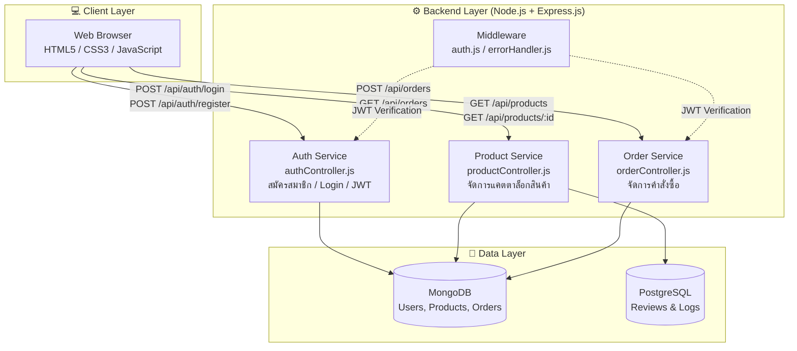

# เอกสารข้อกำหนดระบบ (System Requirement Specification) และ สถาปัตยกรรมระบบ

**โครงการ:** AutoParts Pro - ระบบร้านค้าออนไลน์ขายอุปกรณ์แต่งรถ (E-Commerce)

| เวอร์ชัน | วันที่แก้ไข | ผู้จัดทำ | รายละเอียดการเปลี่ยนแปลง |
| :---: | :---: | :---: | :---: |
| 1.0 | 2026-07-17 | [Nattapong jullaruji   67117379] | (Project Documentation) |
| 2.0 | 2026-07-17 | [Kasidech neamthong    67117148] | 
| 3.0 | 2026-07-17 | [Nuttawat pinpan       67117379] | 
| 4.0 | 2026-07-17 | [Nattapong jullaruji   67117379] | 
| 5.0 | 2026-07-17 | [Nattapong jullaruji   67117379] | 

---

## สารบัญ
1. [ภาพรวมโครงการ](#1-ภาพรวมโครงการ)
2. [สถาปัตยกรรมระบบ (System Architecture)](#2-สถาปัตยกรรมระบบ-system-architecture)
3. [โครงสร้างโปรเจกต์ (Project Structure)](#3-โครงสร้างโปรเจกต์-project-structure)
4. [ความต้องการด้านฟังก์ชันการทำงาน (Functional Requirements)](#4-ความต้องการด้านฟังก์ชันการทำงาน-functional-requirements)
5. [ความต้องการด้านที่ไม่ใช่ฟังก์ชัน (Non-Functional Requirements)](#5-ความต้องการด้านที่ไม่ใช่ฟังก์ชัน-non-functional-requirements)
6. [การประยุกต์ใช้ Software Design Principles](#6-การประยุกต์ใช้-software-design-principles)
7. [วิธีการติดตั้งและใช้งาน (Installation)](#7-วิธีการติดตั้งและใช้งาน-installation)

---

## 1. ภาพรวมโครงการ

**AutoParts Pro** เป็นแพลตฟอร์ม E-Commerce สำหรับจัดจำหน่ายอุปกรณ์แต่งรถยนต์และอะไหล่รถยนต์แบบครบวงจร โดยมีเป้าหมายเพื่ออำนวยความสะดวกให้ผู้ที่รักการแต่งรถสามารถค้นหา เปรียบเทียบ และสั่งซื้อสินค้าได้อย่างรวดเร็วและปลอดภัยผ่านระบบออนไลน์

ระบบถูกแบ่งออกเป็น 2 ส่วนหลักคือ **Frontend** (Static Website) และ **Backend** (RESTful API Server) ที่แยกกันทำงานและสื่อสารกันผ่าน HTTP

---

## 2. สถาปัตยกรรมระบบ (System Architecture)

สถาปัตยกรรมของ AutoParts Pro ถูกออกแบบโดยใช้หลักการ **Separation of Concerns** แบ่งระบบออกเป็น 3 Layer หลัก ได้แก่ Client Layer, Backend Layer และ Data Layer โดยทุกส่วนสื่อสารกันผ่าน REST API



### 2.1 การวิเคราะห์และออกแบบ (Analysis & Design)

การวิเคราะห์สถาปัตยกรรมตามองค์ประกอบหลัก (Architecture Analysis):

- **Frontend Architecture:**
  - โครงสร้าง: ใช้ HTML5, CSS3, JavaScript (Vanilla) ในการแสดงผล UI
  - การออกแบบ: มุ่งเน้นการทำ Responsive Design เพื่อให้รองรับ Mobile และ Desktop รวมถึงปรับแต่ง UX/UI ให้เป็น Dark Theme ให้เข้ากับสินค้ารถยนต์

- **Backend Architecture:**
  - โครงสร้าง: เป็นแบบ Monolithic Architecture โดยใช้ Node.js ร่วมกับ Express.js
  - การทำงาน: จัดการ Business Logic และให้บริการ RESTful API แก่ Frontend (แบ่งเป็น Auth, Product, Order Services)

- **Database Architecture:**
  - โครงสร้าง: ใช้ MongoDB เป็น Primary Database เพื่อจัดเก็บ User, Product, Order ที่โครงสร้างยืดหยุ่นได้
  - การจัดเก็บ Log/Review: ใช้ PostgreSQL สำหรับส่วนที่ต้องการโครงสร้าง Relational อย่างชัดเจน

**[Screenshot ผลลัพธ์หน้าเว็บไซต์ / การทำงานของระบบ]**


---

## 3. โครงสร้างโปรเจกต์ (Project Structure)

โครงสร้างโฟลเดอร์ถูกออกแบบตามหลัก **Modularity** แยกความรับผิดชอบของแต่ละส่วนอย่างชัดเจน:

```text
PJ_Car-Accessories/
├── frontend/                   # Frontend (Static Website)
│   ├── index.html              # หน้าแรก
│   ├── css/
│   │   ├── styles.css          # Stylesheet หลัก
│   │   └── pages.css           # Styles หน้าย่อย
│   ├── js/
│   │   └── app.js              # JavaScript หลัก
│   ├── pages/
│   │   ├── product.html        # หน้ารายละเอียดสินค้า
│   │   └── cart.html           # หน้าตะกร้าสินค้า
│
├── backend/                    # Backend (API Server)
│   ├── server.js               # Entry point ของระบบ
│   ├── package.json            # Dependencies
│   ├── config/
│   │   ├── db.js               # จัดการการเชื่อมต่อฐานข้อมูล MongoDB
│   ├── models/                 # Schemas ของฐานข้อมูล (User, Product, Order)
│   ├── controllers/            # Business Logic ของระบบ
│   ├── routes/                 # กำหนดเส้นทาง (Endpoint) ของ REST API
│   └── middleware/             # ชั้นกลางตรวจสอบ JWT และ Error
│
├── .gitignore                  # กำหนดไฟล์ที่ไม่ต้องนำขึ้น Git
└── README.md                   # เอกสารอธิบายโปรเจกต์ฉบับนี้
```

---

## 4. ความต้องการด้านฟังก์ชันการทำงาน (Functional Requirements)

### 4.1 ระบบหน้าเว็บสำหรับลูกค้า (Customer Frontend)

| รหัส | ฟังก์ชัน | รายละเอียด | ความสำคัญ |
| :---: | :--- | :--- | :---: |
| **C-01** | แสดงรายการสินค้า | แสดงรายการอุปกรณ์แต่งรถพร้อมรูปภาพ ราคา และรายละเอียดเบื้องต้น | High |
| **C-02** | ค้นหาและกรองสินค้า | ค้นหาตามชื่อ, แบรนด์รถยนต์ และหมวดหมู่ | High |
| **C-03** | ดูรายละเอียดสินค้า | หน้า Product Detail แสดงข้อมูลเชิงลึก คะแนนรีวิว | High |
| **C-04** | ตะกร้าสินค้า | เพิ่ม/ลด/ลบสินค้าในตะกร้า และสรุปยอดราคารวม | High |
| **C-05** | ชำระเงิน (Checkout) | กรอกที่อยู่จัดส่งและชำระเงิน สร้างคำสั่งซื้อผ่าน `POST /api/orders` | High |
| **C-06** | สมัครสมาชิก/เข้าสู่ระบบ | ลงทะเบียนและเข้าสู่ระบบด้วย Email/Password (รับ JWT Token) | High |
| **C-07** | ประวัติการสั่งซื้อ | ลูกค้าดูรายการคำสั่งซื้อของตนเองได้ผ่าน `GET /api/orders` | Medium |

### 4.2 ระบบหลังบ้าน (Admin Dashboard)

| รหัส | ฟังก์ชัน | รายละเอียด | ความสำคัญ |
| :---: | :--- | :--- | :---: |
| **A-01** | จัดการสินค้า | CRUD ข้อมูลสินค้า ผ่าน `POST/PUT/DELETE /api/products` | High |
| **A-02** | จัดการออเดอร์ | ดูรายการคำสั่งซื้อทั้งหมดและอัพเดตสถานะ | High |
| **A-03** | จัดการผู้ใช้งาน | ดูข้อมูลผู้ใช้และกำหนดสิทธิ์ (User/Admin) | Medium |

---

## 5. ความต้องการด้านที่ไม่ใช่ฟังก์ชัน (Non-Functional Requirements)

| รหัส | หัวข้อ | รายละเอียด |
| :---: | :--- | :--- |
| **N-01** | Performance | รองรับการ Checkout พร้อมกันไม่น้อยกว่า 100 Users (ผ่านการทดสอบด้วย JMeter แล้ว) |
| **N-02** | Security | รหัสผ่านเข้ารหัสด้วย `bcrypt` และ Private API ป้องกันด้วย `JWT` |
| **N-03** | Usability | รองรับ Responsive Design ทำงานได้ดีบน Desktop และ Mobile |
| **N-04** | Maintainability | Backend จัดโครงสร้างแบบ MVC Pattern |

---

## 6. การประยุกต์ใช้ Software Design Principles

- **Separation of Concerns (SoC):** แยกระบบเป็น Frontend, Backend และ Database ชัดเจน ไม่ปะปนกัน
- **Single Responsibility Principle (SRP):** ไฟล์ Controller แต่ละไฟล์รับผิดชอบงานเดียว (เช่น `authController.js` จัดการเฉพาะส่วน Auth)
- **Loose Coupling:** Frontend ติดต่อ Backend ผ่าน REST API เท่านั้น ช่วยให้อัปเกรดหรือแก้ไขส่วนใดส่วนหนึ่งได้โดยไม่กระทบอีกส่วน
- **Security by Design:** ควบคุมสิทธิ์การเข้าถึงข้อมูลผ่าน Middleware (`auth.js`) ป้องกันผู้ที่ไม่ได้ Login หรือไม่มีสิทธิ์ Admin ไม่ให้เข้าถึง API สำคัญ

---

## 7. วิธีการติดตั้งและใช้งาน (Installation)

### การเตรียมความพร้อม
- Node.js (v16 ขึ้นไป)
- MongoDB

### ขั้นตอนการรันระบบ Backend
```bash
# 1. เข้าไปที่โฟลเดอร์ backend
cd backend

# 2. ติดตั้ง Dependencies
npm install

# 3. รัน Server
npm start
```
*ระบบจะเปิดทำงานที่พอร์ต `5000` (เช่น `http://localhost:5000/api`)*

### ขั้นตอนการรันระบบ Frontend
สามารถเปิดไฟล์ `frontend/index.html` ด้วย Live Server บน VS Code ได้เลย
