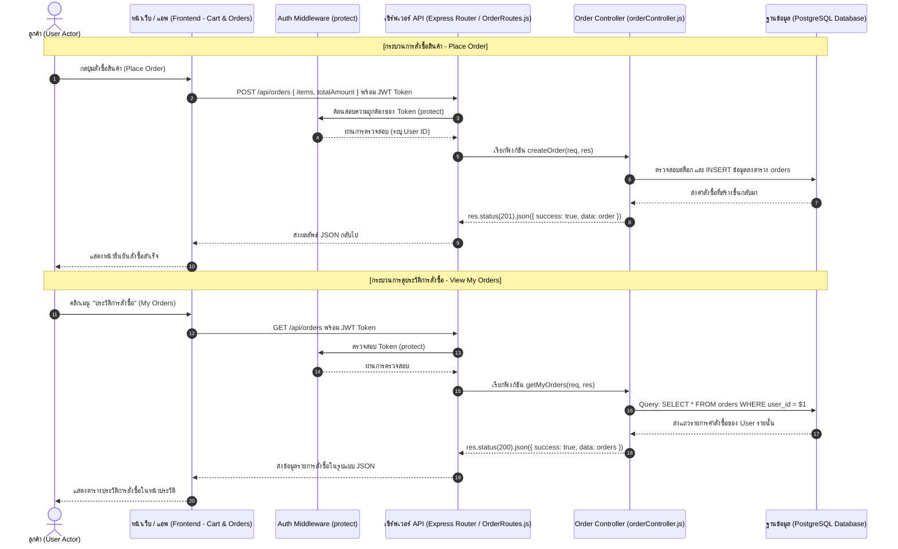
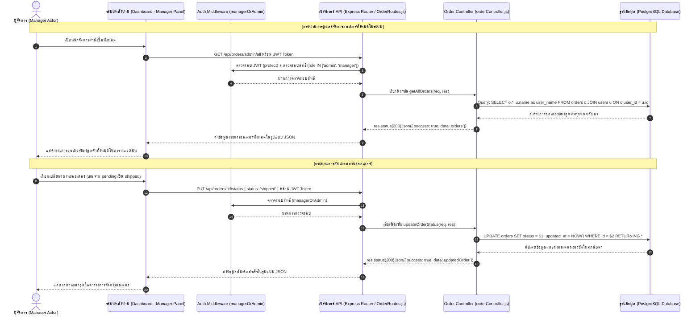
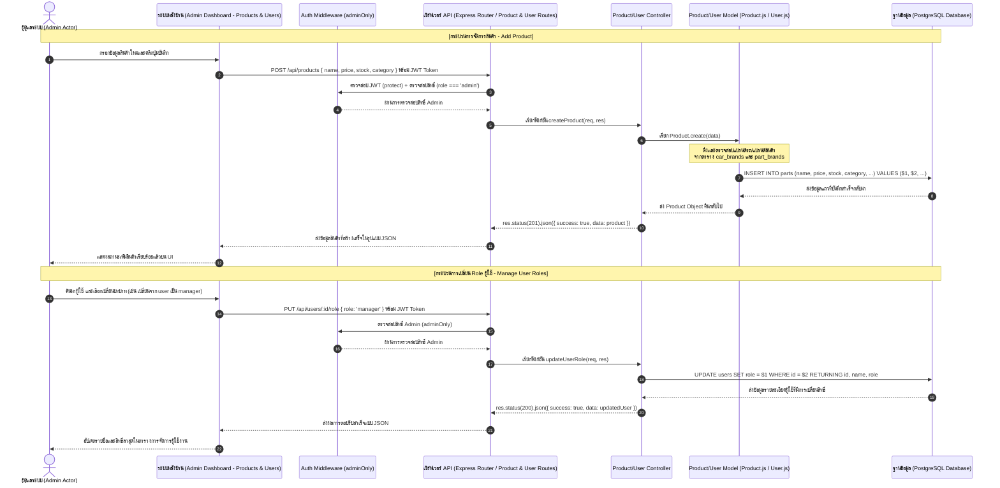

# AutoParts Pro - Sequence Diagrams (Role-Based Process Flows)

เอกสารนี้รวบรวม Sequence Diagrams ของระบบ **AutoParts Pro** เพื่ออธิบายขั้นตอนการทำงานและการไหลของข้อมูล (Data Flow) ตั้งแต่ฝั่ง Frontend, Backend API, Controllers, Models จนถึง PostgreSQL Database อย่างละเอียดและถูกต้องตามโครงสร้างโค้ดจริง

---

## ส่วนประกอบสำคัญของ Sequence Diagram (UML Components)

ตามที่คุณระบุ ไดอะแกรมเหล่านี้ประกอบไปด้วยองค์ประกอบมาตรฐานของ UML Sequence Diagram ดังนี้:
1. **Actor (ตัวแสดง)**: แทนผู้ใช้งานตามบทบาท (User, Manager, Admin)
2. **Lifeline (เส้นชีวิต)**: เส้นประแนวตั้งที่แสดงถึงระยะเวลาการมีอยู่ของออบเจกต์หรือคอมโพเนนต์นั้นๆ (เช่น Frontend, API Router, Controller, Model, DB)
3. **Activation Bar (แถบการทำงาน)**: แถบสี่เหลี่ยมผืนผ้าแนวตั้งบนเส้น Lifeline แสดงว่าออบเจกต์นั้นกำลังประมวลผลอยู่
4. **Message (ข้อความ/เส้นส่งข้อมูล)**: ลูกศรแนวนอนพร้อมข้อความกำกับที่ส่งจาก Lifeline หนึ่งไปยังอีก Lifeline หนึ่ง

---

## 1. Process Flow ของบทบาท: User (ลูกค้า / ผู้ใช้ทั่วไป)
* **สิทธิ์การเข้าถึง**: เข้าถึง Public APIs และ Private APIs เฉพาะข้อมูลส่วนตัวของตนเอง (สั่งซื้อสินค้า / ดูประวัติการสั่งซื้อของตนเอง)

### ภาพไดอะแกรมของบทบาท User:

### รายละเอียด Flow การทำงาน:

---

## 2. Process Flow ของบทบาท: Manager (ผู้จัดการระบบ)
* **สิทธิ์การเข้าถึง**: ได้รับการคุ้มครองผ่าน Middleware `protect` และ `managerOrAdmin` เพื่อจัดการออเดอร์ทั้งหมดในระบบและเปลี่ยนสถานะคำสั่งซื้อ

### ภาพไดอะแกรมของบทบาท Manager:

### รายละเอียด Flow การทำงาน:

---

## 3. Process Flow ของบทบาท: Admin (ผู้ดูแลระบบสูงสุด)
* **สิทธิ์การเข้าถึง**: สิทธิ์สูงสุดในระบบ ผ่าน Middleware `protect` และ `adminOnly` สำหรับการจัดการสินค้าทั้งหมด (เพิ่ม/แก้ไข/ลบ) และควบคุมสถานะบทบาท (Role) ของผู้ใช้งานในระบบ

### ภาพไดอะแกรมของบทบาท Admin:

### รายละเอียด Flow การทำงาน:

